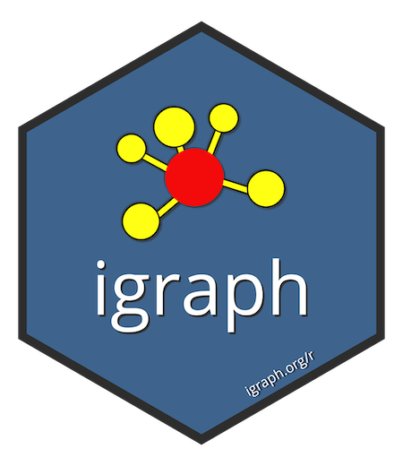

<!-- badges: start -->


[](https://app.codecov.io/gh/igraph/rigraph?branch=main)
<!-- badges: end -->

# R/igraph <a href="https://r.igraph.org/"></a>

R/igraph is an R package of the igraph network analysis library.

## Installation

You can install the stable version of R/igraph from CRAN:

```r
install.packages("igraph")
```

For the development version, you can use R-universe

```r
options(
  repos = c(
    igraph = 'https://igraph.r-universe.dev',
    CRAN = 'https://cloud.r-project.org'
  )
)
install.packages('igraph')
```

or Github, with the [pak package](https://pak.r-lib.org/):

```r
pak::pak("igraph/rigraph")
```

When compiling from sources, make sure that you have C, C++ and Fortran
compilers, as well as development packages for `glpk` and `libxml2`.
On Debian/Ubuntu, use `apt install libglpk-dev libxml2-dev`.
On Fedora, use `yum install glpk-devel libxml2-devel`.

For installation from source on Windows, you need to have
[RTools](https://cran.r-project.org/bin/windows/Rtools/) installed.
For versions R >= 4.0 you can install the dependencies using:

```
pacman -Sy mingw-w64-{i686,x86_64}-glpk mingw-w64-{i686,x86_64}-libxml2
```

## Installation troubleshooting

See the [Installation FAQ](https://r.igraph.org/articles/installation-troubleshooting).

## Documentation

See the [igraph package's website](https://r.igraph.org/) for the complete manual.

## Contributions

Please read our
[contribution guide](https://github.com/igraph/rigraph/blob/dev/CONTRIBUTING.md).

## License

GNU GPL version 2 or later

## Contributors


<!-- ALL-CONTRIBUTORS-LIST:START - Do not remove or modify this section -->
<!-- prettier-ignore-start -->
<!-- markdownlint-disable -->

All contributions to this project are gratefully acknowledged using the [`allcontributors` package](https://github.com/ropenscilabs/allcontributors) following the [all-contributors](https://allcontributors.org) specification. Contributions of any kind are welcome!

### Code

<table>

<tr>
<td align="center">
<a href="https://github.com/gaborcsardi">

</a><br>
<a href="https://github.com/igraph/rigraph/commits?author=gaborcsardi">gaborcsardi</a>
</td>
<td align="center">
<a href="https://github.com/krlmlr">

</a><br>
<a href="https://github.com/igraph/rigraph/commits?author=krlmlr">krlmlr</a>
</td>
<td align="center">
<a href="https://github.com/maelle">

</a><br>
<a href="https://github.com/igraph/rigraph/commits?author=maelle">maelle</a>
</td>
<td align="center">
<a href="https://github.com/ntamas">

</a><br>
<a href="https://github.com/igraph/rigraph/commits?author=ntamas">ntamas</a>
</td>
<td align="center">
<a href="https://github.com/szhorvat">

</a><br>
<a href="https://github.com/igraph/rigraph/commits?author=szhorvat">szhorvat</a>
</td>
<td align="center">
<a href="https://github.com/Antonov548">

</a><br>
<a href="https://github.com/igraph/rigraph/commits?author=Antonov548">Antonov548</a>
</td>
<td align="center">
<a href="https://github.com/vtraag">

</a><br>
<a href="https://github.com/igraph/rigraph/commits?author=vtraag">vtraag</a>
</td>
</tr>


<tr>
<td align="center">
<a href="https://github.com/adalisan">

</a><br>
<a href="https://github.com/igraph/rigraph/commits?author=adalisan">adalisan</a>
</td>
<td align="center">
<a href="https://github.com/ngmaclaren">

</a><br>
<a href="https://github.com/igraph/rigraph/commits?author=ngmaclaren">ngmaclaren</a>
</td>
<td align="center">
<a href="https://github.com/iosonofabio">

</a><br>
<a href="https://github.com/igraph/rigraph/commits?author=iosonofabio">iosonofabio</a>
</td>
<td align="center">
<a href="https://github.com/dmurdoch">

</a><br>
<a href="https://github.com/igraph/rigraph/commits?author=dmurdoch">dmurdoch</a>
</td>
<td align="center">
<a href="https://github.com/pupamanyu">

</a><br>
<a href="https://github.com/igraph/rigraph/commits?author=pupamanyu">pupamanyu</a>
</td>
<td align="center">
<a href="https://github.com/olivroy">

</a><br>
<a href="https://github.com/igraph/rigraph/commits?author=olivroy">olivroy</a>
</td>
<td align="center">
<a href="https://github.com/kalibera">

</a><br>
<a href="https://github.com/igraph/rigraph/commits?author=kalibera">kalibera</a>
</td>
</tr>


<tr>
<td align="center">
<a href="https://github.com/hadley">

</a><br>
<a href="https://github.com/igraph/rigraph/commits?author=hadley">hadley</a>
</td>
<td align="center">
<a href="https://github.com/Matyasch">

</a><br>
<a href="https://github.com/igraph/rigraph/commits?author=Matyasch">Matyasch</a>
</td>
<td align="center">
<a href="https://github.com/clpippel">

</a><br>
<a href="https://github.com/igraph/rigraph/commits?author=clpippel">clpippel</a>
</td>
<td align="center">
<a href="https://github.com/dougmet">

</a><br>
<a href="https://github.com/igraph/rigraph/commits?author=dougmet">dougmet</a>
</td>
<td align="center">
<a href="https://github.com/wael-sadek">

</a><br>
<a href="https://github.com/igraph/rigraph/commits?author=wael-sadek">wael-sadek</a>
</td>
<td align="center">
<a href="https://github.com/das-intensity">

</a><br>
<a href="https://github.com/igraph/rigraph/commits?author=das-intensity">das-intensity</a>
</td>
<td align="center">
<a href="https://github.com/peranti">

</a><br>
<a href="https://github.com/igraph/rigraph/commits?author=peranti">peranti</a>
</td>
</tr>


<tr>
<td align="center">
<a href="https://github.com/RahulHP">

</a><br>
<a href="https://github.com/igraph/rigraph/commits?author=RahulHP">RahulHP</a>
</td>
<td align="center">
<a href="https://github.com/raulzr">

</a><br>
<a href="https://github.com/igraph/rigraph/commits?author=raulzr">raulzr</a>
</td>
<td align="center">
<a href="https://github.com/richardfergie">

</a><br>
<a href="https://github.com/igraph/rigraph/commits?author=richardfergie">richardfergie</a>
</td>
<td align="center">
<a href="https://github.com/zeehio">

</a><br>
<a href="https://github.com/igraph/rigraph/commits?author=zeehio">zeehio</a>
</td>
<td align="center">
<a href="https://github.com/simoncarrignon">

</a><br>
<a href="https://github.com/igraph/rigraph/commits?author=simoncarrignon">simoncarrignon</a>
</td>
<td align="center">
<a href="https://github.com/smoe">

</a><br>
<a href="https://github.com/igraph/rigraph/commits?author=smoe">smoe</a>
</td>
<td align="center">
<a href="https://github.com/covoes">

</a><br>
<a href="https://github.com/igraph/rigraph/commits?author=covoes">covoes</a>
</td>
</tr>


<tr>
<td align="center">
<a href="https://github.com/mirca">

</a><br>
<a href="https://github.com/igraph/rigraph/commits?author=mirca">mirca</a>
</td>
<td align="center">
<a href="https://github.com/adriandiazlab">

</a><br>
<a href="https://github.com/igraph/rigraph/commits?author=adriandiazlab">adriandiazlab</a>
</td>
<td align="center">
<a href="https://github.com/a-lambda">

</a><br>
<a href="https://github.com/igraph/rigraph/commits?author=a-lambda">a-lambda</a>
</td>
<td align="center">
<a href="https://github.com/aleszib">

</a><br>
<a href="https://github.com/igraph/rigraph/commits?author=aleszib">aleszib</a>
</td>
<td align="center">
<a href="https://github.com/person-c">

</a><br>
<a href="https://github.com/igraph/rigraph/commits?author=person-c">person-c</a>
</td>
<td align="center">
<a href="https://github.com/cynthiahqy">

</a><br>
<a href="https://github.com/igraph/rigraph/commits?author=cynthiahqy">cynthiahqy</a>
</td>
<td align="center">
<a href="https://github.com/etheleon">

</a><br>
<a href="https://github.com/igraph/rigraph/commits?author=etheleon">etheleon</a>
</td>
</tr>


<tr>
<td align="center">
<a href="https://github.com/knwng">

</a><br>
<a href="https://github.com/igraph/rigraph/commits?author=knwng">knwng</a>
</td>
<td align="center">
<a href="https://github.com/stnava">

</a><br>
<a href="https://github.com/igraph/rigraph/commits?author=stnava">stnava</a>
</td>
<td align="center">
<a href="https://github.com/ahmohamed">

</a><br>
<a href="https://github.com/igraph/rigraph/commits?author=ahmohamed">ahmohamed</a>
</td>
<td align="center">
<a href="https://github.com/kasterma">

</a><br>
<a href="https://github.com/igraph/rigraph/commits?author=kasterma">kasterma</a>
</td>
<td align="center">
<a href="https://github.com/cfhammill">

</a><br>
<a href="https://github.com/igraph/rigraph/commits?author=cfhammill">cfhammill</a>
</td>
<td align="center">
<a href="https://github.com/clhunsen">

</a><br>
<a href="https://github.com/igraph/rigraph/commits?author=clhunsen">clhunsen</a>
</td>
<td align="center">
<a href="https://github.com/rundel">

</a><br>
<a href="https://github.com/igraph/rigraph/commits?author=rundel">rundel</a>
</td>
</tr>


<tr>
<td align="center">
<a href="https://github.com/qsz13">

</a><br>
<a href="https://github.com/igraph/rigraph/commits?author=qsz13">qsz13</a>
</td>
<td align="center">
<a href="https://github.com/DexGroves">

</a><br>
<a href="https://github.com/igraph/rigraph/commits?author=DexGroves">DexGroves</a>
</td>
<td align="center">
<a href="https://github.com/QuLogic">

</a><br>
<a href="https://github.com/igraph/rigraph/commits?author=QuLogic">QuLogic</a>
</td>
<td align="center">
<a href="https://github.com/dalloliogm">

</a><br>
<a href="https://github.com/igraph/rigraph/commits?author=dalloliogm">dalloliogm</a>
</td>
<td align="center">
<a href="https://github.com/Hosseinazari">

</a><br>
<a href="https://github.com/igraph/rigraph/commits?author=Hosseinazari">Hosseinazari</a>
</td>
<td align="center">
<a href="https://github.com/hclimente">

</a><br>
<a href="https://github.com/igraph/rigraph/commits?author=hclimente">hclimente</a>
</td>
<td align="center">
<a href="https://github.com/jeroen">

</a><br>
<a href="https://github.com/igraph/rigraph/commits?author=jeroen">jeroen</a>
</td>
</tr>


<tr>
<td align="center">
<a href="https://github.com/jooolia">

</a><br>
<a href="https://github.com/igraph/rigraph/commits?author=jooolia">jooolia</a>
</td>
<td align="center">
<a href="https://github.com/reuning">

</a><br>
<a href="https://github.com/igraph/rigraph/commits?author=reuning">reuning</a>
</td>
<td align="center">
<a href="https://github.com/louisaslett">

</a><br>
<a href="https://github.com/igraph/rigraph/commits?author=louisaslett">louisaslett</a>
</td>
<td align="center">
<a href="https://github.com/MajoroMask">

</a><br>
<a href="https://github.com/igraph/rigraph/commits?author=MajoroMask">MajoroMask</a>
</td>
<td align="center">
<a href="https://github.com/MatthieuStigler">

</a><br>
<a href="https://github.com/igraph/rigraph/commits?author=MatthieuStigler">MatthieuStigler</a>
</td>
<td align="center">
<a href="https://github.com/mhils">

</a><br>
<a href="https://github.com/igraph/rigraph/commits?author=mhils">mhils</a>
</td>
<td align="center">
<a href="https://github.com/mfansler">

</a><br>
<a href="https://github.com/igraph/rigraph/commits?author=mfansler">mfansler</a>
</td>
</tr>

</table>


### Issue Authors

<table>

<tr>
<td align="center">
<a href="https://github.com/satuhelske">

</a><br>
<a href="https://github.com/igraph/rigraph/issues?q=is%3Aissue+author%3Asatuhelske">satuhelske</a>
</td>
<td align="center">
<a href="https://github.com/happyshows">

</a><br>
<a href="https://github.com/igraph/rigraph/issues?q=is%3Aissue+author%3Ahappyshows">happyshows</a>
</td>
<td align="center">
<a href="https://github.com/pschmied">

</a><br>
<a href="https://github.com/igraph/rigraph/issues?q=is%3Aissue+author%3Apschmied">pschmied</a>
</td>
<td align="center">
<a href="https://github.com/cndesantana">

</a><br>
<a href="https://github.com/igraph/rigraph/issues?q=is%3Aissue+author%3Acndesantana">cndesantana</a>
</td>
<td align="center">
<a href="https://github.com/ronammar">

</a><br>
<a href="https://github.com/igraph/rigraph/issues?q=is%3Aissue+author%3Aronammar">ronammar</a>
</td>
<td align="center">
<a href="https://github.com/songw01">

</a><br>
<a href="https://github.com/igraph/rigraph/issues?q=is%3Aissue+author%3Asongw01">songw01</a>
</td>
<td align="center">
<a href="https://github.com/MonicaStefu">

</a><br>
<a href="https://github.com/igraph/rigraph/issues?q=is%3Aissue+author%3AMonicaStefu">MonicaStefu</a>
</td>
</tr>


<tr>
<td align="center">
<a href="https://github.com/sam-s">

</a><br>
<a href="https://github.com/igraph/rigraph/issues?q=is%3Aissue+author%3Asam-s">sam-s</a>
</td>
<td align="center">
<a href="https://github.com/ko-ichi-h">

</a><br>
<a href="https://github.com/igraph/rigraph/issues?q=is%3Aissue+author%3Ako-ichi-h">ko-ichi-h</a>
</td>
<td align="center">
<a href="https://github.com/ameyahate">

</a><br>
<a href="https://github.com/igraph/rigraph/issues?q=is%3Aissue+author%3Aameyahate">ameyahate</a>
</td>
<td align="center">
<a href="https://github.com/zachmayer">

</a><br>
<a href="https://github.com/igraph/rigraph/issues?q=is%3Aissue+author%3Azachmayer">zachmayer</a>
</td>
<td align="center">
<a href="https://github.com/nickbloom">

</a><br>
<a href="https://github.com/igraph/rigraph/issues?q=is%3Aissue+author%3Anickbloom">nickbloom</a>
</td>
<td align="center">
<a href="https://github.com/steinee">

</a><br>
<a href="https://github.com/igraph/rigraph/issues?q=is%3Aissue+author%3Asteinee">steinee</a>
</td>
<td align="center">
<a href="https://github.com/beew">

</a><br>
<a href="https://github.com/igraph/rigraph/issues?q=is%3Aissue+author%3Abeew">beew</a>
</td>
</tr>


<tr>
<td align="center">
<a href="https://github.com/cboettig">

</a><br>
<a href="https://github.com/igraph/rigraph/issues?q=is%3Aissue+author%3Acboettig">cboettig</a>
</td>
<td align="center">
<a href="https://github.com/mbojan">

</a><br>
<a href="https://github.com/igraph/rigraph/issues?q=is%3Aissue+author%3Ambojan">mbojan</a>
</td>
<td align="center">
<a href="https://github.com/danielturek">

</a><br>
<a href="https://github.com/igraph/rigraph/issues?q=is%3Aissue+author%3Adanielturek">danielturek</a>
</td>
<td align="center">
<a href="https://github.com/lpantano">

</a><br>
<a href="https://github.com/igraph/rigraph/issues?q=is%3Aissue+author%3Alpantano">lpantano</a>
</td>
<td align="center">
<a href="https://github.com/CHarkerRhodes">

</a><br>
<a href="https://github.com/igraph/rigraph/issues?q=is%3Aissue+author%3ACHarkerRhodes">CHarkerRhodes</a>
</td>
<td align="center">
<a href="https://github.com/briatte">

</a><br>
<a href="https://github.com/igraph/rigraph/issues?q=is%3Aissue+author%3Abriatte">briatte</a>
</td>
<td align="center">
<a href="https://github.com/pfgherardini">

</a><br>
<a href="https://github.com/igraph/rigraph/issues?q=is%3Aissue+author%3Apfgherardini">pfgherardini</a>
</td>
</tr>


<tr>
<td align="center">
<a href="https://github.com/nktkee">

</a><br>
<a href="https://github.com/igraph/rigraph/issues?q=is%3Aissue+author%3Anktkee">nktkee</a>
</td>
<td align="center">
<a href="https://github.com/BrianDiggs">

</a><br>
<a href="https://github.com/igraph/rigraph/issues?q=is%3Aissue+author%3ABrianDiggs">BrianDiggs</a>
</td>
<td align="center">
<a href="https://github.com/shifunan">

</a><br>
<a href="https://github.com/igraph/rigraph/issues?q=is%3Aissue+author%3Ashifunan">shifunan</a>
</td>
<td align="center">
<a href="https://github.com/ecalvo68">

</a><br>
<a href="https://github.com/igraph/rigraph/issues?q=is%3Aissue+author%3Aecalvo68">ecalvo68</a>
</td>
<td align="center">
<a href="https://github.com/pooryorick">

</a><br>
<a href="https://github.com/igraph/rigraph/issues?q=is%3Aissue+author%3Apooryorick">pooryorick</a>
</td>
<td align="center">
<a href="https://github.com/alumbreras">

</a><br>
<a href="https://github.com/igraph/rigraph/issues?q=is%3Aissue+author%3Aalumbreras">alumbreras</a>
</td>
<td align="center">
<a href="https://github.com/Holzhauer">

</a><br>
<a href="https://github.com/igraph/rigraph/issues?q=is%3Aissue+author%3AHolzhauer">Holzhauer</a>
</td>
</tr>


<tr>
<td align="center">
<a href="https://github.com/wangzk">

</a><br>
<a href="https://github.com/igraph/rigraph/issues?q=is%3Aissue+author%3Awangzk">wangzk</a>
</td>
<td align="center">
<a href="https://github.com/ramnathv">

</a><br>
<a href="https://github.com/igraph/rigraph/issues?q=is%3Aissue+author%3Aramnathv">ramnathv</a>
</td>
<td align="center">
<a href="https://github.com/Pablo1990">

</a><br>
<a href="https://github.com/igraph/rigraph/issues?q=is%3Aissue+author%3APablo1990">Pablo1990</a>
</td>
<td align="center">
<a href="https://github.com/sanmai-NL">

</a><br>
<a href="https://github.com/igraph/rigraph/issues?q=is%3Aissue+author%3Asanmai-NL">sanmai-NL</a>
</td>
<td align="center">
<a href="https://github.com/pachevalier">

</a><br>
<a href="https://github.com/igraph/rigraph/issues?q=is%3Aissue+author%3Apachevalier">pachevalier</a>
</td>
<td align="center">
<a href="https://github.com/nathaniel-mahieu">

</a><br>
<a href="https://github.com/igraph/rigraph/issues?q=is%3Aissue+author%3Anathaniel-mahieu">nathaniel-mahieu</a>
</td>
<td align="center">
<a href="https://github.com/tylmoss">

</a><br>
<a href="https://github.com/igraph/rigraph/issues?q=is%3Aissue+author%3Atylmoss">tylmoss</a>
</td>
</tr>


<tr>
<td align="center">
<a href="https://github.com/Lucaweihs">

</a><br>
<a href="https://github.com/igraph/rigraph/issues?q=is%3Aissue+author%3ALucaweihs">Lucaweihs</a>
</td>
<td align="center">
<a href="https://github.com/rustyconover">

</a><br>
<a href="https://github.com/igraph/rigraph/issues?q=is%3Aissue+author%3Arustyconover">rustyconover</a>
</td>
<td align="center">
<a href="https://github.com/youngser">

</a><br>
<a href="https://github.com/igraph/rigraph/issues?q=is%3Aissue+author%3Ayoungser">youngser</a>
</td>
<td align="center">
<a href="https://github.com/Tixierae">

</a><br>
<a href="https://github.com/igraph/rigraph/issues?q=is%3Aissue+author%3ATixierae">Tixierae</a>
</td>
<td align="center">
<a href="https://github.com/hecking">

</a><br>
<a href="https://github.com/igraph/rigraph/issues?q=is%3Aissue+author%3Ahecking">hecking</a>
</td>
<td align="center">
<a href="https://github.com/proj786">

</a><br>
<a href="https://github.com/igraph/rigraph/issues?q=is%3Aissue+author%3Aproj786">proj786</a>
</td>
<td align="center">
<a href="https://github.com/fbreitwieser">

</a><br>
<a href="https://github.com/igraph/rigraph/issues?q=is%3Aissue+author%3Afbreitwieser">fbreitwieser</a>
</td>
</tr>


<tr>
<td align="center">
<a href="https://github.com/mabafaba">

</a><br>
<a href="https://github.com/igraph/rigraph/issues?q=is%3Aissue+author%3Amabafaba">mabafaba</a>
</td>
<td align="center">
<a href="https://github.com/anudeepchimakurthi">

</a><br>
<a href="https://github.com/igraph/rigraph/issues?q=is%3Aissue+author%3Aanudeepchimakurthi">anudeepchimakurthi</a>
</td>
<td align="center">
<a href="https://github.com/ugroempi">

</a><br>
<a href="https://github.com/igraph/rigraph/issues?q=is%3Aissue+author%3Augroempi">ugroempi</a>
</td>
<td align="center">
<a href="https://github.com/gvegayon">

</a><br>
<a href="https://github.com/igraph/rigraph/issues?q=is%3Aissue+author%3Agvegayon">gvegayon</a>
</td>
<td align="center">
<a href="https://github.com/wjmaddox">

</a><br>
<a href="https://github.com/igraph/rigraph/issues?q=is%3Aissue+author%3Awjmaddox">wjmaddox</a>
</td>
<td align="center">
<a href="https://github.com/saramelvin">

</a><br>
<a href="https://github.com/igraph/rigraph/issues?q=is%3Aissue+author%3Asaramelvin">saramelvin</a>
</td>
<td align="center">
<a href="https://github.com/atxmar001">

</a><br>
<a href="https://github.com/igraph/rigraph/issues?q=is%3Aissue+author%3Aatxmar001">atxmar001</a>
</td>
</tr>


<tr>
<td align="center">
<a href="https://github.com/emilBeBri">

</a><br>
<a href="https://github.com/igraph/rigraph/issues?q=is%3Aissue+author%3AemilBeBri">emilBeBri</a>
</td>
<td align="center">
<a href="https://github.com/byrney">

</a><br>
<a href="https://github.com/igraph/rigraph/issues?q=is%3Aissue+author%3Abyrney">byrney</a>
</td>
<td align="center">
<a href="https://github.com/aterhorst">

</a><br>
<a href="https://github.com/igraph/rigraph/issues?q=is%3Aissue+author%3Aaterhorst">aterhorst</a>
</td>
<td align="center">
<a href="https://github.com/benibela">

</a><br>
<a href="https://github.com/igraph/rigraph/issues?q=is%3Aissue+author%3Abenibela">benibela</a>
</td>
<td align="center">
<a href="https://github.com/geoHeil">

</a><br>
<a href="https://github.com/igraph/rigraph/issues?q=is%3Aissue+author%3AgeoHeil">geoHeil</a>
</td>
<td align="center">
<a href="https://github.com/vd4mmind">

</a><br>
<a href="https://github.com/igraph/rigraph/issues?q=is%3Aissue+author%3Avd4mmind">vd4mmind</a>
</td>
<td align="center">
<a href="https://github.com/otoomet">

</a><br>
<a href="https://github.com/igraph/rigraph/issues?q=is%3Aissue+author%3Aotoomet">otoomet</a>
</td>
</tr>


<tr>
<td align="center">
<a href="https://github.com/benjaminpelissie">

</a><br>
<a href="https://github.com/igraph/rigraph/issues?q=is%3Aissue+author%3Abenjaminpelissie">benjaminpelissie</a>
</td>
<td align="center">
<a href="https://github.com/MrBeardface">

</a><br>
<a href="https://github.com/igraph/rigraph/issues?q=is%3Aissue+author%3AMrBeardface">MrBeardface</a>
</td>
<td align="center">
<a href="https://github.com/ngr-t">

</a><br>
<a href="https://github.com/igraph/rigraph/issues?q=is%3Aissue+author%3Angr-t">ngr-t</a>
</td>
<td align="center">
<a href="https://github.com/wzds2015">

</a><br>
<a href="https://github.com/igraph/rigraph/issues?q=is%3Aissue+author%3Awzds2015">wzds2015</a>
</td>
<td align="center">
<a href="https://github.com/thomasp85">

</a><br>
<a href="https://github.com/igraph/rigraph/issues?q=is%3Aissue+author%3Athomasp85">thomasp85</a>
</td>
<td align="center">
<a href="https://github.com/adfi">

</a><br>
<a href="https://github.com/igraph/rigraph/issues?q=is%3Aissue+author%3Aadfi">adfi</a>
</td>
<td align="center">
<a href="https://github.com/zkamvar">

</a><br>
<a href="https://github.com/igraph/rigraph/issues?q=is%3Aissue+author%3Azkamvar">zkamvar</a>
</td>
</tr>


<tr>
<td align="center">
<a href="https://github.com/Lcarey">

</a><br>
<a href="https://github.com/igraph/rigraph/issues?q=is%3Aissue+author%3ALcarey">Lcarey</a>
</td>
<td align="center">
<a href="https://github.com/mkoohafkan">

</a><br>
<a href="https://github.com/igraph/rigraph/issues?q=is%3Aissue+author%3Amkoohafkan">mkoohafkan</a>
</td>
<td align="center">
<a href="https://github.com/rafapereirabr">

</a><br>
<a href="https://github.com/igraph/rigraph/issues?q=is%3Aissue+author%3Arafapereirabr">rafapereirabr</a>
</td>
<td align="center">
<a href="https://github.com/XiaomoWu">

</a><br>
<a href="https://github.com/igraph/rigraph/issues?q=is%3Aissue+author%3AXiaomoWu">XiaomoWu</a>
</td>
<td align="center">
<a href="https://github.com/gtms">

</a><br>
<a href="https://github.com/igraph/rigraph/issues?q=is%3Aissue+author%3Agtms">gtms</a>
</td>
<td align="center">
<a href="https://github.com/mvanins">

</a><br>
<a href="https://github.com/igraph/rigraph/issues?q=is%3Aissue+author%3Amvanins">mvanins</a>
</td>
<td align="center">
<a href="https://github.com/HTizard">

</a><br>
<a href="https://github.com/igraph/rigraph/issues?q=is%3Aissue+author%3AHTizard">HTizard</a>
</td>
</tr>


<tr>
<td align="center">
<a href="https://github.com/mjsteinbaugh">

</a><br>
<a href="https://github.com/igraph/rigraph/issues?q=is%3Aissue+author%3Amjsteinbaugh">mjsteinbaugh</a>
</td>
<td align="center">
<a href="https://github.com/yangstat">

</a><br>
<a href="https://github.com/igraph/rigraph/issues?q=is%3Aissue+author%3Ayangstat">yangstat</a>
</td>
<td align="center">
<a href="https://github.com/MattMyint">

</a><br>
<a href="https://github.com/igraph/rigraph/issues?q=is%3Aissue+author%3AMattMyint">MattMyint</a>
</td>
<td align="center">
<a href="https://github.com/ebridge2">

</a><br>
<a href="https://github.com/igraph/rigraph/issues?q=is%3Aissue+author%3Aebridge2">ebridge2</a>
</td>
<td align="center">
<a href="https://github.com/00joshi">

</a><br>
<a href="https://github.com/igraph/rigraph/issues?q=is%3Aissue+author%3A00joshi">00joshi</a>
</td>
<td align="center">
<a href="https://github.com/jaworskicoline">

</a><br>
<a href="https://github.com/igraph/rigraph/issues?q=is%3Aissue+author%3Ajaworskicoline">jaworskicoline</a>
</td>
<td align="center">
<a href="https://github.com/rohan-shah">

</a><br>
<a href="https://github.com/igraph/rigraph/issues?q=is%3Aissue+author%3Arohan-shah">rohan-shah</a>
</td>
</tr>


<tr>
<td align="center">
<a href="https://github.com/liuyifang">

</a><br>
<a href="https://github.com/igraph/rigraph/issues?q=is%3Aissue+author%3Aliuyifang">liuyifang</a>
</td>
<td align="center">
<a href="https://github.com/alexandergerber">

</a><br>
<a href="https://github.com/igraph/rigraph/issues?q=is%3Aissue+author%3Aalexandergerber">alexandergerber</a>
</td>
<td align="center">
<a href="https://github.com/wlandau">

</a><br>
<a href="https://github.com/igraph/rigraph/issues?q=is%3Aissue+author%3Awlandau">wlandau</a>
</td>
<td align="center">
<a href="https://github.com/ADENIRANADEBIYI">

</a><br>
<a href="https://github.com/igraph/rigraph/issues?q=is%3Aissue+author%3AADENIRANADEBIYI">ADENIRANADEBIYI</a>
</td>
<td align="center">
<a href="https://github.com/gaiazaff">

</a><br>
<a href="https://github.com/igraph/rigraph/issues?q=is%3Aissue+author%3Agaiazaff">gaiazaff</a>
</td>
<td align="center">
<a href="https://github.com/ahmontgo">

</a><br>
<a href="https://github.com/igraph/rigraph/issues?q=is%3Aissue+author%3Aahmontgo">ahmontgo</a>
</td>
<td align="center">
<a href="https://github.com/PinakiGhosh">

</a><br>
<a href="https://github.com/igraph/rigraph/issues?q=is%3Aissue+author%3APinakiGhosh">PinakiGhosh</a>
</td>
</tr>


<tr>
<td align="center">
<a href="https://github.com/otsaw">

</a><br>
<a href="https://github.com/igraph/rigraph/issues?q=is%3Aissue+author%3Aotsaw">otsaw</a>
</td>
<td align="center">
<a href="https://github.com/Noah89">

</a><br>
<a href="https://github.com/igraph/rigraph/issues?q=is%3Aissue+author%3ANoah89">Noah89</a>
</td>
<td align="center">
<a href="https://github.com/hktan0131">

</a><br>
<a href="https://github.com/igraph/rigraph/issues?q=is%3Aissue+author%3Ahktan0131">hktan0131</a>
</td>
<td align="center">
<a href="https://github.com/tintinthong">

</a><br>
<a href="https://github.com/igraph/rigraph/issues?q=is%3Aissue+author%3Atintinthong">tintinthong</a>
</td>
<td align="center">
<a href="https://github.com/jderry">

</a><br>
<a href="https://github.com/igraph/rigraph/issues?q=is%3Aissue+author%3Ajderry">jderry</a>
</td>
<td align="center">
<a href="https://github.com/smichard">

</a><br>
<a href="https://github.com/igraph/rigraph/issues?q=is%3Aissue+author%3Asmichard">smichard</a>
</td>
<td align="center">
<a href="https://github.com/GianRos">

</a><br>
<a href="https://github.com/igraph/rigraph/issues?q=is%3Aissue+author%3AGianRos">GianRos</a>
</td>
</tr>


<tr>
<td align="center">
<a href="https://github.com/pm321">

</a><br>
<a href="https://github.com/igraph/rigraph/issues?q=is%3Aissue+author%3Apm321">pm321</a>
</td>
<td align="center">
<a href="https://github.com/jpalowitch">

</a><br>
<a href="https://github.com/igraph/rigraph/issues?q=is%3Aissue+author%3Ajpalowitch">jpalowitch</a>
</td>
<td align="center">
<a href="https://github.com/Xiaojieqiu">

</a><br>
<a href="https://github.com/igraph/rigraph/issues?q=is%3Aissue+author%3AXiaojieqiu">Xiaojieqiu</a>
</td>
<td align="center">
<a href="https://github.com/alexdeluca">

</a><br>
<a href="https://github.com/igraph/rigraph/issues?q=is%3Aissue+author%3Aalexdeluca">alexdeluca</a>
</td>
<td align="center">
<a href="https://github.com/mohamed-badawy-sp">

</a><br>
<a href="https://github.com/igraph/rigraph/issues?q=is%3Aissue+author%3Amohamed-badawy-sp">mohamed-badawy-sp</a>
</td>
<td align="center">
<a href="https://github.com/jakobgerstenlauer">

</a><br>
<a href="https://github.com/igraph/rigraph/issues?q=is%3Aissue+author%3Ajakobgerstenlauer">jakobgerstenlauer</a>
</td>
<td align="center">
<a href="https://github.com/knbknb">

</a><br>
<a href="https://github.com/igraph/rigraph/issues?q=is%3Aissue+author%3Aknbknb">knbknb</a>
</td>
</tr>


<tr>
<td align="center">
<a href="https://github.com/dpmcsuss">

</a><br>
<a href="https://github.com/igraph/rigraph/issues?q=is%3Aissue+author%3Adpmcsuss">dpmcsuss</a>
</td>
<td align="center">
<a href="https://github.com/SantiFilippo">

</a><br>
<a href="https://github.com/igraph/rigraph/issues?q=is%3Aissue+author%3ASantiFilippo">SantiFilippo</a>
</td>
<td align="center">
<a href="https://github.com/oganm">

</a><br>
<a href="https://github.com/igraph/rigraph/issues?q=is%3Aissue+author%3Aoganm">oganm</a>
</td>
<td align="center">
<a href="https://github.com/ludwikbukowski">

</a><br>
<a href="https://github.com/igraph/rigraph/issues?q=is%3Aissue+author%3Aludwikbukowski">ludwikbukowski</a>
</td>
<td align="center">
<a href="https://github.com/tardigradus">

</a><br>
<a href="https://github.com/igraph/rigraph/issues?q=is%3Aissue+author%3Atardigradus">tardigradus</a>
</td>
<td align="center">
<a href="https://github.com/TomKellyGenetics">

</a><br>
<a href="https://github.com/igraph/rigraph/issues?q=is%3Aissue+author%3ATomKellyGenetics">TomKellyGenetics</a>
</td>
<td align="center">
<a href="https://github.com/mick001">

</a><br>
<a href="https://github.com/igraph/rigraph/issues?q=is%3Aissue+author%3Amick001">mick001</a>
</td>
</tr>


<tr>
<td align="center">
<a href="https://github.com/sammo3182">

</a><br>
<a href="https://github.com/igraph/rigraph/issues?q=is%3Aissue+author%3Asammo3182">sammo3182</a>
</td>
<td align="center">
<a href="https://github.com/joycewang914">

</a><br>
<a href="https://github.com/igraph/rigraph/issues?q=is%3Aissue+author%3Ajoycewang914">joycewang914</a>
</td>
<td align="center">
<a href="https://github.com/FilipeamTeixeira">

</a><br>
<a href="https://github.com/igraph/rigraph/issues?q=is%3Aissue+author%3AFilipeamTeixeira">FilipeamTeixeira</a>
</td>
<td align="center">
<a href="https://github.com/tyleransom">

</a><br>
<a href="https://github.com/igraph/rigraph/issues?q=is%3Aissue+author%3Atyleransom">tyleransom</a>
</td>
<td align="center">
<a href="https://github.com/Prooffreader">

</a><br>
<a href="https://github.com/igraph/rigraph/issues?q=is%3Aissue+author%3AProoffreader">Prooffreader</a>
</td>
<td align="center">
<a href="https://github.com/gabora">

</a><br>
<a href="https://github.com/igraph/rigraph/issues?q=is%3Aissue+author%3Agabora">gabora</a>
</td>
<td align="center">
<a href="https://github.com/floswald">

</a><br>
<a href="https://github.com/igraph/rigraph/issues?q=is%3Aissue+author%3Afloswald">floswald</a>
</td>
</tr>


<tr>
<td align="center">
<a href="https://github.com/beemyfriend">

</a><br>
<a href="https://github.com/igraph/rigraph/issues?q=is%3Aissue+author%3Abeemyfriend">beemyfriend</a>
</td>
<td align="center">
<a href="https://github.com/willnotburn">

</a><br>
<a href="https://github.com/igraph/rigraph/issues?q=is%3Aissue+author%3Awillnotburn">willnotburn</a>
</td>
<td align="center">
<a href="https://github.com/vhcandido">

</a><br>
<a href="https://github.com/igraph/rigraph/issues?q=is%3Aissue+author%3Avhcandido">vhcandido</a>
</td>
<td align="center">
<a href="https://github.com/OscarSouth">

</a><br>
<a href="https://github.com/igraph/rigraph/issues?q=is%3Aissue+author%3AOscarSouth">OscarSouth</a>
</td>
<td align="center">
<a href="https://github.com/DarioS">

</a><br>
<a href="https://github.com/igraph/rigraph/issues?q=is%3Aissue+author%3ADarioS">DarioS</a>
</td>
<td align="center">
<a href="https://github.com/leifeld">

</a><br>
<a href="https://github.com/igraph/rigraph/issues?q=is%3Aissue+author%3Aleifeld">leifeld</a>
</td>
<td align="center">
<a href="https://github.com/alubbock">

</a><br>
<a href="https://github.com/igraph/rigraph/issues?q=is%3Aissue+author%3Aalubbock">alubbock</a>
</td>
</tr>


<tr>
<td align="center">
<a href="https://github.com/anova00">

</a><br>
<a href="https://github.com/igraph/rigraph/issues?q=is%3Aissue+author%3Aanova00">anova00</a>
</td>
<td align="center">
<a href="https://github.com/gmfricke">

</a><br>
<a href="https://github.com/igraph/rigraph/issues?q=is%3Aissue+author%3Agmfricke">gmfricke</a>
</td>
<td align="center">
<a href="https://github.com/smartinsightsfromdata">

</a><br>
<a href="https://github.com/igraph/rigraph/issues?q=is%3Aissue+author%3Asmartinsightsfromdata">smartinsightsfromdata</a>
</td>
<td align="center">
<a href="https://github.com/matt-wirtz">

</a><br>
<a href="https://github.com/igraph/rigraph/issues?q=is%3Aissue+author%3Amatt-wirtz">matt-wirtz</a>
</td>
<td align="center">
<a href="https://github.com/antonkratz">

</a><br>
<a href="https://github.com/igraph/rigraph/issues?q=is%3Aissue+author%3Aantonkratz">antonkratz</a>
</td>
<td align="center">
<a href="https://github.com/pkharchenko">

</a><br>
<a href="https://github.com/igraph/rigraph/issues?q=is%3Aissue+author%3Apkharchenko">pkharchenko</a>
</td>
<td align="center">
<a href="https://github.com/billdenney">

</a><br>
<a href="https://github.com/igraph/rigraph/issues?q=is%3Aissue+author%3Abilldenney">billdenney</a>
</td>
</tr>


<tr>
<td align="center">
<a href="https://github.com/liyq601">

</a><br>
<a href="https://github.com/igraph/rigraph/issues?q=is%3Aissue+author%3Aliyq601">liyq601</a>
</td>
<td align="center">
<a href="https://github.com/bommert">

</a><br>
<a href="https://github.com/igraph/rigraph/issues?q=is%3Aissue+author%3Abommert">bommert</a>
</td>
<td align="center">
<a href="https://github.com/richierocks">

</a><br>
<a href="https://github.com/igraph/rigraph/issues?q=is%3Aissue+author%3Arichierocks">richierocks</a>
</td>
<td align="center">
<a href="https://github.com/ekernf01">

</a><br>
<a href="https://github.com/igraph/rigraph/issues?q=is%3Aissue+author%3Aekernf01">ekernf01</a>
</td>
<td align="center">
<a href="https://github.com/Lily-WL">

</a><br>
<a href="https://github.com/igraph/rigraph/issues?q=is%3Aissue+author%3ALily-WL">Lily-WL</a>
</td>
<td align="center">
<a href="https://github.com/vancleve">

</a><br>
<a href="https://github.com/igraph/rigraph/issues?q=is%3Aissue+author%3Avancleve">vancleve</a>
</td>
<td align="center">
<a href="https://github.com/qalid7">

</a><br>
<a href="https://github.com/igraph/rigraph/issues?q=is%3Aissue+author%3Aqalid7">qalid7</a>
</td>
</tr>


<tr>
<td align="center">
<a href="https://github.com/petershan1119">

</a><br>
<a href="https://github.com/igraph/rigraph/issues?q=is%3Aissue+author%3Apetershan1119">petershan1119</a>
</td>
<td align="center">
<a href="https://github.com/kenahoo">

</a><br>
<a href="https://github.com/igraph/rigraph/issues?q=is%3Aissue+author%3Akenahoo">kenahoo</a>
</td>
<td align="center">
<a href="https://github.com/alessiaf">

</a><br>
<a href="https://github.com/igraph/rigraph/issues?q=is%3Aissue+author%3Aalessiaf">alessiaf</a>
</td>
<td align="center">
<a href="https://github.com/songh-ss">

</a><br>
<a href="https://github.com/igraph/rigraph/issues?q=is%3Aissue+author%3Asongh-ss">songh-ss</a>
</td>
<td align="center">
<a href="https://github.com/adndebanane">

</a><br>
<a href="https://github.com/igraph/rigraph/issues?q=is%3Aissue+author%3Aadndebanane">adndebanane</a>
</td>
<td align="center">
<a href="https://github.com/evebohnett">

</a><br>
<a href="https://github.com/igraph/rigraph/issues?q=is%3Aissue+author%3Aevebohnett">evebohnett</a>
</td>
<td align="center">
<a href="https://github.com/olyerickson">

</a><br>
<a href="https://github.com/igraph/rigraph/issues?q=is%3Aissue+author%3Aolyerickson">olyerickson</a>
</td>
</tr>


<tr>
<td align="center">
<a href="https://github.com/jooyoungseo">

</a><br>
<a href="https://github.com/igraph/rigraph/issues?q=is%3Aissue+author%3Ajooyoungseo">jooyoungseo</a>
</td>
<td align="center">
<a href="https://github.com/ntillie">

</a><br>
<a href="https://github.com/igraph/rigraph/issues?q=is%3Aissue+author%3Antillie">ntillie</a>
</td>
<td align="center">
<a href="https://github.com/TiagoVentura">

</a><br>
<a href="https://github.com/igraph/rigraph/issues?q=is%3Aissue+author%3ATiagoVentura">TiagoVentura</a>
</td>
<td align="center">
<a href="https://github.com/AndreMikulec">

</a><br>
<a href="https://github.com/igraph/rigraph/issues?q=is%3Aissue+author%3AAndreMikulec">AndreMikulec</a>
</td>
<td align="center">
<a href="https://github.com/prehensilecode">

</a><br>
<a href="https://github.com/igraph/rigraph/issues?q=is%3Aissue+author%3Aprehensilecode">prehensilecode</a>
</td>
<td align="center">
<a href="https://github.com/LalZzy">

</a><br>
<a href="https://github.com/igraph/rigraph/issues?q=is%3Aissue+author%3ALalZzy">LalZzy</a>
</td>
<td align="center">
<a href="https://github.com/cxd1995">

</a><br>
<a href="https://github.com/igraph/rigraph/issues?q=is%3Aissue+author%3Acxd1995">cxd1995</a>
</td>
</tr>


<tr>
<td align="center">
<a href="https://github.com/SalimMegat">

</a><br>
<a href="https://github.com/igraph/rigraph/issues?q=is%3Aissue+author%3ASalimMegat">SalimMegat</a>
</td>
<td align="center">
<a href="https://github.com/xiwa2006">

</a><br>
<a href="https://github.com/igraph/rigraph/issues?q=is%3Aissue+author%3Axiwa2006">xiwa2006</a>
</td>
<td align="center">
<a href="https://github.com/fmccown">

</a><br>
<a href="https://github.com/igraph/rigraph/issues?q=is%3Aissue+author%3Afmccown">fmccown</a>
</td>
<td align="center">
<a href="https://github.com/andybeet">

</a><br>
<a href="https://github.com/igraph/rigraph/issues?q=is%3Aissue+author%3Aandybeet">andybeet</a>
</td>
<td align="center">
<a href="https://github.com/devanssjc">

</a><br>
<a href="https://github.com/igraph/rigraph/issues?q=is%3Aissue+author%3Adevanssjc">devanssjc</a>
</td>
<td align="center">
<a href="https://github.com/tikboaHIT">

</a><br>
<a href="https://github.com/igraph/rigraph/issues?q=is%3Aissue+author%3AtikboaHIT">tikboaHIT</a>
</td>
<td align="center">
<a href="https://github.com/vkehayas">

</a><br>
<a href="https://github.com/igraph/rigraph/issues?q=is%3Aissue+author%3Avkehayas">vkehayas</a>
</td>
</tr>


<tr>
<td align="center">
<a href="https://github.com/iaconogi">

</a><br>
<a href="https://github.com/igraph/rigraph/issues?q=is%3Aissue+author%3Aiaconogi">iaconogi</a>
</td>
<td align="center">
<a href="https://github.com/robertamezquita">

</a><br>
<a href="https://github.com/igraph/rigraph/issues?q=is%3Aissue+author%3Arobertamezquita">robertamezquita</a>
</td>
<td align="center">
<a href="https://github.com/gholl0">

</a><br>
<a href="https://github.com/igraph/rigraph/issues?q=is%3Aissue+author%3Agholl0">gholl0</a>
</td>
<td align="center">
<a href="https://github.com/lijing28101">

</a><br>
<a href="https://github.com/igraph/rigraph/issues?q=is%3Aissue+author%3Alijing28101">lijing28101</a>
</td>
<td align="center">
<a href="https://github.com/pipii355">

</a><br>
<a href="https://github.com/igraph/rigraph/issues?q=is%3Aissue+author%3Apipii355">pipii355</a>
</td>
<td align="center">
<a href="https://github.com/ImNotaGit">

</a><br>
<a href="https://github.com/igraph/rigraph/issues?q=is%3Aissue+author%3AImNotaGit">ImNotaGit</a>
</td>
<td align="center">
<a href="https://github.com/mcenno">

</a><br>
<a href="https://github.com/igraph/rigraph/issues?q=is%3Aissue+author%3Amcenno">mcenno</a>
</td>
</tr>


<tr>
<td align="center">
<a href="https://github.com/coelhocao">

</a><br>
<a href="https://github.com/igraph/rigraph/issues?q=is%3Aissue+author%3Acoelhocao">coelhocao</a>
</td>
<td align="center">
<a href="https://github.com/cslycord">

</a><br>
<a href="https://github.com/igraph/rigraph/issues?q=is%3Aissue+author%3Acslycord">cslycord</a>
</td>
<td align="center">
<a href="https://github.com/topl0305">

</a><br>
<a href="https://github.com/igraph/rigraph/issues?q=is%3Aissue+author%3Atopl0305">topl0305</a>
</td>
<td align="center">
<a href="https://github.com/jxu">

</a><br>
<a href="https://github.com/igraph/rigraph/issues?q=is%3Aissue+author%3Ajxu">jxu</a>
</td>
<td align="center">
<a href="https://github.com/Pozdniakov">

</a><br>
<a href="https://github.com/igraph/rigraph/issues?q=is%3Aissue+author%3APozdniakov">Pozdniakov</a>
</td>
<td align="center">
<a href="https://github.com/rozlynboutin">

</a><br>
<a href="https://github.com/igraph/rigraph/issues?q=is%3Aissue+author%3Arozlynboutin">rozlynboutin</a>
</td>
<td align="center">
<a href="https://github.com/Enchufa2">

</a><br>
<a href="https://github.com/igraph/rigraph/issues?q=is%3Aissue+author%3AEnchufa2">Enchufa2</a>
</td>
</tr>


<tr>
<td align="center">
<a href="https://github.com/MabroukAhmed">

</a><br>
<a href="https://github.com/igraph/rigraph/issues?q=is%3Aissue+author%3AMabroukAhmed">MabroukAhmed</a>
</td>
<td align="center">
<a href="https://github.com/vronizor">

</a><br>
<a href="https://github.com/igraph/rigraph/issues?q=is%3Aissue+author%3Avronizor">vronizor</a>
</td>
<td align="center">
<a href="https://github.com/jdfoote">

</a><br>
<a href="https://github.com/igraph/rigraph/issues?q=is%3Aissue+author%3Ajdfoote">jdfoote</a>
</td>
<td align="center">
<a href="https://github.com/myildir3">

</a><br>
<a href="https://github.com/igraph/rigraph/issues?q=is%3Aissue+author%3Amyildir3">myildir3</a>
</td>
<td align="center">
<a href="https://github.com/pmp55">

</a><br>
<a href="https://github.com/igraph/rigraph/issues?q=is%3Aissue+author%3Apmp55">pmp55</a>
</td>
<td align="center">
<a href="https://github.com/cccfran">

</a><br>
<a href="https://github.com/igraph/rigraph/issues?q=is%3Aissue+author%3Acccfran">cccfran</a>
</td>
<td align="center">
<a href="https://github.com/Osterhhase">

</a><br>
<a href="https://github.com/igraph/rigraph/issues?q=is%3Aissue+author%3AOsterhhase">Osterhhase</a>
</td>
</tr>


<tr>
<td align="center">
<a href="https://github.com/arencambre">

</a><br>
<a href="https://github.com/igraph/rigraph/issues?q=is%3Aissue+author%3Aarencambre">arencambre</a>
</td>
<td align="center">
<a href="https://github.com/pat-s">

</a><br>
<a href="https://github.com/igraph/rigraph/issues?q=is%3Aissue+author%3Apat-s">pat-s</a>
</td>
<td align="center">
<a href="https://github.com/pollicipes">

</a><br>
<a href="https://github.com/igraph/rigraph/issues?q=is%3Aissue+author%3Apollicipes">pollicipes</a>
</td>
<td align="center">
<a href="https://github.com/huijfeng">

</a><br>
<a href="https://github.com/igraph/rigraph/issues?q=is%3Aissue+author%3Ahuijfeng">huijfeng</a>
</td>
<td align="center">
<a href="https://github.com/jfb-h">

</a><br>
<a href="https://github.com/igraph/rigraph/issues?q=is%3Aissue+author%3Ajfb-h">jfb-h</a>
</td>
<td align="center">
<a href="https://github.com/mihirp161">

</a><br>
<a href="https://github.com/igraph/rigraph/issues?q=is%3Aissue+author%3Amihirp161">mihirp161</a>
</td>
<td align="center">
<a href="https://github.com/komalsrathi">

</a><br>
<a href="https://github.com/igraph/rigraph/issues?q=is%3Aissue+author%3Akomalsrathi">komalsrathi</a>
</td>
</tr>


<tr>
<td align="center">
<a href="https://github.com/SamGG">

</a><br>
<a href="https://github.com/igraph/rigraph/issues?q=is%3Aissue+author%3ASamGG">SamGG</a>
</td>
<td align="center">
<a href="https://github.com/bergen288">

</a><br>
<a href="https://github.com/igraph/rigraph/issues?q=is%3Aissue+author%3Abergen288">bergen288</a>
</td>
<td align="center">
<a href="https://github.com/ourrym">

</a><br>
<a href="https://github.com/igraph/rigraph/issues?q=is%3Aissue+author%3Aourrym">ourrym</a>
</td>
<td align="center">
<a href="https://github.com/heinonmatti">

</a><br>
<a href="https://github.com/igraph/rigraph/issues?q=is%3Aissue+author%3Aheinonmatti">heinonmatti</a>
</td>
<td align="center">
<a href="https://github.com/Lin936">

</a><br>
<a href="https://github.com/igraph/rigraph/issues?q=is%3Aissue+author%3ALin936">Lin936</a>
</td>
<td align="center">
<a href="https://github.com/jsfalk">

</a><br>
<a href="https://github.com/igraph/rigraph/issues?q=is%3Aissue+author%3Ajsfalk">jsfalk</a>
</td>
<td align="center">
<a href="https://github.com/mikeaalv">

</a><br>
<a href="https://github.com/igraph/rigraph/issues?q=is%3Aissue+author%3Amikeaalv">mikeaalv</a>
</td>
</tr>


<tr>
<td align="center">
<a href="https://github.com/aabor">

</a><br>
<a href="https://github.com/igraph/rigraph/issues?q=is%3Aissue+author%3Aaabor">aabor</a>
</td>
<td align="center">
<a href="https://github.com/torfason">

</a><br>
<a href="https://github.com/igraph/rigraph/issues?q=is%3Aissue+author%3Atorfason">torfason</a>
</td>
<td align="center">
<a href="https://github.com/GrayAlex49">

</a><br>
<a href="https://github.com/igraph/rigraph/issues?q=is%3Aissue+author%3AGrayAlex49">GrayAlex49</a>
</td>
<td align="center">
<a href="https://github.com/dylanzhao1993">

</a><br>
<a href="https://github.com/igraph/rigraph/issues?q=is%3Aissue+author%3Adylanzhao1993">dylanzhao1993</a>
</td>
<td align="center">
<a href="https://github.com/rossinerbe">

</a><br>
<a href="https://github.com/igraph/rigraph/issues?q=is%3Aissue+author%3Arossinerbe">rossinerbe</a>
</td>
<td align="center">
<a href="https://github.com/englianhu">

</a><br>
<a href="https://github.com/igraph/rigraph/issues?q=is%3Aissue+author%3Aenglianhu">englianhu</a>
</td>
<td align="center">
<a href="https://github.com/ManuelHentschel">

</a><br>
<a href="https://github.com/igraph/rigraph/issues?q=is%3Aissue+author%3AManuelHentschel">ManuelHentschel</a>
</td>
</tr>


<tr>
<td align="center">
<a href="https://github.com/NeginValizadegan">

</a><br>
<a href="https://github.com/igraph/rigraph/issues?q=is%3Aissue+author%3ANeginValizadegan">NeginValizadegan</a>
</td>
<td align="center">
<a href="https://github.com/MingwuDuan">

</a><br>
<a href="https://github.com/igraph/rigraph/issues?q=is%3Aissue+author%3AMingwuDuan">MingwuDuan</a>
</td>
<td align="center">
<a href="https://github.com/vagabond12">

</a><br>
<a href="https://github.com/igraph/rigraph/issues?q=is%3Aissue+author%3Avagabond12">vagabond12</a>
</td>
<td align="center">
<a href="https://github.com/Thijss">

</a><br>
<a href="https://github.com/igraph/rigraph/issues?q=is%3Aissue+author%3AThijss">Thijss</a>
</td>
<td align="center">
<a href="https://github.com/brook-milligan">

</a><br>
<a href="https://github.com/igraph/rigraph/issues?q=is%3Aissue+author%3Abrook-milligan">brook-milligan</a>
</td>
<td align="center">
<a href="https://github.com/Close-your-eyes">

</a><br>
<a href="https://github.com/igraph/rigraph/issues?q=is%3Aissue+author%3AClose-your-eyes">Close-your-eyes</a>
</td>
<td align="center">
<a href="https://github.com/moldach">

</a><br>
<a href="https://github.com/igraph/rigraph/issues?q=is%3Aissue+author%3Amoldach">moldach</a>
</td>
</tr>


<tr>
<td align="center">
<a href="https://github.com/lcolladotor">

</a><br>
<a href="https://github.com/igraph/rigraph/issues?q=is%3Aissue+author%3Alcolladotor">lcolladotor</a>
</td>
<td align="center">
<a href="https://github.com/fubingting">

</a><br>
<a href="https://github.com/igraph/rigraph/issues?q=is%3Aissue+author%3Afubingting">fubingting</a>
</td>
<td align="center">
<a href="https://github.com/mgirlich">

</a><br>
<a href="https://github.com/igraph/rigraph/issues?q=is%3Aissue+author%3Amgirlich">mgirlich</a>
</td>
<td align="center">
<a href="https://github.com/BenxiaHu">

</a><br>
<a href="https://github.com/igraph/rigraph/issues?q=is%3Aissue+author%3ABenxiaHu">BenxiaHu</a>
</td>
<td align="center">
<a href="https://github.com/mostafiz67">

</a><br>
<a href="https://github.com/igraph/rigraph/issues?q=is%3Aissue+author%3Amostafiz67">mostafiz67</a>
</td>
<td align="center">
<a href="https://github.com/mathlandry">

</a><br>
<a href="https://github.com/igraph/rigraph/issues?q=is%3Aissue+author%3Amathlandry">mathlandry</a>
</td>
<td align="center">
<a href="https://github.com/deeenes">

</a><br>
<a href="https://github.com/igraph/rigraph/issues?q=is%3Aissue+author%3Adeeenes">deeenes</a>
</td>
</tr>


<tr>
<td align="center">
<a href="https://github.com/ray1919">

</a><br>
<a href="https://github.com/igraph/rigraph/issues?q=is%3Aissue+author%3Aray1919">ray1919</a>
</td>
<td align="center">
<a href="https://github.com/wanglu2014">

</a><br>
<a href="https://github.com/igraph/rigraph/issues?q=is%3Aissue+author%3Awanglu2014">wanglu2014</a>
</td>
<td align="center">
<a href="https://github.com/ha5dzs">

</a><br>
<a href="https://github.com/igraph/rigraph/issues?q=is%3Aissue+author%3Aha5dzs">ha5dzs</a>
</td>
<td align="center">
<a href="https://github.com/arcresu">

</a><br>
<a href="https://github.com/igraph/rigraph/issues?q=is%3Aissue+author%3Aarcresu">arcresu</a>
</td>
<td align="center">
<a href="https://github.com/HughParsonage">

</a><br>
<a href="https://github.com/igraph/rigraph/issues?q=is%3Aissue+author%3AHughParsonage">HughParsonage</a>
</td>
<td align="center">
<a href="https://github.com/leofontenelle">

</a><br>
<a href="https://github.com/igraph/rigraph/issues?q=is%3Aissue+author%3Aleofontenelle">leofontenelle</a>
</td>
<td align="center">
<a href="https://github.com/privefl">

</a><br>
<a href="https://github.com/igraph/rigraph/issues?q=is%3Aissue+author%3Aprivefl">privefl</a>
</td>
</tr>


<tr>
<td align="center">
<a href="https://github.com/samlipworth">

</a><br>
<a href="https://github.com/igraph/rigraph/issues?q=is%3Aissue+author%3Asamlipworth">samlipworth</a>
</td>
<td align="center">
<a href="https://github.com/spocks">

</a><br>
<a href="https://github.com/igraph/rigraph/issues?q=is%3Aissue+author%3Aspocks">spocks</a>
</td>
<td align="center">
<a href="https://github.com/ggrothendieck">

</a><br>
<a href="https://github.com/igraph/rigraph/issues?q=is%3Aissue+author%3Aggrothendieck">ggrothendieck</a>
</td>
<td align="center">
<a href="https://github.com/dn-ra">

</a><br>
<a href="https://github.com/igraph/rigraph/issues?q=is%3Aissue+author%3Adn-ra">dn-ra</a>
</td>
<td align="center">
<a href="https://github.com/DavisVaughan">

</a><br>
<a href="https://github.com/igraph/rigraph/issues?q=is%3Aissue+author%3ADavisVaughan">DavisVaughan</a>
</td>
<td align="center">
<a href="https://github.com/pozsgaig">

</a><br>
<a href="https://github.com/igraph/rigraph/issues?q=is%3Aissue+author%3Apozsgaig">pozsgaig</a>
</td>
<td align="center">
<a href="https://github.com/BurhanSabuwala">

</a><br>
<a href="https://github.com/igraph/rigraph/issues?q=is%3Aissue+author%3ABurhanSabuwala">BurhanSabuwala</a>
</td>
</tr>


<tr>
<td align="center">
<a href="https://github.com/youngjinkim81">

</a><br>
<a href="https://github.com/igraph/rigraph/issues?q=is%3Aissue+author%3Ayoungjinkim81">youngjinkim81</a>
</td>
<td align="center">
<a href="https://github.com/dbarneche">

</a><br>
<a href="https://github.com/igraph/rigraph/issues?q=is%3Aissue+author%3Adbarneche">dbarneche</a>
</td>
<td align="center">
<a href="https://github.com/JacobElder">

</a><br>
<a href="https://github.com/igraph/rigraph/issues?q=is%3Aissue+author%3AJacobElder">JacobElder</a>
</td>
<td align="center">
<a href="https://github.com/Tom-python0121">

</a><br>
<a href="https://github.com/igraph/rigraph/issues?q=is%3Aissue+author%3ATom-python0121">Tom-python0121</a>
</td>
<td align="center">
<a href="https://github.com/pfuehrlich-pik">

</a><br>
<a href="https://github.com/igraph/rigraph/issues?q=is%3Aissue+author%3Apfuehrlich-pik">pfuehrlich-pik</a>
</td>
<td align="center">
<a href="https://github.com/Selbosh">

</a><br>
<a href="https://github.com/igraph/rigraph/issues?q=is%3Aissue+author%3ASelbosh">Selbosh</a>
</td>
<td align="center">
<a href="https://github.com/YulongNiu">

</a><br>
<a href="https://github.com/igraph/rigraph/issues?q=is%3Aissue+author%3AYulongNiu">YulongNiu</a>
</td>
</tr>


<tr>
<td align="center">
<a href="https://github.com/seedvestige">

</a><br>
<a href="https://github.com/igraph/rigraph/issues?q=is%3Aissue+author%3Aseedvestige">seedvestige</a>
</td>
<td align="center">
<a href="https://github.com/brooksambrose">

</a><br>
<a href="https://github.com/igraph/rigraph/issues?q=is%3Aissue+author%3Abrooksambrose">brooksambrose</a>
</td>
<td align="center">
<a href="https://github.com/bockthom">

</a><br>
<a href="https://github.com/igraph/rigraph/issues?q=is%3Aissue+author%3Abockthom">bockthom</a>
</td>
<td align="center">
<a href="https://github.com/evanbiederstedt">

</a><br>
<a href="https://github.com/igraph/rigraph/issues?q=is%3Aissue+author%3Aevanbiederstedt">evanbiederstedt</a>
</td>
<td align="center">
<a href="https://github.com/dokato">

</a><br>
<a href="https://github.com/igraph/rigraph/issues?q=is%3Aissue+author%3Adokato">dokato</a>
</td>
<td align="center">
<a href="https://github.com/VPetukhov">

</a><br>
<a href="https://github.com/igraph/rigraph/issues?q=is%3Aissue+author%3AVPetukhov">VPetukhov</a>
</td>
<td align="center">
<a href="https://github.com/hpages">

</a><br>
<a href="https://github.com/igraph/rigraph/issues?q=is%3Aissue+author%3Ahpages">hpages</a>
</td>
</tr>


<tr>
<td align="center">
<a href="https://github.com/jobeid">

</a><br>
<a href="https://github.com/igraph/rigraph/issues?q=is%3Aissue+author%3Ajobeid">jobeid</a>
</td>
<td align="center">
<a href="https://github.com/drives28">

</a><br>
<a href="https://github.com/igraph/rigraph/issues?q=is%3Aissue+author%3Adrives28">drives28</a>
</td>
<td align="center">
<a href="https://github.com/levinhein">

</a><br>
<a href="https://github.com/igraph/rigraph/issues?q=is%3Aissue+author%3Alevinhein">levinhein</a>
</td>
<td align="center">
<a href="https://github.com/massimoaria">

</a><br>
<a href="https://github.com/igraph/rigraph/issues?q=is%3Aissue+author%3Amassimoaria">massimoaria</a>
</td>
<td align="center">
<a href="https://github.com/steve-real">

</a><br>
<a href="https://github.com/igraph/rigraph/issues?q=is%3Aissue+author%3Asteve-real">steve-real</a>
</td>
<td align="center">
<a href="https://github.com/aaelony-aeg">

</a><br>
<a href="https://github.com/igraph/rigraph/issues?q=is%3Aissue+author%3Aaaelony-aeg">aaelony-aeg</a>
</td>
<td align="center">
<a href="https://github.com/jessexknight">

</a><br>
<a href="https://github.com/igraph/rigraph/issues?q=is%3Aissue+author%3Ajessexknight">jessexknight</a>
</td>
</tr>


<tr>
<td align="center">
<a href="https://github.com/dipterix">

</a><br>
<a href="https://github.com/igraph/rigraph/issues?q=is%3Aissue+author%3Adipterix">dipterix</a>
</td>
<td align="center">
<a href="https://github.com/rLannes">

</a><br>
<a href="https://github.com/igraph/rigraph/issues?q=is%3Aissue+author%3ArLannes">rLannes</a>
</td>
<td align="center">
<a href="https://github.com/Jeff87075">

</a><br>
<a href="https://github.com/igraph/rigraph/issues?q=is%3Aissue+author%3AJeff87075">Jeff87075</a>
</td>
<td align="center">
<a href="https://github.com/Chengwei94">

</a><br>
<a href="https://github.com/igraph/rigraph/issues?q=is%3Aissue+author%3AChengwei94">Chengwei94</a>
</td>
<td align="center">
<a href="https://github.com/michaelschwob">

</a><br>
<a href="https://github.com/igraph/rigraph/issues?q=is%3Aissue+author%3Amichaelschwob">michaelschwob</a>
</td>
<td align="center">
<a href="https://github.com/lufuhao">

</a><br>
<a href="https://github.com/igraph/rigraph/issues?q=is%3Aissue+author%3Alufuhao">lufuhao</a>
</td>
<td align="center">
<a href="https://github.com/tedmoorman">

</a><br>
<a href="https://github.com/igraph/rigraph/issues?q=is%3Aissue+author%3Atedmoorman">tedmoorman</a>
</td>
</tr>


<tr>
<td align="center">
<a href="https://github.com/robert-koetsier">

</a><br>
<a href="https://github.com/igraph/rigraph/issues?q=is%3Aissue+author%3Arobert-koetsier">robert-koetsier</a>
</td>
<td align="center">
<a href="https://github.com/stefpeschel">

</a><br>
<a href="https://github.com/igraph/rigraph/issues?q=is%3Aissue+author%3Astefpeschel">stefpeschel</a>
</td>
<td align="center">
<a href="https://github.com/yli223">

</a><br>
<a href="https://github.com/igraph/rigraph/issues?q=is%3Aissue+author%3Ayli223">yli223</a>
</td>
<td align="center">
<a href="https://github.com/zaynabhammoud">

</a><br>
<a href="https://github.com/igraph/rigraph/issues?q=is%3Aissue+author%3Azaynabhammoud">zaynabhammoud</a>
</td>
<td align="center">
<a href="https://github.com/MANZHAOHUI">

</a><br>
<a href="https://github.com/igraph/rigraph/issues?q=is%3Aissue+author%3AMANZHAOHUI">MANZHAOHUI</a>
</td>
<td align="center">
<a href="https://github.com/tillea">

</a><br>
<a href="https://github.com/igraph/rigraph/issues?q=is%3Aissue+author%3Atillea">tillea</a>
</td>
<td align="center">
<a href="https://github.com/barracuda156">

</a><br>
<a href="https://github.com/igraph/rigraph/issues?q=is%3Aissue+author%3Abarracuda156">barracuda156</a>
</td>
</tr>


<tr>
<td align="center">
<a href="https://github.com/HenrikBengtsson">

</a><br>
<a href="https://github.com/igraph/rigraph/issues?q=is%3Aissue+author%3AHenrikBengtsson">HenrikBengtsson</a>
</td>
<td align="center">
<a href="https://github.com/zhen-fu">

</a><br>
<a href="https://github.com/igraph/rigraph/issues?q=is%3Aissue+author%3Azhen-fu">zhen-fu</a>
</td>
<td align="center">
<a href="https://github.com/3SMMZRjWgS">

</a><br>
<a href="https://github.com/igraph/rigraph/issues?q=is%3Aissue+author%3A3SMMZRjWgS">3SMMZRjWgS</a>
</td>
<td align="center">
<a href="https://github.com/dbswls0322">

</a><br>
<a href="https://github.com/igraph/rigraph/issues?q=is%3Aissue+author%3Adbswls0322">dbswls0322</a>
</td>
<td align="center">
<a href="https://github.com/JamesThompsonC">

</a><br>
<a href="https://github.com/igraph/rigraph/issues?q=is%3Aissue+author%3AJamesThompsonC">JamesThompsonC</a>
</td>
<td align="center">
<a href="https://github.com/swaheera">

</a><br>
<a href="https://github.com/igraph/rigraph/issues?q=is%3Aissue+author%3Aswaheera">swaheera</a>
</td>
<td align="center">
<a href="https://github.com/heathergaya">

</a><br>
<a href="https://github.com/igraph/rigraph/issues?q=is%3Aissue+author%3Aheathergaya">heathergaya</a>
</td>
</tr>


<tr>
<td align="center">
<a href="https://github.com/igibek">

</a><br>
<a href="https://github.com/igraph/rigraph/issues?q=is%3Aissue+author%3Aigibek">igibek</a>
</td>
<td align="center">
<a href="https://github.com/simonheb">

</a><br>
<a href="https://github.com/igraph/rigraph/issues?q=is%3Aissue+author%3Asimonheb">simonheb</a>
</td>
<td align="center">
<a href="https://github.com/Amalthyia">

</a><br>
<a href="https://github.com/igraph/rigraph/issues?q=is%3Aissue+author%3AAmalthyia">Amalthyia</a>
</td>
<td align="center">
<a href="https://github.com/LuShuYangMing">

</a><br>
<a href="https://github.com/igraph/rigraph/issues?q=is%3Aissue+author%3ALuShuYangMing">LuShuYangMing</a>
</td>
<td align="center">
<a href="https://github.com/Carol-seven">

</a><br>
<a href="https://github.com/igraph/rigraph/issues?q=is%3Aissue+author%3ACarol-seven">Carol-seven</a>
</td>
<td align="center">
<a href="https://github.com/ramiromagno">

</a><br>
<a href="https://github.com/igraph/rigraph/issues?q=is%3Aissue+author%3Aramiromagno">ramiromagno</a>
</td>
<td align="center">
<a href="https://github.com/pehenne12">

</a><br>
<a href="https://github.com/igraph/rigraph/issues?q=is%3Aissue+author%3Apehenne12">pehenne12</a>
</td>
</tr>


<tr>
<td align="center">
<a href="https://github.com/jskvor">

</a><br>
<a href="https://github.com/igraph/rigraph/issues?q=is%3Aissue+author%3Ajskvor">jskvor</a>
</td>
<td align="center">
<a href="https://github.com/riccardocadei">

</a><br>
<a href="https://github.com/igraph/rigraph/issues?q=is%3Aissue+author%3Ariccardocadei">riccardocadei</a>
</td>
<td align="center">
<a href="https://github.com/davidskalinder">

</a><br>
<a href="https://github.com/igraph/rigraph/issues?q=is%3Aissue+author%3Adavidskalinder">davidskalinder</a>
</td>
<td align="center">
<a href="https://github.com/szymanskiburgos">

</a><br>
<a href="https://github.com/igraph/rigraph/issues?q=is%3Aissue+author%3Aszymanskiburgos">szymanskiburgos</a>
</td>
<td align="center">
<a href="https://github.com/suthers">

</a><br>
<a href="https://github.com/igraph/rigraph/issues?q=is%3Aissue+author%3Asuthers">suthers</a>
</td>
<td align="center">
<a href="https://github.com/mthompsonecologic">

</a><br>
<a href="https://github.com/igraph/rigraph/issues?q=is%3Aissue+author%3Amthompsonecologic">mthompsonecologic</a>
</td>
<td align="center">
<a href="https://github.com/silasalvescosta">

</a><br>
<a href="https://github.com/igraph/rigraph/issues?q=is%3Aissue+author%3Asilasalvescosta">silasalvescosta</a>
</td>
</tr>


<tr>
<td align="center">
<a href="https://github.com/luukvdmeer">

</a><br>
<a href="https://github.com/igraph/rigraph/issues?q=is%3Aissue+author%3Aluukvdmeer">luukvdmeer</a>
</td>
<td align="center">
<a href="https://github.com/jszhao">

</a><br>
<a href="https://github.com/igraph/rigraph/issues?q=is%3Aissue+author%3Ajszhao">jszhao</a>
</td>
<td align="center">
<a href="https://github.com/stephenashton-dhsc">

</a><br>
<a href="https://github.com/igraph/rigraph/issues?q=is%3Aissue+author%3Astephenashton-dhsc">stephenashton-dhsc</a>
</td>
<td align="center">
<a href="https://github.com/joshua-zh">

</a><br>
<a href="https://github.com/igraph/rigraph/issues?q=is%3Aissue+author%3Ajoshua-zh">joshua-zh</a>
</td>
<td align="center">
<a href="https://github.com/noriakis">

</a><br>
<a href="https://github.com/igraph/rigraph/issues?q=is%3Aissue+author%3Anoriakis">noriakis</a>
</td>
<td align="center">
<a href="https://github.com/jefferis">

</a><br>
<a href="https://github.com/igraph/rigraph/issues?q=is%3Aissue+author%3Ajefferis">jefferis</a>
</td>
<td align="center">
<a href="https://github.com/gherrarte">

</a><br>
<a href="https://github.com/igraph/rigraph/issues?q=is%3Aissue+author%3Agherrarte">gherrarte</a>
</td>
</tr>


<tr>
<td align="center">
<a href="https://github.com/tdhock">

</a><br>
<a href="https://github.com/igraph/rigraph/issues?q=is%3Aissue+author%3Atdhock">tdhock</a>
</td>
<td align="center">
<a href="https://github.com/CdeMills">

</a><br>
<a href="https://github.com/igraph/rigraph/issues?q=is%3Aissue+author%3ACdeMills">CdeMills</a>
</td>
<td align="center">
<a href="https://github.com/csqsiew">

</a><br>
<a href="https://github.com/igraph/rigraph/issues?q=is%3Aissue+author%3Acsqsiew">csqsiew</a>
</td>
<td align="center">
<a href="https://github.com/maksymiuks">

</a><br>
<a href="https://github.com/igraph/rigraph/issues?q=is%3Aissue+author%3Amaksymiuks">maksymiuks</a>
</td>
<td align="center">
<a href="https://github.com/JJ">

</a><br>
<a href="https://github.com/igraph/rigraph/issues?q=is%3Aissue+author%3AJJ">JJ</a>
</td>
<td align="center">
<a href="https://github.com/gauzens">

</a><br>
<a href="https://github.com/igraph/rigraph/issues?q=is%3Aissue+author%3Agauzens">gauzens</a>
</td>
<td align="center">
<a href="https://github.com/ababaian">

</a><br>
<a href="https://github.com/igraph/rigraph/issues?q=is%3Aissue+author%3Aababaian">ababaian</a>
</td>
</tr>


<tr>
<td align="center">
<a href="https://github.com/DOSull">

</a><br>
<a href="https://github.com/igraph/rigraph/issues?q=is%3Aissue+author%3ADOSull">DOSull</a>
</td>
<td align="center">
<a href="https://github.com/jhollway">

</a><br>
<a href="https://github.com/igraph/rigraph/issues?q=is%3Aissue+author%3Ajhollway">jhollway</a>
</td>
<td align="center">
<a href="https://github.com/schochastics">

</a><br>
<a href="https://github.com/igraph/rigraph/issues?q=is%3Aissue+author%3Aschochastics">schochastics</a>
</td>
</tr>

</table>


### Issue Contributors

<table>

<tr>
<td align="center">
<a href="https://github.com/timelyportfolio">

</a><br>
<a href="https://github.com/igraph/rigraph/issues?q=is%3Aissue+commenter%3Atimelyportfolio">timelyportfolio</a>
</td>
<td align="center">
<a href="https://github.com/elbamos">

</a><br>
<a href="https://github.com/igraph/rigraph/issues?q=is%3Aissue+commenter%3Aelbamos">elbamos</a>
</td>
<td align="center">
<a href="https://github.com/tomkom">

</a><br>
<a href="https://github.com/igraph/rigraph/issues?q=is%3Aissue+commenter%3Atomkom">tomkom</a>
</td>
<td align="center">
<a href="https://github.com/JonnoB">

</a><br>
<a href="https://github.com/igraph/rigraph/issues?q=is%3Aissue+commenter%3AJonnoB">JonnoB</a>
</td>
<td align="center">
<a href="https://github.com/nickeubank">

</a><br>
<a href="https://github.com/igraph/rigraph/issues?q=is%3Aissue+commenter%3Anickeubank">nickeubank</a>
</td>
<td align="center">
<a href="https://github.com/jose2007kj">

</a><br>
<a href="https://github.com/igraph/rigraph/issues?q=is%3Aissue+commenter%3Ajose2007kj">jose2007kj</a>
</td>
<td align="center">
<a href="https://github.com/ChrisHIV">

</a><br>
<a href="https://github.com/igraph/rigraph/issues?q=is%3Aissue+commenter%3AChrisHIV">ChrisHIV</a>
</td>
</tr>


<tr>
<td align="center">
<a href="https://github.com/ramsairaguru">

</a><br>
<a href="https://github.com/igraph/rigraph/issues?q=is%3Aissue+commenter%3Aramsairaguru">ramsairaguru</a>
</td>
<td align="center">
<a href="https://github.com/cchan">

</a><br>
<a href="https://github.com/igraph/rigraph/issues?q=is%3Aissue+commenter%3Acchan">cchan</a>
</td>
<td align="center">
<a href="https://github.com/swainjo">

</a><br>
<a href="https://github.com/igraph/rigraph/issues?q=is%3Aissue+commenter%3Aswainjo">swainjo</a>
</td>
<td align="center">
<a href="https://github.com/HedvigS">

</a><br>
<a href="https://github.com/igraph/rigraph/issues?q=is%3Aissue+commenter%3AHedvigS">HedvigS</a>
</td>
<td align="center">
<a href="https://github.com/mdoellma">

</a><br>
<a href="https://github.com/igraph/rigraph/issues?q=is%3Aissue+commenter%3Amdoellma">mdoellma</a>
</td>
<td align="center">
<a href="https://github.com/shawnpg">

</a><br>
<a href="https://github.com/igraph/rigraph/issues?q=is%3Aissue+commenter%3Ashawnpg">shawnpg</a>
</td>
<td align="center">
<a href="https://github.com/kforner">

</a><br>
<a href="https://github.com/igraph/rigraph/issues?q=is%3Aissue+commenter%3Akforner">kforner</a>
</td>
</tr>


<tr>
<td align="center">
<a href="https://github.com/alessandrobessi">

</a><br>
<a href="https://github.com/igraph/rigraph/issues?q=is%3Aissue+commenter%3Aalessandrobessi">alessandrobessi</a>
</td>
<td align="center">
<a href="https://github.com/jimhester">

</a><br>
<a href="https://github.com/igraph/rigraph/issues?q=is%3Aissue+commenter%3Ajimhester">jimhester</a>
</td>
<td align="center">
<a href="https://github.com/kinzaR">

</a><br>
<a href="https://github.com/igraph/rigraph/issues?q=is%3Aissue+commenter%3AkinzaR">kinzaR</a>
</td>
<td align="center">
<a href="https://github.com/mkhezr">

</a><br>
<a href="https://github.com/igraph/rigraph/issues?q=is%3Aissue+commenter%3Amkhezr">mkhezr</a>
</td>
<td align="center">
<a href="https://github.com/jmw86069">

</a><br>
<a href="https://github.com/igraph/rigraph/issues?q=is%3Aissue+commenter%3Ajmw86069">jmw86069</a>
</td>
<td align="center">
<a href="https://github.com/ivirshup">

</a><br>
<a href="https://github.com/igraph/rigraph/issues?q=is%3Aissue+commenter%3Aivirshup">ivirshup</a>
</td>
<td align="center">
<a href="https://github.com/ktmeaton">

</a><br>
<a href="https://github.com/igraph/rigraph/issues?q=is%3Aissue+commenter%3Aktmeaton">ktmeaton</a>
</td>
</tr>


<tr>
<td align="center">
<a href="https://github.com/bvaldebenitom">

</a><br>
<a href="https://github.com/igraph/rigraph/issues?q=is%3Aissue+commenter%3Abvaldebenitom">bvaldebenitom</a>
</td>
<td align="center">
<a href="https://github.com/se4u">

</a><br>
<a href="https://github.com/igraph/rigraph/issues?q=is%3Aissue+commenter%3Ase4u">se4u</a>
</td>
<td align="center">
<a href="https://github.com/rkarpienko">

</a><br>
<a href="https://github.com/igraph/rigraph/issues?q=is%3Aissue+commenter%3Arkarpienko">rkarpienko</a>
</td>
<td align="center">
<a href="https://github.com/melprice">

</a><br>
<a href="https://github.com/igraph/rigraph/issues?q=is%3Aissue+commenter%3Amelprice">melprice</a>
</td>
<td align="center">
<a href="https://github.com/dtenenba">

</a><br>
<a href="https://github.com/igraph/rigraph/issues?q=is%3Aissue+commenter%3Adtenenba">dtenenba</a>
</td>
<td align="center">
<a href="https://github.com/kdaily">

</a><br>
<a href="https://github.com/igraph/rigraph/issues?q=is%3Aissue+commenter%3Akdaily">kdaily</a>
</td>
<td align="center">
<a href="https://github.com/djerbirachid">

</a><br>
<a href="https://github.com/igraph/rigraph/issues?q=is%3Aissue+commenter%3Adjerbirachid">djerbirachid</a>
</td>
</tr>


<tr>
<td align="center">
<a href="https://github.com/gdreiman1">

</a><br>
<a href="https://github.com/igraph/rigraph/issues?q=is%3Aissue+commenter%3Agdreiman1">gdreiman1</a>
</td>
<td align="center">
<a href="https://github.com/ctavplay">

</a><br>
<a href="https://github.com/igraph/rigraph/issues?q=is%3Aissue+commenter%3Actavplay">ctavplay</a>
</td>
<td align="center">
<a href="https://github.com/jkraut">

</a><br>
<a href="https://github.com/igraph/rigraph/issues?q=is%3Aissue+commenter%3Ajkraut">jkraut</a>
</td>
<td align="center">
<a href="https://github.com/justincbagley">

</a><br>
<a href="https://github.com/igraph/rigraph/issues?q=is%3Aissue+commenter%3Ajustincbagley">justincbagley</a>
</td>
<td align="center">
<a href="https://github.com/feelosophy13">

</a><br>
<a href="https://github.com/igraph/rigraph/issues?q=is%3Aissue+commenter%3Afeelosophy13">feelosophy13</a>
</td>
<td align="center">
<a href="https://github.com/richardbeare">

</a><br>
<a href="https://github.com/igraph/rigraph/issues?q=is%3Aissue+commenter%3Arichardbeare">richardbeare</a>
</td>
<td align="center">
<a href="https://github.com/rtrigg">

</a><br>
<a href="https://github.com/igraph/rigraph/issues?q=is%3Aissue+commenter%3Artrigg">rtrigg</a>
</td>
</tr>


<tr>
<td align="center">
<a href="https://github.com/mlindsk">

</a><br>
<a href="https://github.com/igraph/rigraph/issues?q=is%3Aissue+commenter%3Amlindsk">mlindsk</a>
</td>
<td align="center">
<a href="https://github.com/SimonStolz">

</a><br>
<a href="https://github.com/igraph/rigraph/issues?q=is%3Aissue+commenter%3ASimonStolz">SimonStolz</a>
</td>
<td align="center">
<a href="https://github.com/jldevezas">

</a><br>
<a href="https://github.com/igraph/rigraph/issues?q=is%3Aissue+commenter%3Ajldevezas">jldevezas</a>
</td>
<td align="center">
<a href="https://github.com/hugokoopmans">

</a><br>
<a href="https://github.com/igraph/rigraph/issues?q=is%3Aissue+commenter%3Ahugokoopmans">hugokoopmans</a>
</td>
<td align="center">
<a href="https://github.com/ck37">

</a><br>
<a href="https://github.com/igraph/rigraph/issues?q=is%3Aissue+commenter%3Ack37">ck37</a>
</td>
<td align="center">
<a href="https://github.com/fonnesbeck">

</a><br>
<a href="https://github.com/igraph/rigraph/issues?q=is%3Aissue+commenter%3Afonnesbeck">fonnesbeck</a>
</td>
<td align="center">
<a href="https://github.com/djhurio">

</a><br>
<a href="https://github.com/igraph/rigraph/issues?q=is%3Aissue+commenter%3Adjhurio">djhurio</a>
</td>
</tr>


<tr>
<td align="center">
<a href="https://github.com/gustavahlberg">

</a><br>
<a href="https://github.com/igraph/rigraph/issues?q=is%3Aissue+commenter%3Agustavahlberg">gustavahlberg</a>
</td>
<td align="center">
<a href="https://github.com/jankowtf">

</a><br>
<a href="https://github.com/igraph/rigraph/issues?q=is%3Aissue+commenter%3Ajankowtf">jankowtf</a>
</td>
<td align="center">
<a href="https://github.com/akahanaton">

</a><br>
<a href="https://github.com/igraph/rigraph/issues?q=is%3Aissue+commenter%3Aakahanaton">akahanaton</a>
</td>
<td align="center">
<a href="https://github.com/ashiklom">

</a><br>
<a href="https://github.com/igraph/rigraph/issues?q=is%3Aissue+commenter%3Aashiklom">ashiklom</a>
</td>
<td align="center">
<a href="https://github.com/admercs">

</a><br>
<a href="https://github.com/igraph/rigraph/issues?q=is%3Aissue+commenter%3Aadmercs">admercs</a>
</td>
<td align="center">
<a href="https://github.com/achekroud">

</a><br>
<a href="https://github.com/igraph/rigraph/issues?q=is%3Aissue+commenter%3Aachekroud">achekroud</a>
</td>
<td align="center">
<a href="https://github.com/zhiyzuo">

</a><br>
<a href="https://github.com/igraph/rigraph/issues?q=is%3Aissue+commenter%3Azhiyzuo">zhiyzuo</a>
</td>
</tr>


<tr>
<td align="center">
<a href="https://github.com/jokedurnez">

</a><br>
<a href="https://github.com/igraph/rigraph/issues?q=is%3Aissue+commenter%3Ajokedurnez">jokedurnez</a>
</td>
<td align="center">
<a href="https://github.com/omarparr">

</a><br>
<a href="https://github.com/igraph/rigraph/issues?q=is%3Aissue+commenter%3Aomarparr">omarparr</a>
</td>
<td align="center">
<a href="https://github.com/souzapd">

</a><br>
<a href="https://github.com/igraph/rigraph/issues?q=is%3Aissue+commenter%3Asouzapd">souzapd</a>
</td>
<td align="center">
<a href="https://github.com/gdkrmr">

</a><br>
<a href="https://github.com/igraph/rigraph/issues?q=is%3Aissue+commenter%3Agdkrmr">gdkrmr</a>
</td>
<td align="center">
<a href="https://github.com/theclue">

</a><br>
<a href="https://github.com/igraph/rigraph/issues?q=is%3Aissue+commenter%3Atheclue">theclue</a>
</td>
<td align="center">
<a href="https://github.com/basiliomp">

</a><br>
<a href="https://github.com/igraph/rigraph/issues?q=is%3Aissue+commenter%3Abasiliomp">basiliomp</a>
</td>
<td align="center">
<a href="https://github.com/jtfeld">

</a><br>
<a href="https://github.com/igraph/rigraph/issues?q=is%3Aissue+commenter%3Ajtfeld">jtfeld</a>
</td>
</tr>


<tr>
<td align="center">
<a href="https://github.com/TwlyY29">

</a><br>
<a href="https://github.com/igraph/rigraph/issues?q=is%3Aissue+commenter%3ATwlyY29">TwlyY29</a>
</td>
<td align="center">
<a href="https://github.com/tvatter">

</a><br>
<a href="https://github.com/igraph/rigraph/issues?q=is%3Aissue+commenter%3Atvatter">tvatter</a>
</td>
<td align="center">
<a href="https://github.com/MichaelChirico">

</a><br>
<a href="https://github.com/igraph/rigraph/issues?q=is%3Aissue+commenter%3AMichaelChirico">MichaelChirico</a>
</td>
<td align="center">
<a href="https://github.com/fairmiracle">

</a><br>
<a href="https://github.com/igraph/rigraph/issues?q=is%3Aissue+commenter%3Afairmiracle">fairmiracle</a>
</td>
<td align="center">
<a href="https://github.com/wlandau-lilly">

</a><br>
<a href="https://github.com/igraph/rigraph/issues?q=is%3Aissue+commenter%3Awlandau-lilly">wlandau-lilly</a>
</td>
<td align="center">
<a href="https://github.com/jonashaag">

</a><br>
<a href="https://github.com/igraph/rigraph/issues?q=is%3Aissue+commenter%3Ajonashaag">jonashaag</a>
</td>
<td align="center">
<a href="https://github.com/Kodiologist">

</a><br>
<a href="https://github.com/igraph/rigraph/issues?q=is%3Aissue+commenter%3AKodiologist">Kodiologist</a>
</td>
</tr>


<tr>
<td align="center">
<a href="https://github.com/alugowski">

</a><br>
<a href="https://github.com/igraph/rigraph/issues?q=is%3Aissue+commenter%3Aalugowski">alugowski</a>
</td>
<td align="center">
<a href="https://github.com/cchng">

</a><br>
<a href="https://github.com/igraph/rigraph/issues?q=is%3Aissue+commenter%3Acchng">cchng</a>
</td>
<td align="center">
<a href="https://github.com/venkatachalapathy">

</a><br>
<a href="https://github.com/igraph/rigraph/issues?q=is%3Aissue+commenter%3Avenkatachalapathy">venkatachalapathy</a>
</td>
<td align="center">
<a href="https://github.com/jeffcav">

</a><br>
<a href="https://github.com/igraph/rigraph/issues?q=is%3Aissue+commenter%3Ajeffcav">jeffcav</a>
</td>
<td align="center">
<a href="https://github.com/Deleetdk">

</a><br>
<a href="https://github.com/igraph/rigraph/issues?q=is%3Aissue+commenter%3ADeleetdk">Deleetdk</a>
</td>
<td align="center">
<a href="https://github.com/thibautjombart">

</a><br>
<a href="https://github.com/igraph/rigraph/issues?q=is%3Aissue+commenter%3Athibautjombart">thibautjombart</a>
</td>
<td align="center">
<a href="https://github.com/bersbersbers">

</a><br>
<a href="https://github.com/igraph/rigraph/issues?q=is%3Aissue+commenter%3Abersbersbers">bersbersbers</a>
</td>
</tr>


<tr>
<td align="center">
<a href="https://github.com/rbreunev">

</a><br>
<a href="https://github.com/igraph/rigraph/issues?q=is%3Aissue+commenter%3Arbreunev">rbreunev</a>
</td>
<td align="center">
<a href="https://github.com/OnlyBelter">

</a><br>
<a href="https://github.com/igraph/rigraph/issues?q=is%3Aissue+commenter%3AOnlyBelter">OnlyBelter</a>
</td>
<td align="center">
<a href="https://github.com/Anna-qwerty">

</a><br>
<a href="https://github.com/igraph/rigraph/issues?q=is%3Aissue+commenter%3AAnna-qwerty">Anna-qwerty</a>
</td>
<td align="center">
<a href="https://github.com/arpitghiya-zz">

</a><br>
<a href="https://github.com/igraph/rigraph/issues?q=is%3Aissue+commenter%3Aarpitghiya-zz">arpitghiya-zz</a>
</td>
<td align="center">
<a href="https://github.com/bplatt21">

</a><br>
<a href="https://github.com/igraph/rigraph/issues?q=is%3Aissue+commenter%3Abplatt21">bplatt21</a>
</td>
<td align="center">
<a href="https://github.com/Norali81">

</a><br>
<a href="https://github.com/igraph/rigraph/issues?q=is%3Aissue+commenter%3ANorali81">Norali81</a>
</td>
<td align="center">
<a href="https://github.com/shubham1637">

</a><br>
<a href="https://github.com/igraph/rigraph/issues?q=is%3Aissue+commenter%3Ashubham1637">shubham1637</a>
</td>
</tr>


<tr>
<td align="center">
<a href="https://github.com/sbaudoin">

</a><br>
<a href="https://github.com/igraph/rigraph/issues?q=is%3Aissue+commenter%3Asbaudoin">sbaudoin</a>
</td>
<td align="center">
<a href="https://github.com/SKrPl">

</a><br>
<a href="https://github.com/igraph/rigraph/issues?q=is%3Aissue+commenter%3ASKrPl">SKrPl</a>
</td>
<td align="center">
<a href="https://github.com/colinwxl">

</a><br>
<a href="https://github.com/igraph/rigraph/issues?q=is%3Aissue+commenter%3Acolinwxl">colinwxl</a>
</td>
<td align="center">
<a href="https://github.com/whitleyo">

</a><br>
<a href="https://github.com/igraph/rigraph/issues?q=is%3Aissue+commenter%3Awhitleyo">whitleyo</a>
</td>
<td align="center">
<a href="https://github.com/EricPeter">

</a><br>
<a href="https://github.com/igraph/rigraph/issues?q=is%3Aissue+commenter%3AEricPeter">EricPeter</a>
</td>
<td align="center">
<a href="https://github.com/yuxiaokang-source">

</a><br>
<a href="https://github.com/igraph/rigraph/issues?q=is%3Aissue+commenter%3Ayuxiaokang-source">yuxiaokang-source</a>
</td>
<td align="center">
<a href="https://github.com/D-Harouni">

</a><br>
<a href="https://github.com/igraph/rigraph/issues?q=is%3Aissue+commenter%3AD-Harouni">D-Harouni</a>
</td>
</tr>


<tr>
<td align="center">
<a href="https://github.com/taosun112">

</a><br>
<a href="https://github.com/igraph/rigraph/issues?q=is%3Aissue+commenter%3Ataosun112">taosun112</a>
</td>
<td align="center">
<a href="https://github.com/MEFarhadieh">

</a><br>
<a href="https://github.com/igraph/rigraph/issues?q=is%3Aissue+commenter%3AMEFarhadieh">MEFarhadieh</a>
</td>
<td align="center">
<a href="https://github.com/CosBa">

</a><br>
<a href="https://github.com/igraph/rigraph/issues?q=is%3Aissue+commenter%3ACosBa">CosBa</a>
</td>
<td align="center">
<a href="https://github.com/ben519">

</a><br>
<a href="https://github.com/igraph/rigraph/issues?q=is%3Aissue+commenter%3Aben519">ben519</a>
</td>
<td align="center">
<a href="https://github.com/bachi55">

</a><br>
<a href="https://github.com/igraph/rigraph/issues?q=is%3Aissue+commenter%3Abachi55">bachi55</a>
</td>
<td align="center">
<a href="https://github.com/shiosai">

</a><br>
<a href="https://github.com/igraph/rigraph/issues?q=is%3Aissue+commenter%3Ashiosai">shiosai</a>
</td>
<td align="center">
<a href="https://github.com/StephCarr">

</a><br>
<a href="https://github.com/igraph/rigraph/issues?q=is%3Aissue+commenter%3AStephCarr">StephCarr</a>
</td>
</tr>


<tr>
<td align="center">
<a href="https://github.com/kosmoz">

</a><br>
<a href="https://github.com/igraph/rigraph/issues?q=is%3Aissue+commenter%3Akosmoz">kosmoz</a>
</td>
<td align="center">
<a href="https://github.com/alexperrone">

</a><br>
<a href="https://github.com/igraph/rigraph/issues?q=is%3Aissue+commenter%3Aalexperrone">alexperrone</a>
</td>
<td align="center">
<a href="https://github.com/nacnudus">

</a><br>
<a href="https://github.com/igraph/rigraph/issues?q=is%3Aissue+commenter%3Anacnudus">nacnudus</a>
</td>
<td align="center">
<a href="https://github.com/jmonlong">

</a><br>
<a href="https://github.com/igraph/rigraph/issues?q=is%3Aissue+commenter%3Ajmonlong">jmonlong</a>
</td>
<td align="center">
<a href="https://github.com/lazappi">

</a><br>
<a href="https://github.com/igraph/rigraph/issues?q=is%3Aissue+commenter%3Alazappi">lazappi</a>
</td>
<td align="center">
<a href="https://github.com/LTLA">

</a><br>
<a href="https://github.com/igraph/rigraph/issues?q=is%3Aissue+commenter%3ALTLA">LTLA</a>
</td>
<td align="center">
<a href="https://github.com/MariaHei">

</a><br>
<a href="https://github.com/igraph/rigraph/issues?q=is%3Aissue+commenter%3AMariaHei">MariaHei</a>
</td>
</tr>


<tr>
<td align="center">
<a href="https://github.com/rmflight">

</a><br>
<a href="https://github.com/igraph/rigraph/issues?q=is%3Aissue+commenter%3Armflight">rmflight</a>
</td>
<td align="center">
<a href="https://github.com/daf">

</a><br>
<a href="https://github.com/igraph/rigraph/issues?q=is%3Aissue+commenter%3Adaf">daf</a>
</td>
<td align="center">
<a href="https://github.com/biosas">

</a><br>
<a href="https://github.com/igraph/rigraph/issues?q=is%3Aissue+commenter%3Abiosas">biosas</a>
</td>
<td align="center">
<a href="https://github.com/wayne-emery">

</a><br>
<a href="https://github.com/igraph/rigraph/issues?q=is%3Aissue+commenter%3Awayne-emery">wayne-emery</a>
</td>
<td align="center">
<a href="https://github.com/igordot">

</a><br>
<a href="https://github.com/igraph/rigraph/issues?q=is%3Aissue+commenter%3Aigordot">igordot</a>
</td>
<td align="center">
<a href="https://github.com/MMJansen">

</a><br>
<a href="https://github.com/igraph/rigraph/issues?q=is%3Aissue+commenter%3AMMJansen">MMJansen</a>
</td>
<td align="center">
<a href="https://github.com/ThreadNet">

</a><br>
<a href="https://github.com/igraph/rigraph/issues?q=is%3Aissue+commenter%3AThreadNet">ThreadNet</a>
</td>
</tr>


<tr>
<td align="center">
<a href="https://github.com/JLPuga">

</a><br>
<a href="https://github.com/igraph/rigraph/issues?q=is%3Aissue+commenter%3AJLPuga">JLPuga</a>
</td>
<td align="center">
<a href="https://github.com/ahbon123">

</a><br>
<a href="https://github.com/igraph/rigraph/issues?q=is%3Aissue+commenter%3Aahbon123">ahbon123</a>
</td>
<td align="center">
<a href="https://github.com/nershman">

</a><br>
<a href="https://github.com/igraph/rigraph/issues?q=is%3Aissue+commenter%3Anershman">nershman</a>
</td>
<td align="center">
<a href="https://github.com/pchtsp">

</a><br>
<a href="https://github.com/igraph/rigraph/issues?q=is%3Aissue+commenter%3Apchtsp">pchtsp</a>
</td>
<td align="center">
<a href="https://github.com/zettsu-t">

</a><br>
<a href="https://github.com/igraph/rigraph/issues?q=is%3Aissue+commenter%3Azettsu-t">zettsu-t</a>
</td>
<td align="center">
<a href="https://github.com/izahn">

</a><br>
<a href="https://github.com/igraph/rigraph/issues?q=is%3Aissue+commenter%3Aizahn">izahn</a>
</td>
<td align="center">
<a href="https://github.com/ltierney">

</a><br>
<a href="https://github.com/igraph/rigraph/issues?q=is%3Aissue+commenter%3Altierney">ltierney</a>
</td>
</tr>


<tr>
<td align="center">
<a href="https://github.com/domi84">

</a><br>
<a href="https://github.com/igraph/rigraph/issues?q=is%3Aissue+commenter%3Adomi84">domi84</a>
</td>
<td align="center">
<a href="https://github.com/asuccurro">

</a><br>
<a href="https://github.com/igraph/rigraph/issues?q=is%3Aissue+commenter%3Aasuccurro">asuccurro</a>
</td>
<td align="center">
<a href="https://github.com/shabbybanks">

</a><br>
<a href="https://github.com/igraph/rigraph/issues?q=is%3Aissue+commenter%3Ashabbybanks">shabbybanks</a>
</td>
<td align="center">
<a href="https://github.com/hokkaido">

</a><br>
<a href="https://github.com/igraph/rigraph/issues?q=is%3Aissue+commenter%3Ahokkaido">hokkaido</a>
</td>
<td align="center">
<a href="https://github.com/mokawi">

</a><br>
<a href="https://github.com/igraph/rigraph/issues?q=is%3Aissue+commenter%3Amokawi">mokawi</a>
</td>
<td align="center">
<a href="https://github.com/rachitkinger">

</a><br>
<a href="https://github.com/igraph/rigraph/issues?q=is%3Aissue+commenter%3Arachitkinger">rachitkinger</a>
</td>
<td align="center">
<a href="https://github.com/achubaty">

</a><br>
<a href="https://github.com/igraph/rigraph/issues?q=is%3Aissue+commenter%3Aachubaty">achubaty</a>
</td>
</tr>


<tr>
<td align="center">
<a href="https://github.com/fusaroli">

</a><br>
<a href="https://github.com/igraph/rigraph/issues?q=is%3Aissue+commenter%3Afusaroli">fusaroli</a>
</td>
<td align="center">
<a href="https://github.com/irudnyts">

</a><br>
<a href="https://github.com/igraph/rigraph/issues?q=is%3Aissue+commenter%3Airudnyts">irudnyts</a>
</td>
<td align="center">
<a href="https://github.com/ShixiangWang">

</a><br>
<a href="https://github.com/igraph/rigraph/issues?q=is%3Aissue+commenter%3AShixiangWang">ShixiangWang</a>
</td>
<td align="center">
<a href="https://github.com/XYZuo">

</a><br>
<a href="https://github.com/igraph/rigraph/issues?q=is%3Aissue+commenter%3AXYZuo">XYZuo</a>
</td>
<td align="center">
<a href="https://github.com/dirediredock">

</a><br>
<a href="https://github.com/igraph/rigraph/issues?q=is%3Aissue+commenter%3Adirediredock">dirediredock</a>
</td>
<td align="center">
<a href="https://github.com/mcas-git">

</a><br>
<a href="https://github.com/igraph/rigraph/issues?q=is%3Aissue+commenter%3Amcas-git">mcas-git</a>
</td>
<td align="center">
<a href="https://github.com/angelovaag">

</a><br>
<a href="https://github.com/igraph/rigraph/issues?q=is%3Aissue+commenter%3Aangelovaag">angelovaag</a>
</td>
</tr>


<tr>
<td align="center">
<a href="https://github.com/kojikoji">

</a><br>
<a href="https://github.com/igraph/rigraph/issues?q=is%3Aissue+commenter%3Akojikoji">kojikoji</a>
</td>
<td align="center">
<a href="https://github.com/mawds">

</a><br>
<a href="https://github.com/igraph/rigraph/issues?q=is%3Aissue+commenter%3Amawds">mawds</a>
</td>
<td align="center">
<a href="https://github.com/jlblancopastor">

</a><br>
<a href="https://github.com/igraph/rigraph/issues?q=is%3Aissue+commenter%3Ajlblancopastor">jlblancopastor</a>
</td>
<td align="center">
<a href="https://github.com/ChemiKyle">

</a><br>
<a href="https://github.com/igraph/rigraph/issues?q=is%3Aissue+commenter%3AChemiKyle">ChemiKyle</a>
</td>
<td align="center">
<a href="https://github.com/genecell">

</a><br>
<a href="https://github.com/igraph/rigraph/issues?q=is%3Aissue+commenter%3Agenecell">genecell</a>
</td>
<td align="center">
<a href="https://github.com/HUNNNGRY">

</a><br>
<a href="https://github.com/igraph/rigraph/issues?q=is%3Aissue+commenter%3AHUNNNGRY">HUNNNGRY</a>
</td>
<td align="center">
<a href="https://github.com/seanv507">

</a><br>
<a href="https://github.com/igraph/rigraph/issues?q=is%3Aissue+commenter%3Aseanv507">seanv507</a>
</td>
</tr>


<tr>
<td align="center">
<a href="https://github.com/cls3415">

</a><br>
<a href="https://github.com/igraph/rigraph/issues?q=is%3Aissue+commenter%3Acls3415">cls3415</a>
</td>
<td align="center">
<a href="https://github.com/kendonB">

</a><br>
<a href="https://github.com/igraph/rigraph/issues?q=is%3Aissue+commenter%3AkendonB">kendonB</a>
</td>
<td align="center">
<a href="https://github.com/zlfccnu">

</a><br>
<a href="https://github.com/igraph/rigraph/issues?q=is%3Aissue+commenter%3Azlfccnu">zlfccnu</a>
</td>
<td align="center">
<a href="https://github.com/TheRealDrDre">

</a><br>
<a href="https://github.com/igraph/rigraph/issues?q=is%3Aissue+commenter%3ATheRealDrDre">TheRealDrDre</a>
</td>
<td align="center">
<a href="https://github.com/sbushmanov">

</a><br>
<a href="https://github.com/igraph/rigraph/issues?q=is%3Aissue+commenter%3Asbushmanov">sbushmanov</a>
</td>
<td align="center">
<a href="https://github.com/oliserand">

</a><br>
<a href="https://github.com/igraph/rigraph/issues?q=is%3Aissue+commenter%3Aoliserand">oliserand</a>
</td>
<td align="center">
<a href="https://github.com/cramjaco">

</a><br>
<a href="https://github.com/igraph/rigraph/issues?q=is%3Aissue+commenter%3Acramjaco">cramjaco</a>
</td>
</tr>


<tr>
<td align="center">
<a href="https://github.com/FloHu">

</a><br>
<a href="https://github.com/igraph/rigraph/issues?q=is%3Aissue+commenter%3AFloHu">FloHu</a>
</td>
<td align="center">
<a href="https://github.com/hsiaoyi0504">

</a><br>
<a href="https://github.com/igraph/rigraph/issues?q=is%3Aissue+commenter%3Ahsiaoyi0504">hsiaoyi0504</a>
</td>
<td align="center">
<a href="https://github.com/haotianteng">

</a><br>
<a href="https://github.com/igraph/rigraph/issues?q=is%3Aissue+commenter%3Ahaotianteng">haotianteng</a>
</td>
<td align="center">
<a href="https://github.com/gustavomirapalheta">

</a><br>
<a href="https://github.com/igraph/rigraph/issues?q=is%3Aissue+commenter%3Agustavomirapalheta">gustavomirapalheta</a>
</td>
<td align="center">
<a href="https://github.com/HemingLiao">

</a><br>
<a href="https://github.com/igraph/rigraph/issues?q=is%3Aissue+commenter%3AHemingLiao">HemingLiao</a>
</td>
<td align="center">
<a href="https://github.com/xiaochen2015">

</a><br>
<a href="https://github.com/igraph/rigraph/issues?q=is%3Aissue+commenter%3Axiaochen2015">xiaochen2015</a>
</td>
<td align="center">
<a href="https://github.com/Jidgdoi">

</a><br>
<a href="https://github.com/igraph/rigraph/issues?q=is%3Aissue+commenter%3AJidgdoi">Jidgdoi</a>
</td>
</tr>


<tr>
<td align="center">
<a href="https://github.com/WilliamBarela">

</a><br>
<a href="https://github.com/igraph/rigraph/issues?q=is%3Aissue+commenter%3AWilliamBarela">WilliamBarela</a>
</td>
<td align="center">
<a href="https://github.com/HenrikEckermann">

</a><br>
<a href="https://github.com/igraph/rigraph/issues?q=is%3Aissue+commenter%3AHenrikEckermann">HenrikEckermann</a>
</td>
<td align="center">
<a href="https://github.com/danielee0707">

</a><br>
<a href="https://github.com/igraph/rigraph/issues?q=is%3Aissue+commenter%3Adanielee0707">danielee0707</a>
</td>
<td align="center">
<a href="https://github.com/chengarthur">

</a><br>
<a href="https://github.com/igraph/rigraph/issues?q=is%3Aissue+commenter%3Achengarthur">chengarthur</a>
</td>
<td align="center">
<a href="https://github.com/jake-bioinfo">

</a><br>
<a href="https://github.com/igraph/rigraph/issues?q=is%3Aissue+commenter%3Ajake-bioinfo">jake-bioinfo</a>
</td>
<td align="center">
<a href="https://github.com/ShotaOchi">

</a><br>
<a href="https://github.com/igraph/rigraph/issues?q=is%3Aissue+commenter%3AShotaOchi">ShotaOchi</a>
</td>
<td align="center">
<a href="https://github.com/gjhuizing">

</a><br>
<a href="https://github.com/igraph/rigraph/issues?q=is%3Aissue+commenter%3Agjhuizing">gjhuizing</a>
</td>
</tr>


<tr>
<td align="center">
<a href="https://github.com/mgei">

</a><br>
<a href="https://github.com/igraph/rigraph/issues?q=is%3Aissue+commenter%3Amgei">mgei</a>
</td>
<td align="center">
<a href="https://github.com/airuchen">

</a><br>
<a href="https://github.com/igraph/rigraph/issues?q=is%3Aissue+commenter%3Aairuchen">airuchen</a>
</td>
<td align="center">
<a href="https://github.com/qjgods">

</a><br>
<a href="https://github.com/igraph/rigraph/issues?q=is%3Aissue+commenter%3Aqjgods">qjgods</a>
</td>
<td align="center">
<a href="https://github.com/matteodelucchi">

</a><br>
<a href="https://github.com/igraph/rigraph/issues?q=is%3Aissue+commenter%3Amatteodelucchi">matteodelucchi</a>
</td>
<td align="center">
<a href="https://github.com/ssh352">

</a><br>
<a href="https://github.com/igraph/rigraph/issues?q=is%3Aissue+commenter%3Assh352">ssh352</a>
</td>
<td align="center">
<a href="https://github.com/yfu1116">

</a><br>
<a href="https://github.com/igraph/rigraph/issues?q=is%3Aissue+commenter%3Ayfu1116">yfu1116</a>
</td>
<td align="center">
<a href="https://github.com/igorkf">

</a><br>
<a href="https://github.com/igraph/rigraph/issues?q=is%3Aissue+commenter%3Aigorkf">igorkf</a>
</td>
</tr>


<tr>
<td align="center">
<a href="https://github.com/botellaflotante">

</a><br>
<a href="https://github.com/igraph/rigraph/issues?q=is%3Aissue+commenter%3Abotellaflotante">botellaflotante</a>
</td>
<td align="center">
<a href="https://github.com/Ge526874">

</a><br>
<a href="https://github.com/igraph/rigraph/issues?q=is%3Aissue+commenter%3AGe526874">Ge526874</a>
</td>
<td align="center">
<a href="https://github.com/mooresm">

</a><br>
<a href="https://github.com/igraph/rigraph/issues?q=is%3Aissue+commenter%3Amooresm">mooresm</a>
</td>
<td align="center">
<a href="https://github.com/MKLau">

</a><br>
<a href="https://github.com/igraph/rigraph/issues?q=is%3Aissue+commenter%3AMKLau">MKLau</a>
</td>
<td align="center">
<a href="https://github.com/bretonics">

</a><br>
<a href="https://github.com/igraph/rigraph/issues?q=is%3Aissue+commenter%3Abretonics">bretonics</a>
</td>
<td align="center">
<a href="https://github.com/aittomaki">

</a><br>
<a href="https://github.com/igraph/rigraph/issues?q=is%3Aissue+commenter%3Aaittomaki">aittomaki</a>
</td>
<td align="center">
<a href="https://github.com/cdueben">

</a><br>
<a href="https://github.com/igraph/rigraph/issues?q=is%3Aissue+commenter%3Acdueben">cdueben</a>
</td>
</tr>


<tr>
<td align="center">
<a href="https://github.com/Vivianstats">

</a><br>
<a href="https://github.com/igraph/rigraph/issues?q=is%3Aissue+commenter%3AVivianstats">Vivianstats</a>
</td>
<td align="center">
<a href="https://github.com/amin-kaveh">

</a><br>
<a href="https://github.com/igraph/rigraph/issues?q=is%3Aissue+commenter%3Aamin-kaveh">amin-kaveh</a>
</td>
<td align="center">
<a href="https://github.com/LaurentBerder">

</a><br>
<a href="https://github.com/igraph/rigraph/issues?q=is%3Aissue+commenter%3ALaurentBerder">LaurentBerder</a>
</td>
<td align="center">
<a href="https://github.com/alfonsocheng1025">

</a><br>
<a href="https://github.com/igraph/rigraph/issues?q=is%3Aissue+commenter%3Aalfonsocheng1025">alfonsocheng1025</a>
</td>
<td align="center">
<a href="https://github.com/mtaghizadehbioinf">

</a><br>
<a href="https://github.com/igraph/rigraph/issues?q=is%3Aissue+commenter%3Amtaghizadehbioinf">mtaghizadehbioinf</a>
</td>
<td align="center">
<a href="https://github.com/bollard">

</a><br>
<a href="https://github.com/igraph/rigraph/issues?q=is%3Aissue+commenter%3Abollard">bollard</a>
</td>
<td align="center">
<a href="https://github.com/dchiu911">

</a><br>
<a href="https://github.com/igraph/rigraph/issues?q=is%3Aissue+commenter%3Adchiu911">dchiu911</a>
</td>
</tr>


<tr>
<td align="center">
<a href="https://github.com/griznog">

</a><br>
<a href="https://github.com/igraph/rigraph/issues?q=is%3Aissue+commenter%3Agriznog">griznog</a>
</td>
<td align="center">
<a href="https://github.com/harryprince">

</a><br>
<a href="https://github.com/igraph/rigraph/issues?q=is%3Aissue+commenter%3Aharryprince">harryprince</a>
</td>
<td align="center">
<a href="https://github.com/960801">

</a><br>
<a href="https://github.com/igraph/rigraph/issues?q=is%3Aissue+commenter%3A960801">960801</a>
</td>
<td align="center">
<a href="https://github.com/nograpes">

</a><br>
<a href="https://github.com/igraph/rigraph/issues?q=is%3Aissue+commenter%3Anograpes">nograpes</a>
</td>
<td align="center">
<a href="https://github.com/ppdouble">

</a><br>
<a href="https://github.com/igraph/rigraph/issues?q=is%3Aissue+commenter%3Appdouble">ppdouble</a>
</td>
<td align="center">
<a href="https://github.com/djb17">

</a><br>
<a href="https://github.com/igraph/rigraph/issues?q=is%3Aissue+commenter%3Adjb17">djb17</a>
</td>
<td align="center">
<a href="https://github.com/DevGra">

</a><br>
<a href="https://github.com/igraph/rigraph/issues?q=is%3Aissue+commenter%3ADevGra">DevGra</a>
</td>
</tr>


<tr>
<td align="center">
<a href="https://github.com/jmarshallnz">

</a><br>
<a href="https://github.com/igraph/rigraph/issues?q=is%3Aissue+commenter%3Ajmarshallnz">jmarshallnz</a>
</td>
<td align="center">
<a href="https://github.com/LTribelhorn">

</a><br>
<a href="https://github.com/igraph/rigraph/issues?q=is%3Aissue+commenter%3ALTribelhorn">LTribelhorn</a>
</td>
<td align="center">
<a href="https://github.com/pagarwal14">

</a><br>
<a href="https://github.com/igraph/rigraph/issues?q=is%3Aissue+commenter%3Apagarwal14">pagarwal14</a>
</td>
<td align="center">
<a href="https://github.com/grandtiger">

</a><br>
<a href="https://github.com/igraph/rigraph/issues?q=is%3Aissue+commenter%3Agrandtiger">grandtiger</a>
</td>
<td align="center">
<a href="https://github.com/davidzbiral">

</a><br>
<a href="https://github.com/igraph/rigraph/issues?q=is%3Aissue+commenter%3Adavidzbiral">davidzbiral</a>
</td>
<td align="center">
<a href="https://github.com/daissi">

</a><br>
<a href="https://github.com/igraph/rigraph/issues?q=is%3Aissue+commenter%3Adaissi">daissi</a>
</td>
<td align="center">
<a href="https://github.com/PrashantPaunipagar">

</a><br>
<a href="https://github.com/igraph/rigraph/issues?q=is%3Aissue+commenter%3APrashantPaunipagar">PrashantPaunipagar</a>
</td>
</tr>


<tr>
<td align="center">
<a href="https://github.com/kzuza">

</a><br>
<a href="https://github.com/igraph/rigraph/issues?q=is%3Aissue+commenter%3Akzuza">kzuza</a>
</td>
<td align="center">
<a href="https://github.com/Colelyman">

</a><br>
<a href="https://github.com/igraph/rigraph/issues?q=is%3Aissue+commenter%3AColelyman">Colelyman</a>
</td>
<td align="center">
<a href="https://github.com/davemcg">

</a><br>
<a href="https://github.com/igraph/rigraph/issues?q=is%3Aissue+commenter%3Adavemcg">davemcg</a>
</td>
<td align="center">
<a href="https://github.com/SimonMontfort">

</a><br>
<a href="https://github.com/igraph/rigraph/issues?q=is%3Aissue+commenter%3ASimonMontfort">SimonMontfort</a>
</td>
<td align="center">
<a href="https://github.com/Matherion">

</a><br>
<a href="https://github.com/igraph/rigraph/issues?q=is%3Aissue+commenter%3AMatherion">Matherion</a>
</td>
<td align="center">
<a href="https://github.com/jan-glx">

</a><br>
<a href="https://github.com/igraph/rigraph/issues?q=is%3Aissue+commenter%3Ajan-glx">jan-glx</a>
</td>
<td align="center">
<a href="https://github.com/pacificma">

</a><br>
<a href="https://github.com/igraph/rigraph/issues?q=is%3Aissue+commenter%3Apacificma">pacificma</a>
</td>
</tr>


<tr>
<td align="center">
<a href="https://github.com/nickharrigan">

</a><br>
<a href="https://github.com/igraph/rigraph/issues?q=is%3Aissue+commenter%3Anickharrigan">nickharrigan</a>
</td>
<td align="center">
<a href="https://github.com/hua1991">

</a><br>
<a href="https://github.com/igraph/rigraph/issues?q=is%3Aissue+commenter%3Ahua1991">hua1991</a>
</td>
<td align="center">
<a href="https://github.com/milanmlft">

</a><br>
<a href="https://github.com/igraph/rigraph/issues?q=is%3Aissue+commenter%3Amilanmlft">milanmlft</a>
</td>
<td align="center">
<a href="https://github.com/GroteGnoom">

</a><br>
<a href="https://github.com/igraph/rigraph/issues?q=is%3Aissue+commenter%3AGroteGnoom">GroteGnoom</a>
</td>
<td align="center">
<a href="https://github.com/zx8754">

</a><br>
<a href="https://github.com/igraph/rigraph/issues?q=is%3Aissue+commenter%3Azx8754">zx8754</a>
</td>
<td align="center">
<a href="https://github.com/saeedfc">

</a><br>
<a href="https://github.com/igraph/rigraph/issues?q=is%3Aissue+commenter%3Asaeedfc">saeedfc</a>
</td>
<td align="center">
<a href="https://github.com/testtraag">

</a><br>
<a href="https://github.com/igraph/rigraph/issues?q=is%3Aissue+commenter%3Atesttraag">testtraag</a>
</td>
</tr>


<tr>
<td align="center">
<a href="https://github.com/see24">

</a><br>
<a href="https://github.com/igraph/rigraph/issues?q=is%3Aissue+commenter%3Asee24">see24</a>
</td>
<td align="center">
<a href="https://github.com/ex-tag">

</a><br>
<a href="https://github.com/igraph/rigraph/issues?q=is%3Aissue+commenter%3Aex-tag">ex-tag</a>
</td>
<td align="center">
<a href="https://github.com/yonirab">

</a><br>
<a href="https://github.com/igraph/rigraph/issues?q=is%3Aissue+commenter%3Ayonirab">yonirab</a>
</td>
<td align="center">
<a href="https://github.com/mdeea">

</a><br>
<a href="https://github.com/igraph/rigraph/issues?q=is%3Aissue+commenter%3Amdeea">mdeea</a>
</td>
<td align="center">
<a href="https://github.com/lpalbou">

</a><br>
<a href="https://github.com/igraph/rigraph/issues?q=is%3Aissue+commenter%3Alpalbou">lpalbou</a>
</td>
<td align="center">
<a href="https://github.com/parthdacoder">

</a><br>
<a href="https://github.com/igraph/rigraph/issues?q=is%3Aissue+commenter%3Aparthdacoder">parthdacoder</a>
</td>
<td align="center">
<a href="https://github.com/ucb">

</a><br>
<a href="https://github.com/igraph/rigraph/issues?q=is%3Aissue+commenter%3Aucb">ucb</a>
</td>
</tr>


<tr>
<td align="center">
<a href="https://github.com/xiaoying201355">

</a><br>
<a href="https://github.com/igraph/rigraph/issues?q=is%3Aissue+commenter%3Axiaoying201355">xiaoying201355</a>
</td>
<td align="center">
<a href="https://github.com/zhpn1024">

</a><br>
<a href="https://github.com/igraph/rigraph/issues?q=is%3Aissue+commenter%3Azhpn1024">zhpn1024</a>
</td>
<td align="center">
<a href="https://github.com/sclewis23">

</a><br>
<a href="https://github.com/igraph/rigraph/issues?q=is%3Aissue+commenter%3Asclewis23">sclewis23</a>
</td>
<td align="center">
<a href="https://github.com/paleolimbot">

</a><br>
<a href="https://github.com/igraph/rigraph/issues?q=is%3Aissue+commenter%3Apaleolimbot">paleolimbot</a>
</td>
<td align="center">
<a href="https://github.com/vjcitn">

</a><br>
<a href="https://github.com/igraph/rigraph/issues?q=is%3Aissue+commenter%3Avjcitn">vjcitn</a>
</td>
<td align="center">
<a href="https://github.com/georgestagg">

</a><br>
<a href="https://github.com/igraph/rigraph/issues?q=is%3Aissue+commenter%3Ageorgestagg">georgestagg</a>
</td>
<td align="center">
<a href="https://github.com/rfsaldanha">

</a><br>
<a href="https://github.com/igraph/rigraph/issues?q=is%3Aissue+commenter%3Arfsaldanha">rfsaldanha</a>
</td>
</tr>


<tr>
<td align="center">
<a href="https://github.com/nipnipj">

</a><br>
<a href="https://github.com/igraph/rigraph/issues?q=is%3Aissue+commenter%3Anipnipj">nipnipj</a>
</td>
<td align="center">
<a href="https://github.com/peibana">

</a><br>
<a href="https://github.com/igraph/rigraph/issues?q=is%3Aissue+commenter%3Apeibana">peibana</a>
</td>
<td align="center">
<a href="https://github.com/mpadge">

</a><br>
<a href="https://github.com/igraph/rigraph/issues?q=is%3Aissue+commenter%3Ampadge">mpadge</a>
</td>
<td align="center">
<a href="https://github.com/emilio-berti">

</a><br>
<a href="https://github.com/igraph/rigraph/issues?q=is%3Aissue+commenter%3Aemilio-berti">emilio-berti</a>
</td>
</tr>

</table>

<!-- markdownlint-enable -->
<!-- prettier-ignore-end -->
<!-- ALL-CONTRIBUTORS-LIST:END -->

