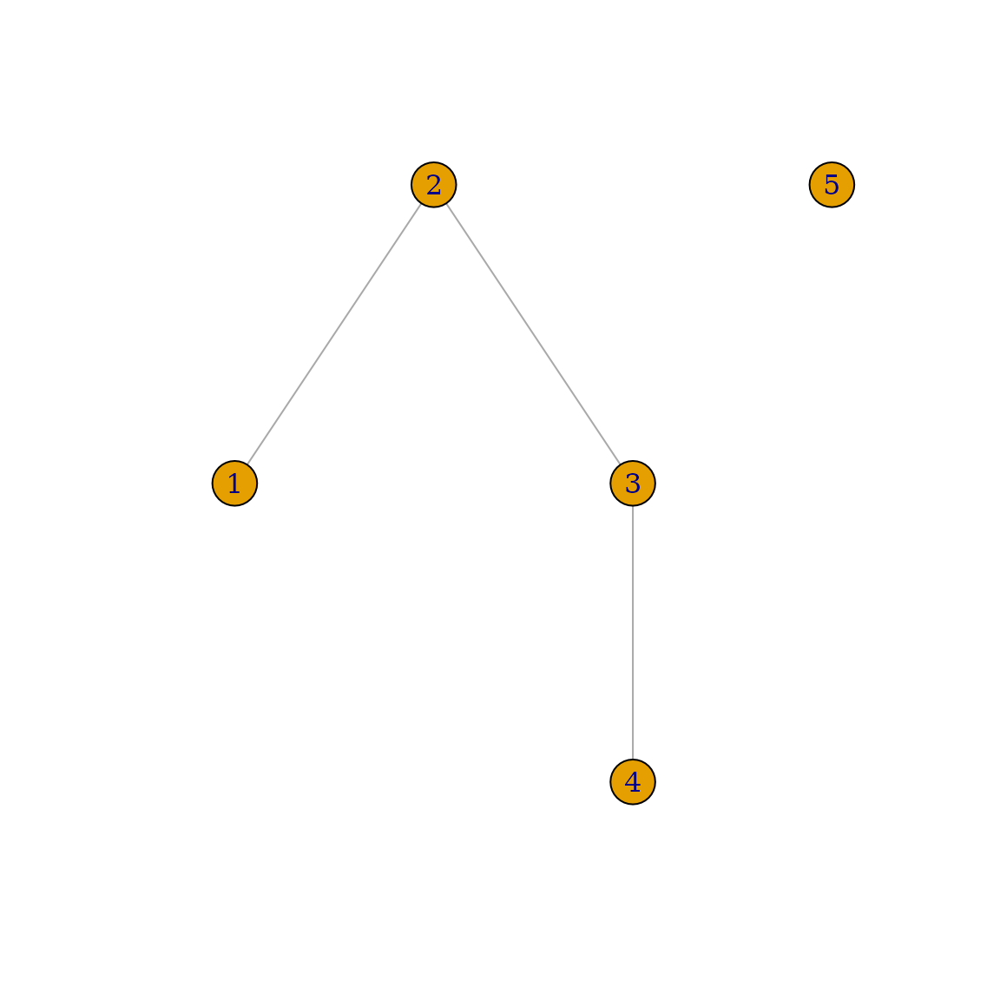
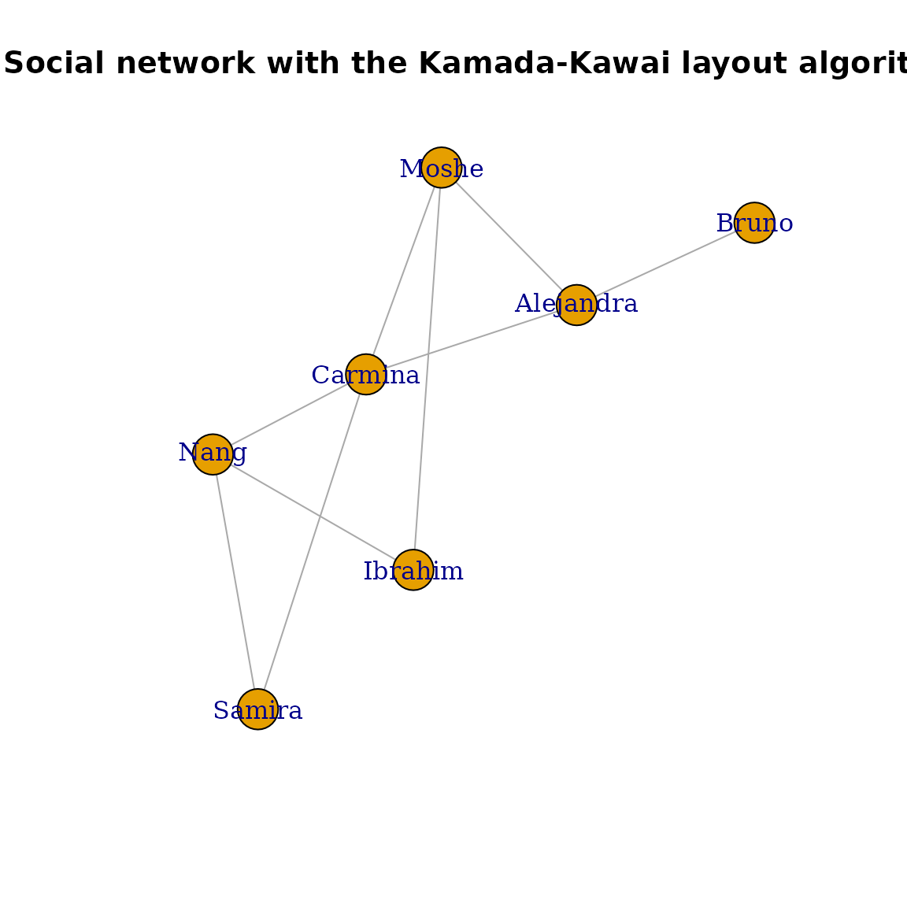
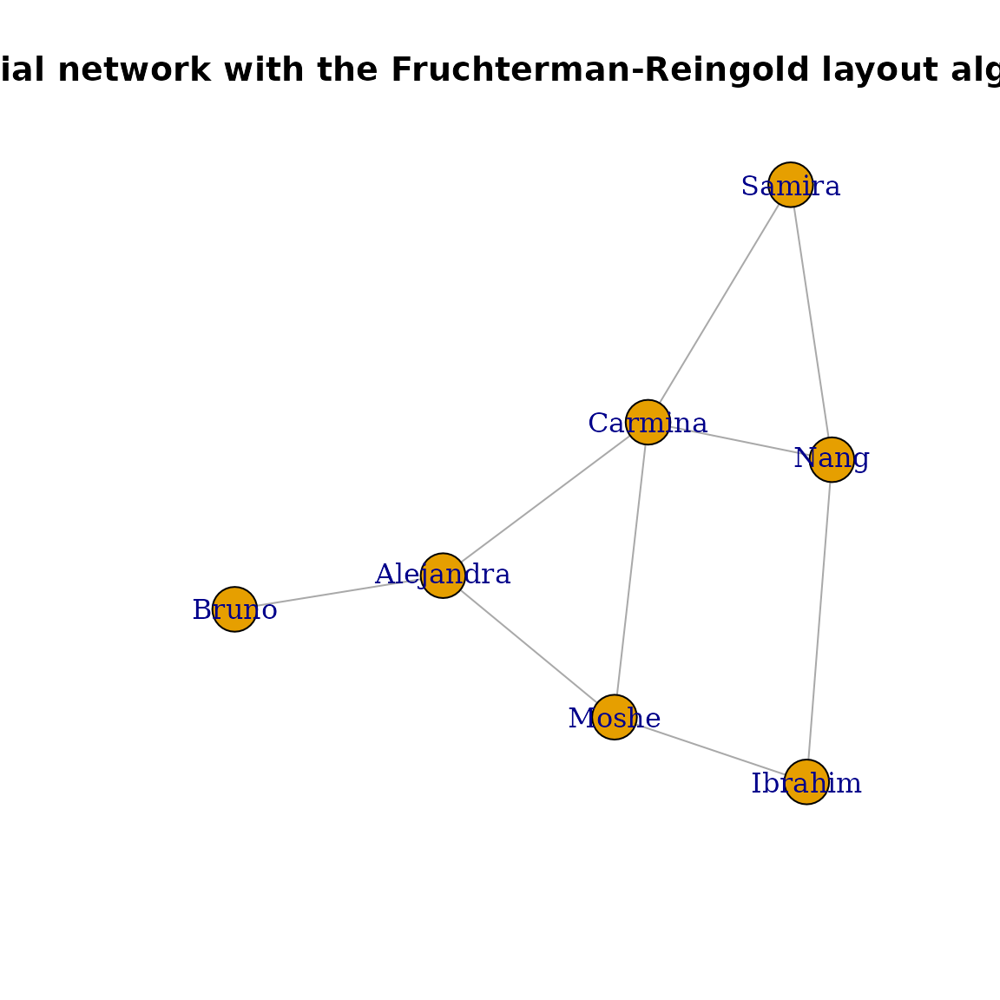
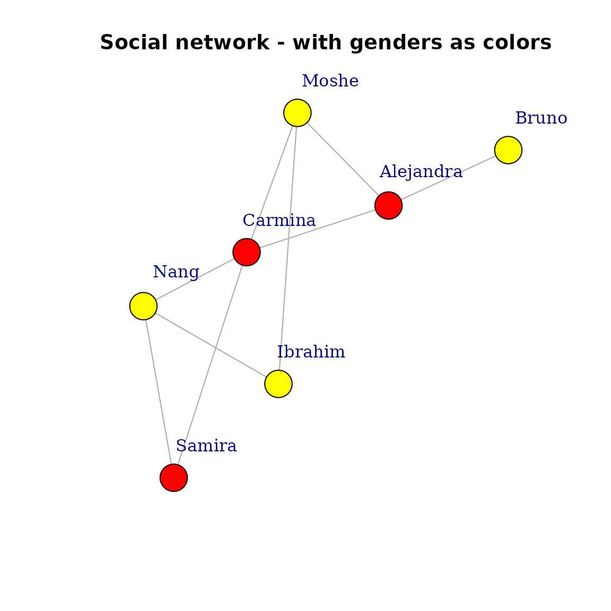
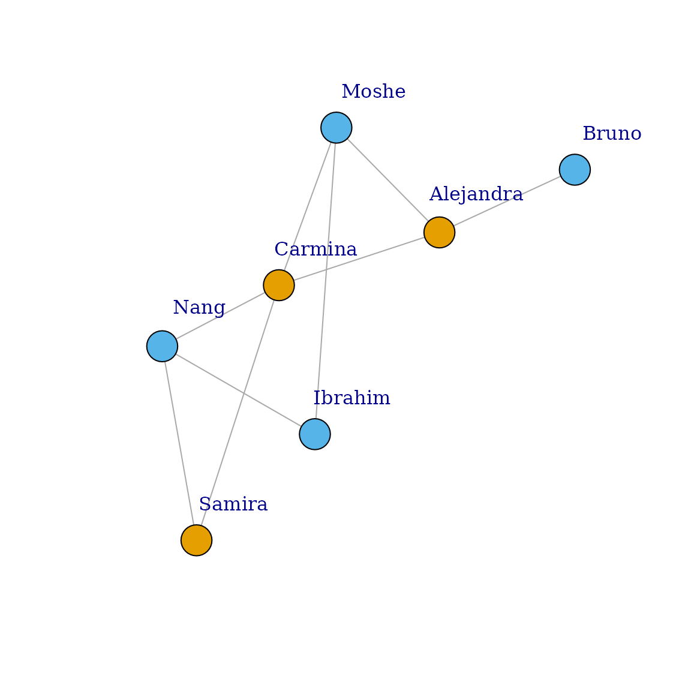
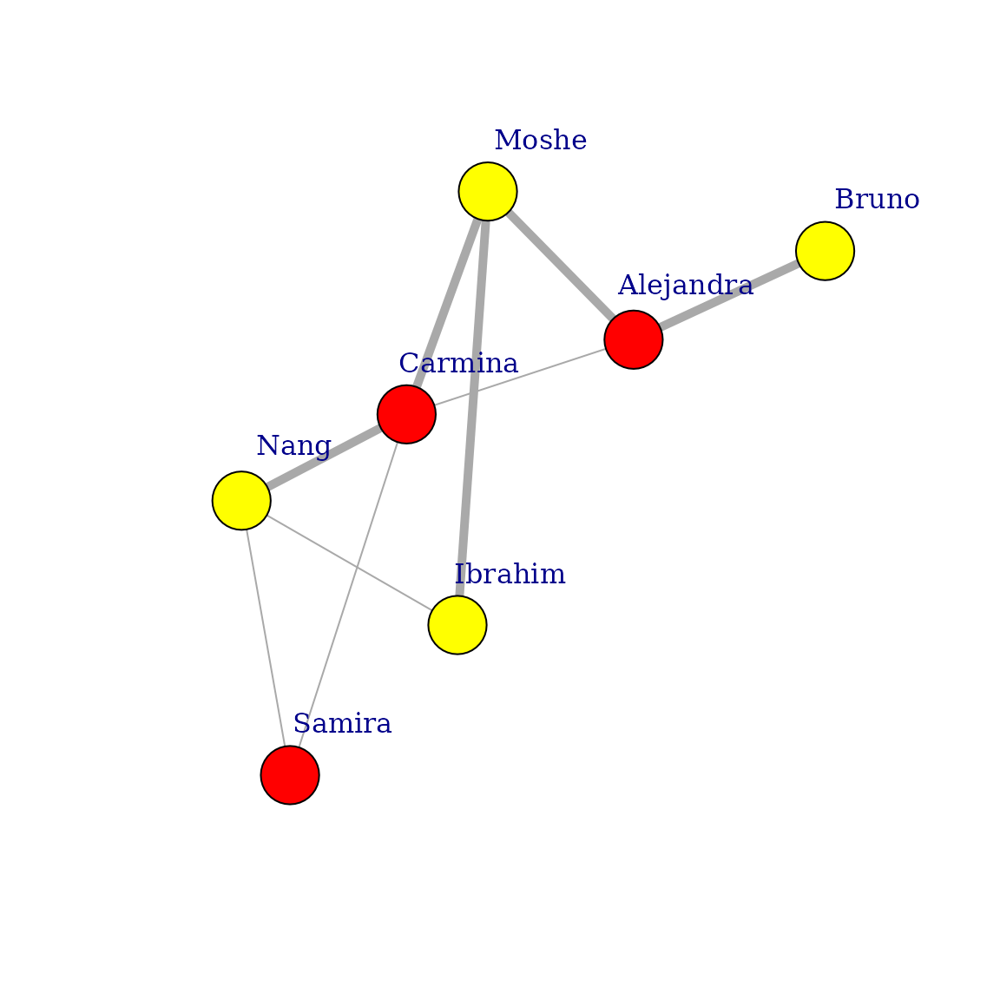

# igraph (R interface)

`igraph` is a fast and open source library for the analysis of graphs or
networks. The library consists of a core written in C and bindings for
high-level languages including [R](https://r.igraph.org/),
[Python](https://python.igraph.org/en/stable/), and
[Mathematica](http://szhorvat.net/pelican/igraphm-a-mathematica-interface-for-igraph.md).
This vignette aims to give you an overview of the functions available in
the R interface of `igraph`. For detailed function by function API
documentation, check out <https://r.igraph.org/reference/>.

------------------------------------------------------------------------

**NOTE:** Throughout this tutorial, we will use words `graph` and
`network` as synonyms, and also `vertex` or `node` as synonyms.

------------------------------------------------------------------------

## Installation

To install the library from CRAN, use:

``` r
install.packages("igraph")
```

More details on dependencies, requirements, and troubleshooting on
installation are found on the main [documentation
page](https://r.igraph.org/).

## Usage

To use `igraph` in your R code, you must first load the library:

``` r
library("igraph")
```

    ## 
    ## Attaching package: 'igraph'

    ## The following objects are masked from 'package:stats':
    ## 
    ##     decompose, spectrum

    ## The following object is masked from 'package:base':
    ## 
    ##     union

Now you have all `igraph` functions available.

## Creating a graph

`igraph` offers many ways to create a graph. The simplest one is the
function
[`make_empty_graph()`](https://r.igraph.org/reference/make_empty_graph.md):

``` r
g <- make_empty_graph()
```

The most common way to create a graph is
[`make_graph()`](https://r.igraph.org/reference/make_graph.md), which
constructs a network based on specified edges. For example, to make a
graph with 10 nodes (numbered `1` to `10`) and two edges connecting
nodes `1-2` and `1-5`:

``` r
g <- make_graph(edges = c(1, 2, 1, 5), n = 10, directed = FALSE)
```

Starting from igraph 0.8.0, you can also include literal here, via
igraph’s formula notation. In this case, the first term of the formula
has to start with a `~` character, just like regular formulae in R. The
expressions consist of vertex names and edge operators. An edge operator
is a sequence of `-` and `+` characters, the former is for the edges and
the latter is used for arrow heads. The edges can be arbitrarily long,
that is to say, you may use as many `-` characters to “draw” them as you
like. If all edge operators consist of only `-` characters then the
graph will be undirected, whereas a single `+` character implies a
directed graph: that is to say to create the same graph as above:

``` r
g <- make_graph(~ 1--2, 1--5, 3, 4, 5, 6, 7, 8, 9, 10)
```

We can print the graph to get a summary of its nodes and edges:

``` r
g
```

    ## IGRAPH 3a0b33d UN-- 10 2 -- 
    ## + attr: name (v/c)
    ## + edges from 3a0b33d (vertex names):
    ## [1] 1--2 1--5

This means: **U**ndirected **N**amed graph with **10** vertices and
**2** edges, with the exact edges listed out. If the graph has a
`[name]` attribute, it is printed as well.

------------------------------------------------------------------------

**NOTE**: [`summary()`](https://rdrr.io/r/base/summary.html) does not
list the edges, which is convenient for large graphs with millions of
edges:

------------------------------------------------------------------------

``` r
summary(g)
```

    ## IGRAPH 3a0b33d UN-- 10 2 -- 
    ## + attr: name (v/c)

The same function
[`make_graph()`](https://r.igraph.org/reference/make_graph.md) can
create some notable graphs by just specifying their name. For example
you can create the graph that represents the social network of Zachary’s
karate club, that shows the friendship between 34 members of a karate
club at a US university in the 1970s:

``` r
g <- make_graph("Zachary")
```

To visualize a graph you can use
[`plot()`](https://rdrr.io/r/graphics/plot.default.html):

``` r
plot(g)
```


A more detailed description of plotting options is provided later on in
this tutorial.

## Vertex and edge IDs

Vertices and edges have numerical vertex IDs in igraph. Vertex IDs are
always consecutive and they start with 1. For a graph with n vertices
the vertex IDs are always between 1 and n. If some operation changes the
number of vertices in the graphs, for instance a subgraph is created via
[`induced_subgraph()`](https://r.igraph.org/reference/subgraph.md), then
the vertices are renumbered to satisfy this criterion.

The same is true for the edges as well: edge IDs are always between 1
and m, the total number of edges in the graph.

------------------------------------------------------------------------

**NOTE**: If you are familiar with the C core or the
[Python](https://python.igraph.org/en/stable/) interface of `igraph`,
you might have noticed that in those languages vertex and edge IDs start
from 0. In the R interface, both start from 1 instead, to keep
consistent with the convention in each language.

------------------------------------------------------------------------

In addition to IDs, vertices and edges can be assigned a name and other
attributes. That makes it easier to track them whenever the graph is
altered. Examples of this pattern are shown later on in this tutorial.

## Adding/deleting vertices and edges

Let’s continue working with the Karate club graph. To add one or more
vertices to an existing graph, use
[`add_vertices()`](https://r.igraph.org/reference/add_vertices.md):

``` r
g <- add_vertices(g, 3)
```

Similarly, to add edges you can use
[`add_edges()`](https://r.igraph.org/reference/add_edges.md):

``` r
g <- add_edges(g, edges = c(1, 35, 1, 36, 34, 37))
```

Edges are added by specifying the source and target vertex IDs for each
edge. This call added three edges, one connecting vertices `1` and `35`,
one connecting vertices `1` and `36`, and one connecting vertices `34`
and `37`.

In addition to the
[`add_vertices()`](https://r.igraph.org/reference/add_vertices.md) and
[`add_edges()`](https://r.igraph.org/reference/add_edges.md) functions,
the plus operator can be used to add vertices or edges to graph. The
actual operation that is performed depends on the type of the right hand
side argument:

``` r
g <- g + edges(c(1, 35, 1, 36, 34, 37))
```

You can add a single vertex/edge at a time using `add_vertex()` and
`add_edge()` (singular).

**Warning**: If you need to add multiple edges to a graph, it is much
more efficient to call
[`add_edges()`](https://r.igraph.org/reference/add_edges.md) once rather
than repeatedly calling `add_edge()` with a single new edge. The same
applies when deleting edges and vertices.

If you try to add edges to vertices with invalid IDs (i.e., you try to
add an edge to vertex `38` when the graph has only 37 vertices),
`igraph` shows an error:

``` r
g <- add_edges(g, edges = c(38, 37))
```

    ## Error in add_edges(g, edges = c(38, 37)): At vendor/cigraph/src/graph/type_indexededgelist.c:261 : Out-of-range vertex IDs when adding edges. Invalid vertex ID

Let us add some more vertices and edges to our graph. In `igraph` we can
use the `magrittr` package, which provides a mechanism for chaining
commands with the operator `%>%`:

``` r
g <- g %>%
  add_edges(edges = c(1, 34)) %>%
  add_vertices(3) %>%
  add_edges(edges = c(38, 39, 39, 40, 40, 38, 40, 37))
g
```

    ## IGRAPH 5f77371 U--- 40 86 -- Zachary
    ## + attr: name (g/c)
    ## + edges from 5f77371:
    ##  [1]  1-- 2  1-- 3  1-- 4  1-- 5  1-- 6  1-- 7  1-- 8  1-- 9  1--11  1--12
    ## [11]  1--13  1--14  1--18  1--20  1--22  1--32  2-- 3  2-- 4  2-- 8  2--14
    ## [21]  2--18  2--20  2--22  2--31  3-- 4  3-- 8  3--28  3--29  3--33  3--10
    ## [31]  3-- 9  3--14  4-- 8  4--13  4--14  5-- 7  5--11  6-- 7  6--11  6--17
    ## [41]  7--17  9--31  9--33  9--34 10--34 14--34 15--33 15--34 16--33 16--34
    ## [51] 19--33 19--34 20--34 21--33 21--34 23--33 23--34 24--26 24--28 24--33
    ## [61] 24--34 24--30 25--26 25--28 25--32 26--32 27--30 27--34 28--34 29--32
    ## [71] 29--34 30--33 30--34 31--33 31--34 32--33 32--34 33--34  1--35  1--36
    ## + ... omitted several edges

We now have an undirected graph with 40 vertices and 86 edges. Vertex
and edge IDs are always *contiguous*, so if you delete a vertex all
subsequent vertices will be renumbered. When a vertex is renumbered,
edges are **not** renumbered, but their source and target vertices will
be. Use
[`delete_vertices()`](https://r.igraph.org/reference/delete_vertices.md)
and [`delete_edges()`](https://r.igraph.org/reference/delete_edges.md)
to perform these operations. For instance, to delete the edge connecting
vertices `1-34`, get its ID and then delete it:

``` r
edge_id_to_delete <- get_edge_ids(g, c(1, 34))
edge_id_to_delete
```

    ## [1] 82

``` r
g <- delete_edges(g, edge_id_to_delete)
```

As an example, to create a broken ring:

``` r
g <- make_ring(10) %>% delete_edges("10|1")
plot(g)
```


The example above shows that you can also refer to edges with strings
containing the IDs of the source and target vertices, connected by a
pipe symbol `|`. `"10|1"` in the above example means the edge that
connects vertex 10 to vertex 1. Of course you can also use the edge IDs
directly, or retrieve them with the
[`get_edge_ids()`](https://r.igraph.org/reference/get_edge_ids.md)
function:

``` r
g <- make_ring(5)
g <- delete_edges(g, get_edge_ids(g, c(1, 5, 4, 5)))
plot(g)
```



As another example, let’s make a chordal graph. Remember that a graph is
chordal (or triangulated) if each of its cycles of four or more nodes
has a chord, which is an edge joining two nodes that are not adjacent in
the cycle. First, let’s create the initial graph using
[`graph_from_literal()`](https://r.igraph.org/reference/graph_from_literal.md):

``` r
g1 <- graph_from_literal(
  A - B:C:I, B - A:C:D, 
  C - A:B:E:H, 
  D - B:E:F,
  E - C:D:F:H, 
  F - D:E:G, 
  G - F:H, 
  H - C:E:G:I,
  I - A:H
)
plot(g1)
```


In the example above, the `:` operator was used to define vertex sets.
If an edge operator connects two vertex sets, then every vertex from the
first set will be connected to every vertex in the second set. Then we
use [`is_chordal()`](https://r.igraph.org/reference/is_chordal.md) to
evaluate if our graph is chordal and to search what edges are missing to
fill-in the graph:

``` r
is_chordal(g1, fillin = TRUE)
```

    ## $chordal
    ## [1] FALSE
    ## 
    ## $fillin
    ##  [1] 2 6 8 7 5 7 2 7 6 1 7 1
    ## 
    ## $newgraph
    ## NULL

We can then add the edges required to make the initial graph chordal in
a single line:

``` r
chordal_graph <- add_edges(g1, is_chordal(g1, fillin = TRUE)$fillin)
plot(chordal_graph)
```


## Constructing graphs

In addition to
[`make_empty_graph()`](https://r.igraph.org/reference/make_empty_graph.md),
[`make_graph()`](https://r.igraph.org/reference/make_graph.md), and
`make_graph_from_literal()`, `igraph` includes many other function to
construct a graph. Some are *deterministic*, that is to say they produce
the same graph each single time, for instance
[`make_tree()`](https://r.igraph.org/reference/make_tree.md):

``` r
graph1 <- make_tree(127, 2, mode = "undirected")
summary(graph1)
```

    ## IGRAPH d2246c3 U--- 127 126 -- Tree
    ## + attr: name (g/c), children (g/n), mode (g/c)

This generates a regular tree graph with 127 vertices, each vertex
having two children. No matter how many times you call
[`make_tree()`](https://r.igraph.org/reference/make_tree.md), the
generated graph will always be the same if you use the same parameters:

``` r
graph2 <- make_tree(127, 2, mode = "undirected")
```

``` r
identical_graphs(graph1, graph2)
```

    ## [1] TRUE

Other functions generate graphs *stochastically*, which means they
produce a different graph each time. For instance
[`sample_grg()`](https://r.igraph.org/reference/sample_grg.md):

``` r
graph1 <- sample_grg(100, 0.2)
summary(graph1)
```

    ## IGRAPH 56d6c6c U--- 100 499 -- Geometric random graph
    ## + attr: name (g/c), radius (g/n), torus (g/l)

This generates a geometric random graph: *n* points are chosen randomly
and uniformly inside the unit square and pairs of points closer to each
other than a predefined distance *d* are connected by an edge. If you
generate GRGs with the same parameters, they will be different:

``` r
graph2 <- sample_grg(100, 0.2)
identical_graphs(graph1, graph2)
```

    ## [1] FALSE

A slightly looser way to check if the graphs are equivalent is via
`isomorphic`. Two graphs are said to be isomorphic if they have the same
number of components (vertices and edges) and maintain a one-to-one
correspondence between vertices and edges, that is to say, they are
connected in the same way.

``` r
isomorphic(graph1, graph2)
```

    ## [1] FALSE

Checking for isomorphism can take a while for large graphs (in this
case, the answer can quickly be given by checking the degree sequence of
the two graphs). `identical_graph()` is a stricter criterion than
[`isomorphic()`](https://r.igraph.org/reference/isomorphic.md): the two
graphs must have the same list of vertices and edges, in exactly the
same order, with same directedness, and the two graphs must also have
identical graph, vertex and edge attributes.

## Setting and retrieving attributes

In addition to IDs, vertex and edges can have *attributes* such as a
name, coordinates for plotting, metadata, and weights. The graph itself
can have such attributes too (for instance a name, which will show in
[`summary()`](https://rdrr.io/r/base/summary.html)). In a sense, every
graph, vertex and edge can be used as an R namespace to store and
retrieve these attributes.

To demonstrate the use of attributes, let us create a simple social
network:

``` r
g <- make_graph(
  ~ Alice - Boris:Himari:Moshe, Himari - Alice:Nang:Moshe:Samira,
  Ibrahim - Nang:Moshe, Nang - Samira
)
```

Each vertex represents a person, so we want to store ages, genders and
types of connection between two people (`is_formal()` refers to whether
a connection between one person or another is formal or informal,
respectively colleagues or friends). The `$` operator is a shortcut to
get and set graph attributes. It is shorter and just as readable as
[`graph_attr()`](https://r.igraph.org/reference/graph_attr.md) and
[`set_graph_attr()`](https://r.igraph.org/reference/set_graph_attr.md).

``` r
V(g)$age <- c(25, 31, 18, 23, 47, 22, 50)
V(g)$gender <- c("f", "m", "f", "m", "m", "f", "m")
E(g)$is_formal <- c(FALSE, FALSE, TRUE, TRUE, TRUE, FALSE, TRUE, FALSE, FALSE)
summary(g)
```

    ## IGRAPH da70fd7 UN-- 7 9 -- 
    ## + attr: name (v/c), age (v/n), gender (v/c), is_formal (e/l)

[`V()`](https://r.igraph.org/reference/V.md) and
[`E()`](https://r.igraph.org/reference/E.md) are the standard way to
obtain a sequence of all vertices and edges, respectively. This assigns
an attribute to *all* vertices/edges at once. Another way to generate
our social network is with the use of
[`set_vertex_attr()`](https://r.igraph.org/reference/set_vertex_attr.md)
and [`set_edge_attr()`](https://r.igraph.org/reference/set_edge_attr.md)
and the operator `%>%`:

``` r
g <- make_graph(
  ~ Alice - Boris:Himari:Moshe, Himari - Alice:Nang:Moshe:Samira,
  Ibrahim - Nang:Moshe, Nang - Samira
) %>%
  set_vertex_attr("age", value = c(25, 31, 18, 23, 47, 22, 50)) %>%
  set_vertex_attr("gender", value = c("f", "m", "f", "m", "m", "f", "m")) %>%
  set_edge_attr("is_formal", value = c(FALSE, FALSE, TRUE, TRUE, TRUE, FALSE, TRUE, FALSE, FALSE))
summary(g)
```

To assign or modify an attribute for a single vertex/edge:

``` r
E(g)$is_formal
```

    ## [1] FALSE FALSE  TRUE  TRUE  TRUE FALSE  TRUE FALSE FALSE

``` r
E(g)$is_formal[1] <- TRUE
E(g)$is_formal
```

    ## [1]  TRUE FALSE  TRUE  TRUE  TRUE FALSE  TRUE FALSE FALSE

Attribute values can be set to any R object, but note that storing the
graph in some file formats might result in the loss of complex attribute
values. Vertices, edges and the graph itself can all be used to set
attributes, for instance to add a date to the graph:

``` r
g$date <- c("2022-02-11")
graph_attr(g, "date")
```

    ## [1] "2022-02-11"

To retrieve attributes, you can also use
[`graph_attr()`](https://r.igraph.org/reference/graph_attr.md),
[`vertex_attr()`](https://r.igraph.org/reference/vertex_attr.md), and
[`edge_attr()`](https://r.igraph.org/reference/edge_attr.md). To find
the ID of a vertex you can use the function
[`match()`](https://rdrr.io/r/base/match.html):

``` r
match(c("Ibrahim"), V(g)$name)
```

    ## [1] 7

To assign attributes to a subset of vertices or edges, you can use:

``` r
V(g)$name[1:3] <- c("Alejandra", "Bruno", "Carmina")
V(g)
```

    ## + 7/7 vertices, named, from da70fd7:
    ## [1] Alejandra Bruno     Carmina   Moshe     Nang      Samira    Ibrahim

To delete attributes:

``` r
g <- delete_vertex_attr(g, "gender")
V(g)$gender
```

    ## NULL

If you want to save a graph in R with all the attributes use
[`saveRDS()`](https://rdrr.io/r/base/readRDS.html) (and then
[`readRDS()`](https://rdrr.io/r/base/readRDS.html) to retrieve it).

## Structural properties of graphs

`igraph` provides a large set of functions to calculate various
structural properties of graphs. It is beyond the scope of this tutorial
to document all of them, hence this section will only introduce a few of
them for illustrative purposes. We will work on the small social network
constructed in the previous section.

Perhaps the simplest property one can think of is the *degree*. The
degree of a vertex equals the number of edges adjacent to it. In case of
directed networks, we can also define *in-degree* (the number of edges
pointing towards the vertex) and *out-degree* (the number of edges
originating from the vertex). `igraph` is able to calculate all of them
using a simple syntax:

``` r
degree(g)
```

    ## Alejandra     Bruno   Carmina     Moshe      Nang    Samira   Ibrahim 
    ##         3         1         4         3         3         2         2

If the graph was directed, we would have been able to calculate the in-
and out-degrees separately using `degree(mode = "in")` and
`degree(mode = "out")`. You can also pass a single vertex ID or a list
of vertex IDs to [`degree()`](https://r.igraph.org/reference/degree.md)
if you want to calculate the degrees for only a subset of vertices:

``` r
degree(g, 7)
```

    ## Ibrahim 
    ##       2

``` r
degree(g, v = c(3, 4, 5))
```

    ## Carmina   Moshe    Nang 
    ##       4       3       3

Most functions that accept vertex IDs also accept vertex *names* (the
values of the `name` vertex attribute) as long as the names are unique:

``` r
degree(g, v = c("Carmina", "Moshe", "Nang"))
```

    ## Carmina   Moshe    Nang 
    ##       4       3       3

It also works for single vertices:

``` r
degree(g, "Bruno")
```

    ## Bruno 
    ##     1

A similar syntax is used for most of the structural properties `igraph`
can calculate. For vertex properties, the functions accept a vertex ID,
a vertex name, or a list of vertex IDs or names (and if they are
omitted, the default is the set of all vertices). For edge properties,
the functions accept a single edge ID or a list of edge IDs.

------------------------------------------------------------------------

**NOTE:** For some measures, it does not make sense to calculate them
only for a few vertices or edges instead of the whole graph, as it would
take the same time anyway. In this case, the functions won’t accept
vertex or edge IDs, but you can still restrict the resulting list later
using standard operations. One such example is eigenvector centrality
([`evcent()`](https://r.igraph.org/reference/evcent.md)).

------------------------------------------------------------------------

Besides degree, igraph includes built-in routines to calculate many
other centrality properties, including vertex and edge betweenness
([`edge_betweenness()`](https://r.igraph.org/reference/betweenness.md))
or Google’s PageRank
([`page_rank()`](https://r.igraph.org/reference/page_rank.md)) just to
name a few. Here we just illustrate edge betweenness:

``` r
edge_betweenness(g)
```

    ## [1] 6 6 4 3 4 4 4 2 3

Now we can also figure out which connections have the highest
betweenness centrality:

``` r
ebs <- edge_betweenness(g)
as_edgelist(g)[ebs == max(ebs), ]
```

    ##      [,1]        [,2]     
    ## [1,] "Alejandra" "Bruno"  
    ## [2,] "Alejandra" "Carmina"

## Querying vertices and edges based on attributes

### Selecting vertices

Imagine that in a given social network, you want to find out who has the
largest degree. You can do that with the tools presented so far and the
[`which.max()`](https://rdrr.io/r/base/which.min.html) function:

``` r
which.max(degree(g))
```

    ## Carmina 
    ##       3

Another example would be to select only vertices that have only odd IDs
but not even ones, using the
[`V()`](https://r.igraph.org/reference/V.md) function:

``` r
graph <- graph.full(n = 10)
```

    ## Warning: `graph.full()` was deprecated in igraph 2.1.0.
    ## ℹ Please use `make_full_graph()` instead.
    ## This warning is displayed once every 8 hours.
    ## Call `lifecycle::last_lifecycle_warnings()` to see where this warning was
    ## generated.

``` r
only_odd_vertices <- which(V(graph) %% 2 == 1)
length(only_odd_vertices)
```

    ## [1] 5

Of course, it is possible to select vertices or edges by positional
indices:

``` r
seq <- V(graph)[2, 3, 7]
seq
```

    ## + 3/10 vertices, from b5014ba:
    ## [1] 2 3 7

``` r
seq <- seq[1, 3] # filtering an existing vertex set
seq
```

    ## + 2/10 vertices, from b5014ba:
    ## [1] 2 7

Selecting a vertex that does not exist results in an error:

``` r
seq <- V(graph)[2, 3, 7, "foo", 3.5]
## Error in simple_vs_index(x, ii, na_ok) : Unknown vertex selected
```

Attribute names can also be used as-is within the indexing brackets of
[`V()`](https://r.igraph.org/reference/V.md) and
[`E()`](https://r.igraph.org/reference/E.md). This can be combined with
R’s ability to use Boolean vectors for indexing to obtain very concise
and readable expressions to retrieve a subset of the vertex or edge set
of a graph. For instance, the following command gives you the names of
the individuals younger than 30 years in our social network:

``` r
V(g)[age < 30]$name
```

    ## [1] "Alejandra" "Carmina"   "Moshe"     "Samira"

Of course, `<` is not the only boolean operator that can be used for
this. Other possibilities include the following:

| Operator | Meaning                                                         |
|----------|-----------------------------------------------------------------|
| `==`     | The attribute/property value must be *equal to*                 |
| `!=`     | The attribute/property value must *not be equal to*             |
| `<`      | The attribute/property value must be *less than*                |
| `<=`     | The attribute/property value must be *less than or equal to*    |
| `>`      | The attribute/property value must be *greater than*             |
| `>=`     | The attribute/property value must be *greater than or equal to* |
| `%in%`   | The attribute/property value must be *included in*              |

You can also create a “not in” operator from `%in%` using the
[`Negate()`](https://rdrr.io/r/base/funprog.html) function:

``` r
`%notin%` <- Negate(`%in%`)
```

If an attribute has the same name as an `igraph` function, you should be
careful as the syntax can become a little confusing. For instance, if
there is an attribute named `degree` that represents the grades of an
exam for each person, that should not be confused with the `igraph`
function that computes the degrees of vertices in a network sense:

``` r
V(g)$degree <- c("A", "B", "B+", "A+", "C", "A", "B")
V(g)$degree[degree(g) == 3]
```

    ## [1] "A"  "A+" "C"

``` r
V(g)$name[degree(g) == 3]
```

    ## [1] "Alejandra" "Moshe"     "Nang"

### Selecting edges

Edges can be selected based on attributes just like vertices. As
mentioned above, the standard way to get edges is `E`. Moreover, there
are a few special structural properties for selecting edges.

Using [`.from()`](https://r.igraph.org/reference/inside-square-error.md)
allows you to filter the edge sequence based on the source vertices of
the edges. For instance, to select all the edges originating from
Carmina (who has vertex index 3):

``` r
E(g)[.from(3)]
```

    ## + 4/9 edges from da70fd7 (vertex names):
    ## [1] Alejandra--Carmina Carmina  --Moshe   Carmina  --Nang    Carmina  --Samira

Of course it also works with vertex names:

``` r
E(g)[.from("Carmina")]
```

    ## + 4/9 edges from da70fd7 (vertex names):
    ## [1] Alejandra--Carmina Carmina  --Moshe   Carmina  --Nang    Carmina  --Samira

Using [`.to()`](https://r.igraph.org/reference/inside-square-error.md)
filters edge sequences based on the target vertices. This is different
from [`.from()`](https://r.igraph.org/reference/inside-square-error.md)
if the graph is directed, while it gives the same answer for undirected
graphs. Using
[`.inc()`](https://r.igraph.org/reference/inside-square-error.md)
selects only those edges that are incident on a single vertex or at
least one of the vertices, irrespective of the edge directions.

The `%--%` operator can be used to select edges between specific groups
of vertices, ignoring edge directions in directed graphs. For instance,
the following expression selects all the edges between Carmina (vertex
index 3), Nang (vertex index 5) and Samira (vertex index 6):

``` r
E(g)[3:5 %--% 5:6]
```

    ## + 3/9 edges from da70fd7 (vertex names):
    ## [1] Carmina--Nang   Carmina--Samira Nang   --Samira

To make the `%--%` operator work with names, you can build string
vectors containing the names and then use these vectors as operands. For
instance, to select all the edges that connect men to women, we can do
the following after re-adding the gender attribute that we deleted
earlier:

``` r
V(g)$gender <- c("f", "m", "f", "m", "m", "f", "m")
```

``` r
men <- V(g)[gender == "m"]$name
men
```

    ## [1] "Bruno"   "Moshe"   "Nang"    "Ibrahim"

``` r
women <- V(g)[gender == "f"]$name
women
```

    ## [1] "Alejandra" "Carmina"   "Samira"

``` r
E(g)[men %--% women]
```

    ## + 5/9 edges from da70fd7 (vertex names):
    ## [1] Alejandra--Bruno  Alejandra--Moshe  Carmina  --Moshe  Carmina  --Nang  
    ## [5] Nang     --Samira

## Treating a graph as an adjacency matrix

The adjacency matrix is another way to represent a graph. In an
adjacency matrix, rows and columns are labeled by graph vertices, and
the elements of the matrix indicate the number of edges between vertices
*i* and *j*. The adjacency matrix for the example graph is:

``` r
as_adjacency_matrix(g)
```

    ## 7 x 7 sparse Matrix of class "dgCMatrix"
    ##           Alejandra Bruno Carmina Moshe Nang Samira Ibrahim
    ## Alejandra         .     1       1     1    .      .       .
    ## Bruno             1     .       .     .    .      .       .
    ## Carmina           1     .       .     1    1      1       .
    ## Moshe             1     .       1     .    .      .       1
    ## Nang              .     .       1     .    .      1       1
    ## Samira            .     .       1     .    1      .       .
    ## Ibrahim           .     .       .     1    1      .       .

For example, Carmina (`1, 0, 0, 1, 1, 1, 0`) is directly connected to
Alejandra (who has vertex index 1), Moshe (index 4), Nang (index 5) and
Samira (index 6), but not to Bruno (index 2) or to Ibrahim (index 7).

## Layouts and plotting

A graph is an abstract mathematical object without a specific
representation in 2D, 3D or any other geometric space. This means that
whenever we want to visualise a graph, we have to find a mapping from
vertices to coordinates in two- or three-dimensional space first,
preferably in a way that is useful and/or pleasing for the eye. A
separate branch of graph theory, namely graph drawing, tries to solve
this problem via several graph layout algorithms. igraph implements
quite a few layout algorithms and is also able to draw them onto the
screen or to any output format that R itself supports.

### Layout algorithms

The layout functions in igraph always start with `layout`. The following
table summarises them:

| Method name        | Algorithm description                                                                                          |
|--------------------|----------------------------------------------------------------------------------------------------------------|
| `layout_randomly`  | Places the vertices completely randomly                                                                        |
| `layout_in_circle` | Deterministic layout that places the vertices on a circle                                                      |
| `layout_on_sphere` | Deterministic layout that places the vertices evenly on the surface of a sphere                                |
| `layout_with_drl`  | The Drl (Distributed Recursive Layout) algorithm for large graphs                                              |
| `layout_with_fr`   | Fruchterman-Reingold force-directed algorithm                                                                  |
| `layout_with_kk`   | Kamada-Kawai force-directed algorithm                                                                          |
| `layout_with_lgl`  | The LGL (Large Graph Layout) algorithm for large graphs                                                        |
| `layout_as_tree`   | Reingold-Tilford tree layout, useful for (almost) tree-like graphs                                             |
| `layout_nicely`    | Layout algorithm that automatically picks one of the other algorithms based on certain properties of the graph |

Layout algorithms can be called directly with a graph as its first
argument. They will return a matrix with two columns and as many rows as
the number of vertices in the graph; each row will correspond to the
position of a single vertex, ordered by vertex IDs. Some algorithms have
a 3D variant; in this case they return 3 columns instead of 2.

``` r
layout <- layout_with_kk(g)
```

Some layout algorithms take additional arguments; for instance, when
laying out a graph as a tree, it might make sense to specify which
vertex is to be placed at the root of the layout:

``` r
layout <- layout_as_tree(g, root = 2)
```

### Drawing a graph using a layout

We can plot our imaginary social network with the Kamada-Kawai layout
algorithm as follows:

``` r
layout <- layout_with_kk(g)
```

``` r
plot(g, layout = layout, main = "Social network with the Kamada-Kawai layout algorithm")
```



This should open a new window showing a visual representation of the
network. Remember that the exact placement of nodes may be different on
your machine since the layout is not deterministic.

The `layout` argument also accepts functions; in this case, the function
will be called with the graph as its first argument. This makes it
possible to just pass the name of a layout function directly, without
creating a layout variable:

``` r
plot(
  g,
  layout = layout_with_fr,
  main = "Social network with the Fruchterman-Reingold layout algorithm"
)
```



To improve the visuals, a trivial addition would be to color the
vertices according to the gender. We should also try to place the labels
slightly outside the vertices to improve readability:

``` r
V(g)$color <- ifelse(V(g)$gender == "m", "yellow", "red")
plot(
  g,
  layout = layout, vertex.label.dist = 3.5,
  main = "Social network - with genders as colors"
)
```



You can also treat the `gender` attribute as a factor and provide the
colors with an argument to
[`plot()`](https://rdrr.io/r/graphics/plot.default.html), which takes
precedence over the `color` vertex attribute. Colors will be assigned
automatically to levels of a factor:

``` r
plot(g, layout = layout, vertex.label.dist = 3.5, vertex.color = as.factor(V(g)$gender))
```



As seen above with the `vertex.color` argument, you can specify visual
properties as arguments to `plot` instead of using vertex or edge
attributes. The following plot shows the formal ties with thick lines
while informal ones with thin lines:

``` r
plot(g,
  layout = layout, vertex.label.dist = 3.5, vertex.size = 20,
  vertex.color = ifelse(V(g)$gender == "m", "yellow", "red"),
  edge.width = ifelse(E(g)$is_formal, 5, 1)
)
```



This latter approach is preferred if you want to keep the properties of
the visual representation of your graph separate from the graph itself.

In summary, there are special vertex and edge properties that correspond
to the visual representation of the graph. These attributes override the
default settings of igraph (i.e color, weight, name, shape, layout,
etc.). The following two tables summarise the most frequently used
visual attributes for vertices and edges, respectively:

### Vertex attributes controlling graph plots

| Attribute name | Keyword argument      | Purpose                                                                                                                                                                                                                                        |
|----------------|-----------------------|------------------------------------------------------------------------------------------------------------------------------------------------------------------------------------------------------------------------------------------------|
| `color`        | `vertex.color`        | Color of the vertex                                                                                                                                                                                                                            |
| `label`        | `vertex.label`        | Label of the vertex. They will be converted to character. Specify NA to omit vertex labels. The default vertex labels are the vertex ids.                                                                                                      |
| `label.cex`    | `vertex.label.cex`    | Font size of the vertex label, interpreted as a multiplicative factor, similarly to R’s `text` function                                                                                                                                        |
| `label.color`  | `vertex.label.color`  | Color of the vertex label                                                                                                                                                                                                                      |
| `label.degree` | `vertex.label.degree` | It defines the position of the vertex labels, relative to the center of the vertices. It is interpreted as an angle in radian, zero means ‘to the right’, and ‘pi’ means to the left, up is -pi/2 and down is pi/2. The default value is -pi/4 |
| `label.dist`   | `vertex.label.dist`   | Distance of the vertex label from the vertex itself, relative to the vertex size                                                                                                                                                               |
| `label.family` | `vertex.label.family` | Font family of the vertex, similarly to R’s `text` function                                                                                                                                                                                    |
| `label.font`   | `vertex.label.font`   | Font within the font family of the vertex, similarly to R’s `text` function                                                                                                                                                                    |
| `shape`        | `vertex.shape`        | The shape of the vertex, currently “circle”, “square”, “csquare”, “rectangle”, “crectangle”, “vrectangle”, “pie” (see vertex.shape.pie), ‘sphere’, and “none” are supported, and only by the plot.igraph command.                              |
| `size`         | `vertex.size`         | The size of the vertex, a numeric scalar or vector, in the latter case each vertex sizes may differ                                                                                                                                            |

### Edge attributes controlling graph plots

| Attribute name | Keyword argument    | Purpose                                                                                                                                                                                                                                                |
|----------------|---------------------|--------------------------------------------------------------------------------------------------------------------------------------------------------------------------------------------------------------------------------------------------------|
| `color`        | `edge.color`        | Color of the edge                                                                                                                                                                                                                                      |
| `curved`       | `edge.curved`       | A numeric value specifies the curvature of the edge; zero curvature means straight edges, negative values means the edge bends clockwise, positive values the opposite. TRUE means curvature 0.5, FALSE means curvature zero                           |
| `arrow.size`   | `edge.arrow.size`   | Currently this is a constant, so it is the same for every edge. If a vector is submitted then only the first element is used, that is to say if this is taken from an edge attribute then only the attribute of the first edge is used for all arrows. |
| `arrow.width`  | `edge.arrow.width`  | The width of the arrows. Currently this is a constant, so it is the same for every edge                                                                                                                                                                |
| `width`        | `edge.width`        | Width of the edge in pixels                                                                                                                                                                                                                            |
| `label`        | `edge.label`        | If specified, it adds a label to the edge.                                                                                                                                                                                                             |
| `label.cex`    | `edge.label.cex`    | Font size of the edge label, interpreted as a multiplicative factor, similarly to R’s `text` function                                                                                                                                                  |
| `label.color`  | `edge.label.color`  | Color of the edge label                                                                                                                                                                                                                                |
| `label.family` | `edge.label.family` | Font family of the edge, similarly to R’s `text` function                                                                                                                                                                                              |
| `label.font`   | `edge.label.font`   | Font within the font family of the edge, similarly to R’s `text` function                                                                                                                                                                              |

### Generic arguments of `plot()`

These settings can be specified as arguments to the `plot` function to
control the overall appearance of the plot.

| Keyword argument | Purpose                                                                                                                                                                                                                                                           |
|------------------|-------------------------------------------------------------------------------------------------------------------------------------------------------------------------------------------------------------------------------------------------------------------|
| `layout`         | The layout to be used. It can be an instance of `Layout`, a list of tuples containing X-Y coordinates, or the name of a layout algorithm. The default is `auto`, which selects a layout algorithm automatically based on the size and connectedness of the graph. |
| `margin`         | The amount of empty space below, over, at the left and right of the plot, it is a numeric vector of length four.                                                                                                                                                  |

## igraph and the outside world

No graph module would be complete without some kind of import/export
functionality that enables the package to communicate with external
programs and toolkits. `igraph` is no exception: it provides functions
to read the most common graph formats and to save graphs into files
obeying these format specifications. The main functions for reading and
writing from/to file are
[`read_graph()`](https://r.igraph.org/reference/read_graph.md) and
[`write_graph()`](https://r.igraph.org/reference/write_graph.md),
respectively. The following table summarises the formats igraph can read
or write:

| Format                                                                    | Short name  | Read function                                                                                                                                                                             | Write function                                     |
|---------------------------------------------------------------------------|-------------|-------------------------------------------------------------------------------------------------------------------------------------------------------------------------------------------|----------------------------------------------------|
| Adjacency list (a.k.a. [LGL](https://lgl.sourceforge.net/#FileFormat))    | `lgl`       | `read_graph(file, format = c("lgl"))`                                                                                                                                                     | `write_graph(graph, file, format = c("lgl"))`      |
| Adjacency matrix                                                          | `adjacency` | `graph_from_adjacency_matrix(adjmatrix, mode = c("directed", "undirected", "max", "min", "upper","lower", "plus"), weighted = NULL, diag = TRUE, add.colnames = NULL, add.rownames = NA)` | `as.matrix(graph, "adjacency")`                    |
| DIMACS                                                                    | `dimacs`    | `read_graph(file, format = c("dimacs"))`                                                                                                                                                  | `write_graph(graph, file, format = c("dimacs"))`   |
| Edge list                                                                 | `edgelist`  | `read_graph(file, format = c("edgelist"))`                                                                                                                                                | `write_graph(graph, file, format = c("edgelist"))` |
| [GraphViz](https://www.graphviz.org)                                      | `dot`       | not supported yet                                                                                                                                                                         | `write_graph(graph, file, format = c("dot"))`      |
| GML                                                                       | `gml`       | `read_graph(file, format = c("gml"))`                                                                                                                                                     | `write_graph(graph, file, format = c("gml"))`      |
| GraphML                                                                   | `graphml`   | `read_graph(file, format = c("graphml"))`                                                                                                                                                 | `write_graph(graph, file, format = c("graphml"))`  |
| LEDA                                                                      | `leda`      | not supported yet                                                                                                                                                                         | `write_graph(graph, file, format = c("leda"))`     |
| Labeled edgelist (a.k.a. [NCOL](https://lgl.sourceforge.net/#FileFormat)) | `ncol`      | `read_graph(file, format = c("ncol"))`                                                                                                                                                    | `write_graph(graph, file, format = c("ncol"))`     |
| [Pajek](http://mrvar.fdv.uni-lj.si/pajek/) format                         | `pajek`     | `read_graph(file, format = c("pajek"))`                                                                                                                                                   | `write_graph(graph, file, format = c("pajek"))`    |

------------------------------------------------------------------------

**NOTE:** Each file format has its own limitations. For instance, not
all of them can store attributes. Your best bet is probably GraphML or
GML if you want to save igraph graphs in a format that can be read from
an external package and you want to preserve numeric and string
attributes. Edge list and NCOL is also fine if you don’t have attributes
(NCOL supports vertex names and edge weights, though).

------------------------------------------------------------------------

## Where to go next

This tutorial is a brief introduction to `igraph` in R. We sincerely
hope you enjoyed reading it and that it will be useful for your own
network analyses.

For a detailed description of specific functions, see
<https://r.igraph.org/reference/>. For questions on how to use `igraph`,
please visit our [Forum](https://igraph.discourse.group). To report a
bug, open a [Github issue](https://github.com/igraph/rigraph/issues).
Please do not ask usage questions on Github directly as it’s meant for
developers rather than users.

## Session info

For the sake of reproducibility, the session information for the code
above is the following:

``` r
sessionInfo()
```

    ## R version 4.5.1 (2025-06-13)
    ## Platform: x86_64-pc-linux-gnu
    ## Running under: Ubuntu 24.04.3 LTS
    ## 
    ## Matrix products: default
    ## BLAS:   /usr/lib/x86_64-linux-gnu/openblas-pthread/libblas.so.3 
    ## LAPACK: /usr/lib/x86_64-linux-gnu/openblas-pthread/libopenblasp-r0.3.26.so;  LAPACK version 3.12.0
    ## 
    ## locale:
    ##  [1] LC_CTYPE=C.UTF-8       LC_NUMERIC=C           LC_TIME=C.UTF-8       
    ##  [4] LC_COLLATE=C.UTF-8     LC_MONETARY=C.UTF-8    LC_MESSAGES=C.UTF-8   
    ##  [7] LC_PAPER=C.UTF-8       LC_NAME=C              LC_ADDRESS=C          
    ## [10] LC_TELEPHONE=C         LC_MEASUREMENT=C.UTF-8 LC_IDENTIFICATION=C   
    ## 
    ## time zone: UTC
    ## tzcode source: system (glibc)
    ## 
    ## attached base packages:
    ## [1] stats     graphics  grDevices utils     datasets  methods   base     
    ## 
    ## other attached packages:
    ## [1] igraph_2.2.1
    ## 
    ## loaded via a namespace (and not attached):
    ##  [1] crayon_1.5.3       vctrs_0.6.5        cli_3.6.5          knitr_1.50        
    ##  [5] rlang_1.1.6        xfun_0.53          textshaping_1.0.4  jsonlite_2.0.0    
    ##  [9] glue_1.8.0         htmltools_0.5.8.1  ragg_1.5.0         sass_0.4.10       
    ## [13] rmarkdown_2.30     grid_4.5.1         evaluate_1.0.5     jquerylib_0.1.4   
    ## [17] fastmap_1.2.0      yaml_2.3.10        lifecycle_1.0.4    compiler_4.5.1    
    ## [21] fs_1.6.6           htmlwidgets_1.6.4  pkgconfig_2.0.3    lattice_0.22-7    
    ## [25] systemfonts_1.3.1  digest_0.6.37      R6_2.6.1           pillar_1.11.1     
    ## [29] magrittr_2.0.4     Matrix_1.7-3       bslib_0.9.0        tools_4.5.1       
    ## [33] pkgdown_2.1.3.9000 cachem_1.1.0       desc_1.4.3
