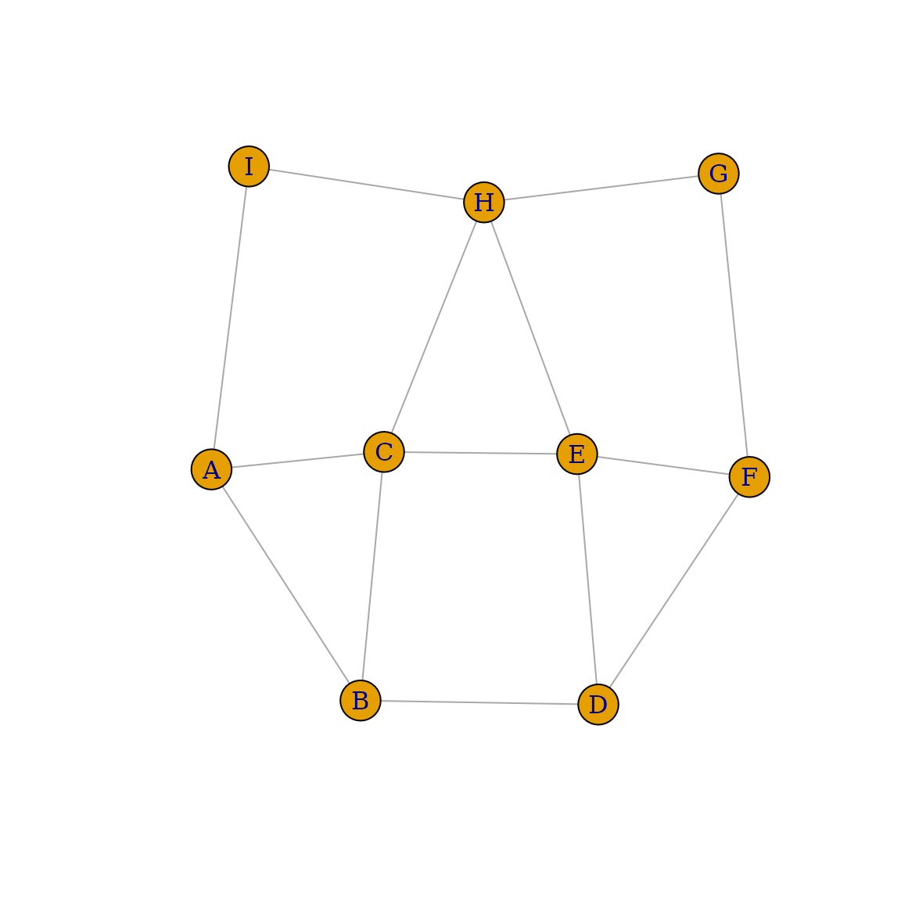
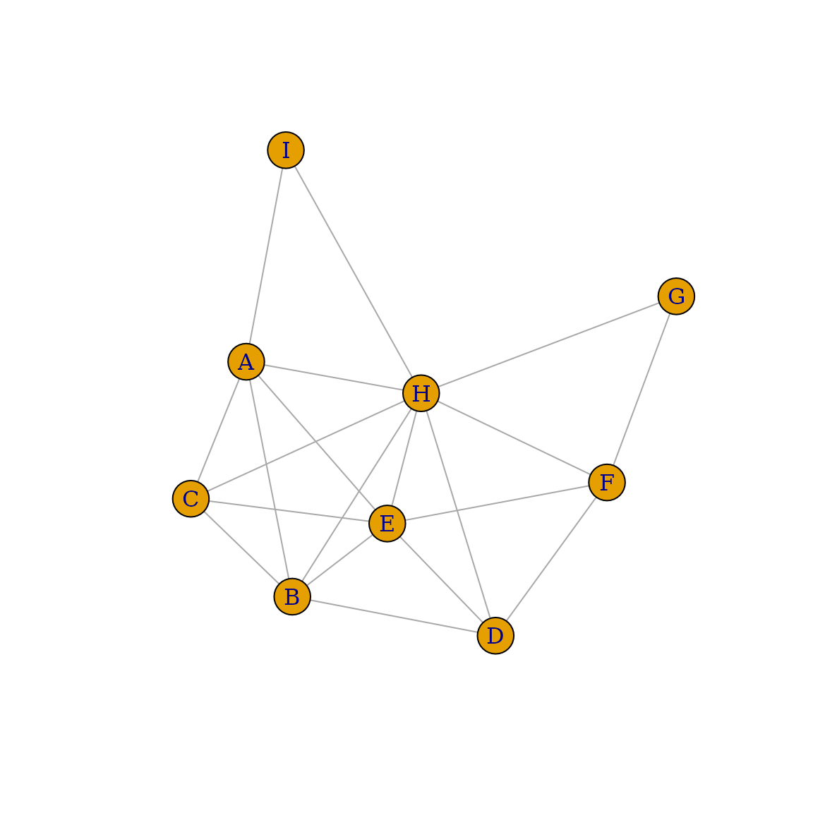
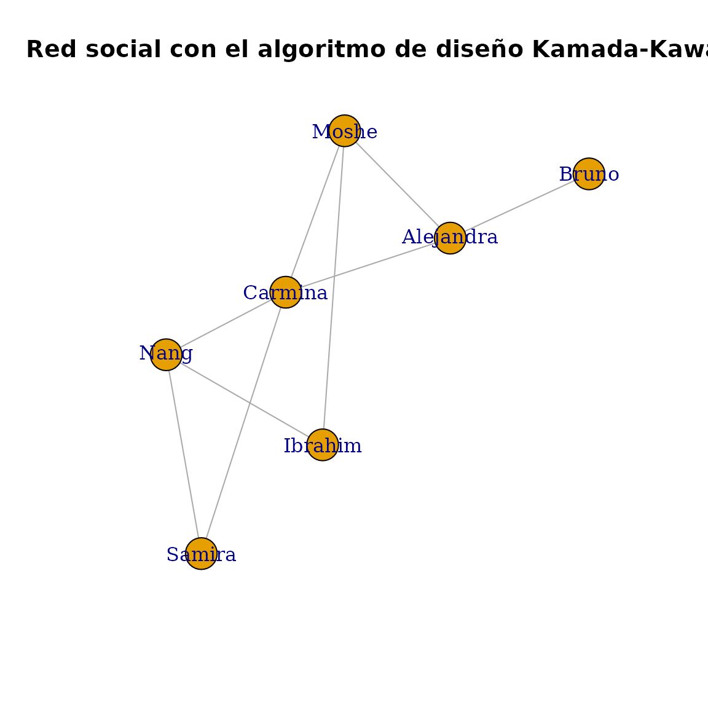
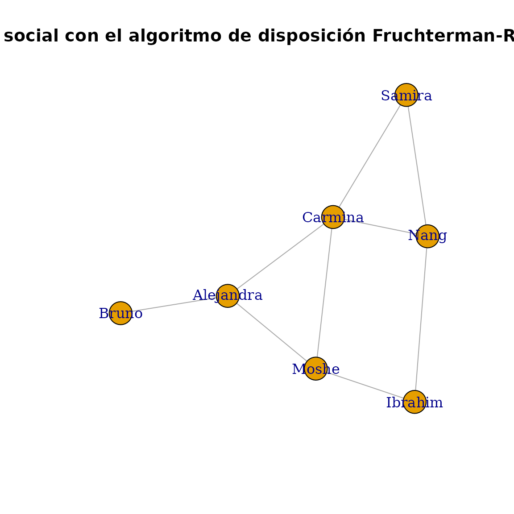
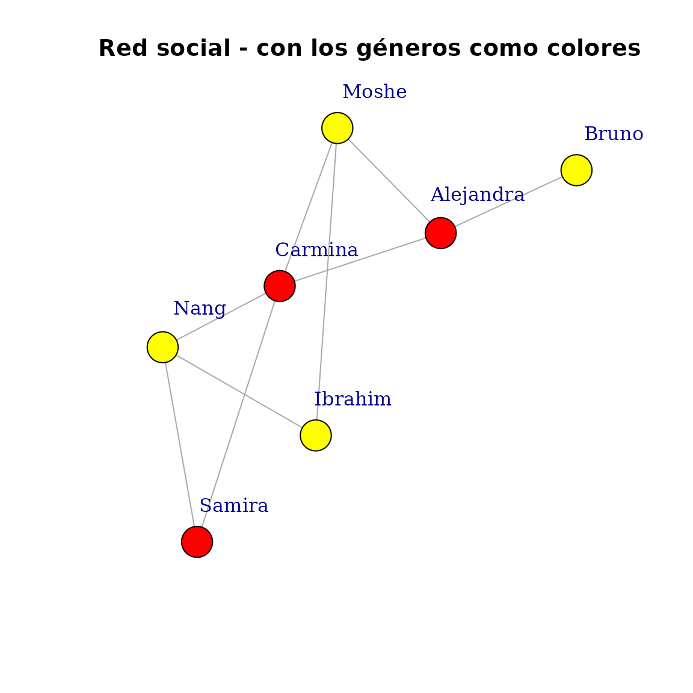
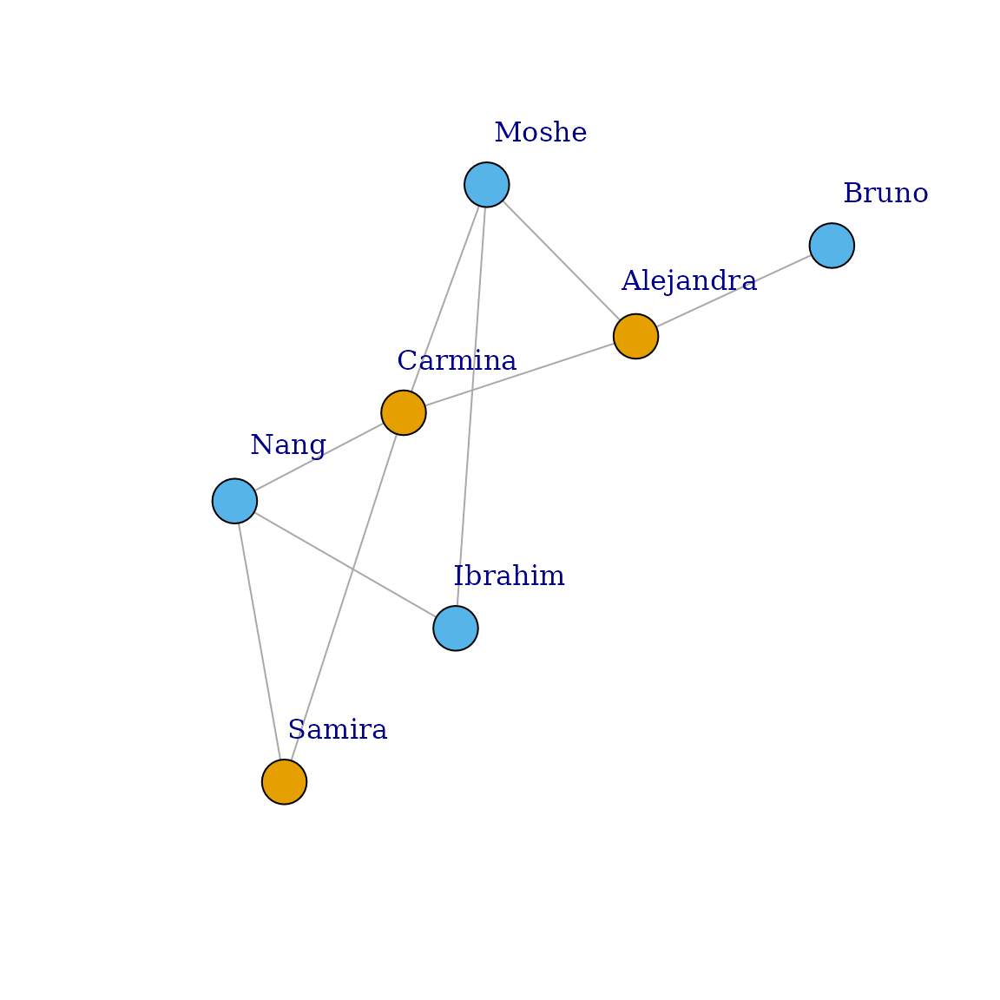
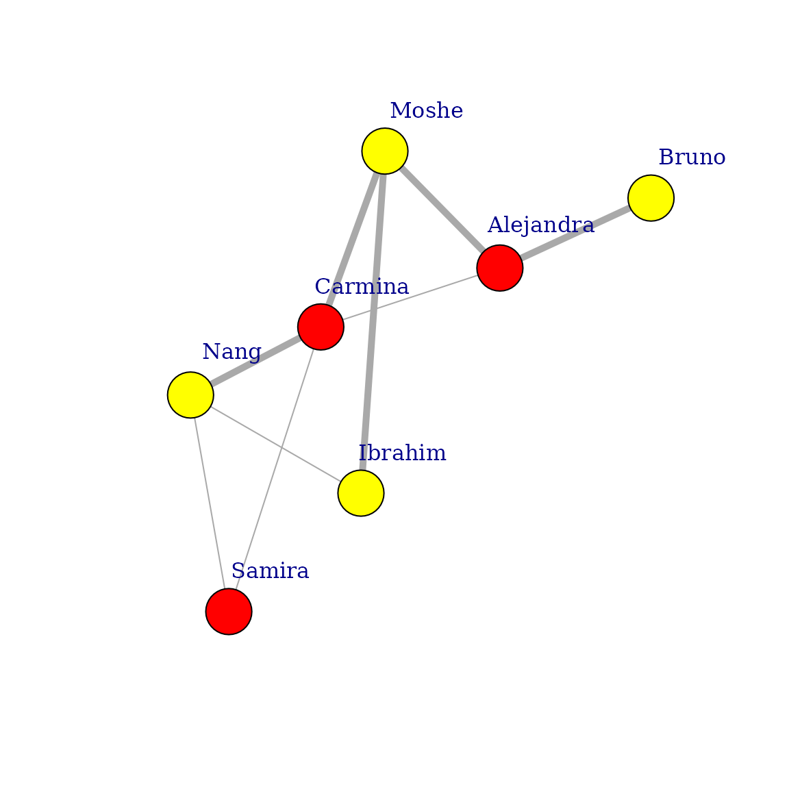

# igraph (interfaz R)

`igraph` es una biblioteca rápida y de código abierto para el análisis
de grafos o redes. El núcleo de ésta libreria se encuentra escrito en C
y contiene enlaces para lenguajes de alto nivel como
[R](https://r.igraph.org/), [Python](https://python.igraph.org/), y
[Mathematica](http://szhorvat.net/pelican/igraphm-a-mathematica-interface-for-igraph.md).
Esta viñeta pretende darte una visión general de las funciones
disponibles de `igraph` en R. Para obtener información detallada de cada
función, consulta <https://r.igraph.org/reference/>.

------------------------------------------------------------------------

**NOTA:** A lo largo de este tutorial, utilizaremos las palabras `grafo`
y `red` como sinónimos, y también `vértice` o `nodo` como sinónimos.

------------------------------------------------------------------------

## Instalación

Para instalar la librería desde CRAN, usa:

``` r
install.packages("igraph")
```

Encontrarás más información sobre dependencias, requisitos y resolución
de problemas sobre la instalación en la [página
principal](https://r.igraph.org/).

## Uso de igraph

Para utilizar `igraph` en tu código de R, primero debes cargar la
biblioteca:

``` r
library("igraph")
```

    ## 
    ## Attaching package: 'igraph'

    ## The following objects are masked from 'package:stats':
    ## 
    ##     decompose, spectrum

    ## The following object is masked from 'package:base':
    ## 
    ##     union

Ahora tienes todas las funciones de `igraph` disponibles.

## Crear un grafo

`igraph` ofrece muchas formas de crear un grafo. La más sencilla es con
la función
[`make_empty_graph()`](https://r.igraph.org/reference/make_empty_graph.md):

``` r
g <- make_empty_graph()
```

La forma más común de crear un grafo es con
[`make_graph()`](https://r.igraph.org/reference/make_graph.md), que
construye un grafo basado en especificar las aristas. Por ejemplo, Para
hacer un grafo con 10 nodos (numerados `1` a `10`) y dos aristas que
conecten los nodos `1-2` y `1-5`:

``` r
g <- make_graph(edges = c(1,2, 1,5), n=10, directed = FALSE)
```

A partir de igraph 0.8.0, también puedes incluir literales mediante la
notación de fórmulas de igraph. En este caso, el primer término de la
fórmula tiene que empezar con un carácter `~`, como comúnmente se usa en
las fórmulas en R. Las expresiones constan de los nombres de los
vértices y los operadores de las aristas. El operador de un arista es
una secuencia de caracteres `-` y `+`, el primero es para indicar
propiamente las aristas y el segundo para las puntas de flecha
(dirección). Puedes utilizar tantos caracteres `-` como quieras para
“dibujarlas”. Si todos los operadores de un arista están formados
únicamente por caracteres `-`, el grafo será no dirigido, mientras que
un único carácter `+` implica un grafo dirigido. Por ejemplo, para crear
el mismo grafo que antes:

``` r
g <- make_graph(~ 1--2, 1--5, 3, 4, 5, 6, 7, 8, 9, 10)
```

Podemos imprimir el grafo para obtener un resumen de sus nodos y
aristas:

``` r
g
```

    ## IGRAPH b727ce0 UN-- 10 2 -- 
    ## + attr: name (v/c)
    ## + edges from b727ce0 (vertex names):
    ## [1] 1--2 1--5

Esto significa: grafo no dirigido (**U**ndirected) con **10** vértices y
**2** aristas, que se enlistan en la última parte. Si el grafo tiene un
atributo \[nombre\], también se imprime.

------------------------------------------------------------------------

**NOTA**: [`summary()`](https://rdrr.io/r/base/summary.html) no enlista
las aristas, lo cual es conveniente para grafos grandes con millones de
aristas:

------------------------------------------------------------------------

``` r
summary(g)
```

    ## IGRAPH b727ce0 UN-- 10 2 -- 
    ## + attr: name (v/c)

También [`make_graph()`](https://r.igraph.org/reference/make_graph.md)
puede crear algunos grafos destacados con sólo especificar su nombre.
Por ejemplo, puedes generar el grafo que muestra la red social del club
de kárate de Zachary, que refleja la amistad entre los 34 miembros del
club de una universidad de los Estados Unidos en la década de los 70s:

``` r
g <- make_graph("Zachary")
```

Para observar un grafo puedes utilizar
[`plot()`](https://rdrr.io/r/graphics/plot.default.html):

``` r
plot(g)
```


Más adelante en este tutorial se ofrece una descripción detallada de las
opciones para graficar un grafo.

## IDs de vértices y aristas

Los vértices y las aristas tienen un identificador numérico en igraph.
Los ID de los vértices son siempre consecutivos y empiezan por 1. Para
un grafo con “n” vértices, los ID de los vértices están siempre entre 1
y “n”. Si alguna operación cambia el número de vértices en los grafos,
por ejemplo, se crea un subgrafo mediante
[`induced_subgraph()`](https://r.igraph.org/reference/subgraph.md),
entonces los vértices se vuelven a enumerar para satisfacer este
criterio.

Lo mismo ocurre con las aristas: los ID de las aristas están siempre
entre 1 y “m”, el número total de aristas del grafo.

------------------------------------------------------------------------

**NOTA**: Si estás familiarizado con C o con la interfaz
[Python](https://python.igraph.org/en/stable/) de `igraph`, te habrás
dado cuenta de que en esos lenguajes los IDs de vértices y aristas
empiezan por 0. En la interfaz de R, ambos empiezan por 1, para mantener
la coherencia con la convención de cada lenguaje.

------------------------------------------------------------------------

Además de los IDs, a los vértices y aristas se les puede asignar un
nombre y otros atributos. Esto facilita su seguimiento cada vez que se
altera un grafo. Más adelante en este tutorial se muestran ejemplos de
cómo alterar estas características.

## Añadir y borrar vértices y aristas

Sigamos trabajando con el grafo del club de kárate. Para añadir uno o
más vértices a un grafo existente, utiliza
[`add_vertices()`](https://r.igraph.org/reference/add_vertices.md):

``` r
g <- add_vertices(g, 3)
```

Del mismo modo, para añadir aristas puedes utilizar
[`add_edges()`](https://r.igraph.org/reference/add_edges.md):

``` r
g <- add_edges(g, edges = c(1,35, 1,36, 34,37))
```

Las aristas se añaden especificando el ID del vértice origen y el
vértice destino de cada arista. Con las instrucciones anteriores se
añaden tres aristas, una que conecta los vértices `1` y `35`, otra que
conecta los vértices `1` y `36` y otra que conecta los vértices `34` y
`37`.

Además de las funciones
[`add_vertices()`](https://r.igraph.org/reference/add_vertices.md) y
[`add_edges()`](https://r.igraph.org/reference/add_edges.md), se puede
utilizar el operador “+” para añadir vértices o aristas al grafo. La
operación que se realice dependerá del tipo de argumento del lado
derecho:

``` r
g <- g + edges(c(1,35, 1,36, 34,37))
```

Puedes añadir un solo vértice/arista a la vez usando `add_vertex()` y
`add_edge()` (singular).

**Advertencia**: Si necesitas añadir múltiples aristas a un grafo, es
mucho más eficiente usar
[`add_edges()`](https://r.igraph.org/reference/add_edges.md) una vez que
utilizar repetidamente `add_edge()` con una nueva arista a la vez. Lo
mismo ocurre al eliminar aristas y vértices.

Si intentas añadir aristas a vértices con IDs no válidos (por ejemplo,
intentas añadir una arista al vértice `38` cuando el grafo sólo tiene 37
vértices), `igraph` muestra un error:

``` r
g <- add_edges(g, edges = c(38, 37))
```

    ## Error in add_edges(g, edges = c(38, 37)): At vendor/cigraph/src/graph/type_indexededgelist.c:261 : Out-of-range vertex IDs when adding edges. Invalid vertex ID

Añadamos más vértices y aristas a nuestro grafo. En `igraph` podemos
utilizar el paquete `magrittr`, que proporciona un mecanismo para
encadenar comandos con el operador `%>%`:

``` r
g <- g %>%
  add_edges(edges = c(1, 34)) %>%
  add_vertices(3) %>%
  add_edges(edges = c(38, 39, 39, 40, 40, 38, 40, 37))
g
```

    ## IGRAPH bb47876 U--- 40 86 -- Zachary
    ## + attr: name (g/c)
    ## + edges from bb47876:
    ##  [1]  1-- 2  1-- 3  1-- 4  1-- 5  1-- 6  1-- 7  1-- 8  1-- 9  1--11  1--12
    ## [11]  1--13  1--14  1--18  1--20  1--22  1--32  2-- 3  2-- 4  2-- 8  2--14
    ## [21]  2--18  2--20  2--22  2--31  3-- 4  3-- 8  3--28  3--29  3--33  3--10
    ## [31]  3-- 9  3--14  4-- 8  4--13  4--14  5-- 7  5--11  6-- 7  6--11  6--17
    ## [41]  7--17  9--31  9--33  9--34 10--34 14--34 15--33 15--34 16--33 16--34
    ## [51] 19--33 19--34 20--34 21--33 21--34 23--33 23--34 24--26 24--28 24--33
    ## [61] 24--34 24--30 25--26 25--28 25--32 26--32 27--30 27--34 28--34 29--32
    ## [71] 29--34 30--33 30--34 31--33 31--34 32--33 32--34 33--34  1--35  1--36
    ## + ... omitted several edges

Ahora tenemos un grafo no dirigido con 40 vértices y 89 aristas. Los IDs
de los vértices y aristas son siempre *contiguos*, así que si borras un
vértice, todos los vértices subsecuentes se vuelven a enumerar. Cuando
se re-numera un vértice, las aristas **no** se vuelven a enumerar, pero
sí sus vértices origen y destino. Puedes usar
[`delete_vertices()`](https://r.igraph.org/reference/delete_vertices.md)
y [`delete_edges()`](https://r.igraph.org/reference/delete_edges.md)
para realizar estas operaciones. Por ejemplo, para borrar la arista que
conecta los vértices `1-34`, obtén su ID y luego bórrala:

``` r
edge_id_para_borrar <- get_edge_ids(g, c(1,34))
edge_id_para_borrar
```

    ## [1] 82

``` r
g <- delete_edges(g, edge_id_para_borrar)
```

Por ejemplo, para crear un grafo con forma de anillo y para partirlo:

``` r
g <- make_ring(10) %>% delete_edges("10|1")
plot(g)
```


El ejemplo anterior muestra que también puedes referirte a las aristas
indicando los IDs de los vértices origen y destino, conectados por el
símbolo `|`. En el ejemplo, `"10|1"` significa la arista que conecta el
vértice `10` con el vértice `1`. Por supuesto, también puedes usar los
IDs de las aristas directamente, o recuperarlos con la función
[`get_edge_ids()`](https://r.igraph.org/reference/get_edge_ids.md):

``` r
g <- make_ring(5)
g <- delete_edges(g, get_edge_ids(g, c(1,5, 4,5)))
plot(g)
```


Veamos otro ejemplo, hagamos un grafo cordal. Recuerda que un grafo es
cordal (o triangulado) si cada uno de sus ciclos de cuatro o más nodos
tienen una “cuerda”, que es una arista que une dos nodos que no son
adyacentes en el ciclo. En primer lugar, vamos a crear el grafo inicial
utilizando
[`graph_from_literal()`](https://r.igraph.org/reference/graph_from_literal.md):

``` r
g1 <- graph_from_literal(
  A-B:C:I,
  B-A:C:D,
  C-A:B:E:H,
  D-B:E:F,
  E-C:D:F:H,
  F-D:E:G,
  G-F:H,
  H-C:E:G:I,
  I-A:H
)
plot(g1)
```



En este ejemplo, se ha utilizado el operador `:` para definir conjuntos
de vértices. Si el operador de un arista conecta dos conjuntos de
vértices, entonces cada vértice del primer conjunto estará conectado a
cada vértice del segundo conjunto. A continuación utilizamos
[`is_chordal()`](https://r.igraph.org/reference/is_chordal.md) para
evaluar si nuestro grafo es cordal y buscar qué aristas faltan para
rellenar el grafo:

``` r
is_chordal(g1, fillin=TRUE)
```

    ## $chordal
    ## [1] FALSE
    ## 
    ## $fillin
    ##  [1] 2 6 8 7 5 7 2 7 6 1 7 1
    ## 
    ## $newgraph
    ## NULL

Luego, en una sola línea podemos añadir las aristas necesarias para que
el grafo inicial sea cordal:

``` r
chordal_graph <- add_edges(g1, is_chordal(g1, fillin=TRUE)$fillin)
plot(chordal_graph)
```



## Construcción de grafos

Además de
[`make_empty_graph()`](https://r.igraph.org/reference/make_empty_graph.md),
[`make_graph()`](https://r.igraph.org/reference/make_graph.md) y
`make_graph_from_literal()`, `igraph` incluye muchas otras funciones
para construir un grafo. Algunas son *deterministas*, es decir, producen
el mismo grafo cada vez, por ejemplo
[`make_tree()`](https://r.igraph.org/reference/make_tree.md):

``` r
graph1 <- make_tree(127, 2, mode = "undirected")
summary(g)
```

    ## IGRAPH 001c621 U--- 5 3 -- Ring graph
    ## + attr: name (g/c), mutual (g/l), circular (g/l)

Esto genera un grafo regular en forma de árbol con 127 vértices, cada
vértice con dos hijos. No importa cuántas veces llames a
[`make_tree()`](https://r.igraph.org/reference/make_tree.md), el grafo
generado será siempre el mismo si utilizas los mismos parámetros:

``` r
graph2 <- make_tree(127, 2, mode = "undirected")
```

``` r
identical_graphs(graph1, graph2)
```

    ## [1] TRUE

Otras funciones son *estocásticas*, lo cual quiere decir que producen un
grafo diferente cada vez; por ejemplo,
[`sample_grg()`](https://r.igraph.org/reference/sample_grg.md):

``` r
graph1 <- sample_grg(100, 0.2)
summary(graph1)
```

    ## IGRAPH 0a97e39 U--- 100 499 -- Geometric random graph
    ## + attr: name (g/c), radius (g/n), torus (g/l)

Esto genera un grafo geométrico aleatorio: Se eligen *n* puntos de forma
aleatoria y uniforme dentro del espacio métrico, y los pares de puntos
más cercanos entre sí respecto a una distancia predeterminada *d* se
conectan mediante una arista. Si se generan GRGs con los mismos
parámetros, serán diferentes:

``` r
graph2 <- sample_grg(100, 0.2)
identical_graphs(graph1, graph2)
```

    ## [1] FALSE

Una forma un poco más relajada de comprobar si los grafos son
equivalentes es mediante
[`isomorphic()`](https://r.igraph.org/reference/isomorphic.md). Se dice
que dos grafos son isomorfos si tienen el mismo número de componentes
(vértices y aristas) y mantienen una correspondencia uno a uno entre
vértices y aristas, es decir, están conectados de la misma manera:

``` r
isomorphic(graph1, graph2)
```

    ## [1] FALSE

Comprobar el isomorfismo puede llevar un tiempo en el caso de grafos
grandes (en este caso, la respuesta puede darse rápidamente comprobando
la secuencia de grados de los dos grafos). `identical_graph()` es un
criterio más estricto que
[`isomorphic()`](https://r.igraph.org/reference/isomorphic.md): los dos
grafos deben tener la misma lista de vértices y aristas, exactamente en
el mismo orden, con la misma direccionalidad, y los dos grafos también
deben tener idénticos atributos de grafo, vértice y arista.

## Establecer y recuperar atributos

Además de los IDs, los vértices y aristas pueden tener *atributos* como
un nombre, coordenadas para graficar, metadatos y pesos. El propio grafo
también puede tener estos atributos (por ejemplo, un nombre, que se
mostrará en `summary`). En cierto sentido, cada grafo, vértice y arista
puede ser utilizado como un espacio de nombres en R para almacenar y
recuperar estos atributos.

Para demostrar el uso de los atributos, creemos una red social sencilla:

``` r
g <- make_graph(
  ~ Alice-Boris:Himari:Moshe,
  Himari-Alice:Nang:Moshe:Samira,
  Ibrahim-Nang:Moshe,
  Nang-Samira
)
```

Cada vértice representa a una persona, por lo que queremos almacenar sus
edades, géneros y el tipo de conexión entre dos personas (`is_formal()`
se refiere a si una conexión entre una persona y otra es formal o
informal, es decir, colegas o amigos). El operador `$` es un atajo para
obtener y establecer atributos de un grafo. Es más corto y tan legible
como [`graph_attr()`](https://r.igraph.org/reference/graph_attr.md) y
[`set_graph_attr()`](https://r.igraph.org/reference/set_graph_attr.md).

``` r
V(g)$age <- c(25, 31, 18, 23, 47, 22, 50)
V(g)$gender <- c("f", "m", "f", "m", "m", "f", "m")
E(g)$is_formal <- c(FALSE, FALSE, TRUE, TRUE, TRUE, FALSE, TRUE, FALSE, FALSE)
summary(g)
```

    ## IGRAPH 96e42f4 UN-- 7 9 -- 
    ## + attr: name (v/c), age (v/n), gender (v/c), is_formal (e/l)

`V` y `E` son la forma estándar de obtener una secuencia de todos los
vértices y aristas respectivamente. Esto asigna un atributo a *todos*
los vértices/aristas a la vez. Otra forma de generar nuestra red social
es con el uso de
[`set_vertex_attr()`](https://r.igraph.org/reference/set_vertex_attr.md)
y [`set_edge_attr()`](https://r.igraph.org/reference/set_edge_attr.md) y
el operador `%>%`:

``` r
g <- make_graph(
  ~ Alice-Boris:Himari:Moshe,
  Himari-Alice:Nang:Moshe:Samira,
  Ibrahim-Nang:Moshe,
  Nang-Samira
) %>%
  set_vertex_attr("age", value = c(25, 31, 18, 23, 47, 22, 50)) %>%
  set_vertex_attr("gender", value = c("f", "m", "f", "m", "m", "f", "m")) %>%
  set_edge_attr("is_formal", value = c(FALSE, FALSE, TRUE, TRUE, TRUE, FALSE, TRUE, FALSE, FALSE))
summary(g)
```

Para asignar o modificar un atributo a un único vértice/arista:

``` r
E(g)$is_formal
```

    ## [1] FALSE FALSE  TRUE  TRUE  TRUE FALSE  TRUE FALSE FALSE

``` r
E(g)$is_formal[1] <- TRUE
E(g)$is_formal
```

    ## [1]  TRUE FALSE  TRUE  TRUE  TRUE FALSE  TRUE FALSE FALSE

Los valores de los atributos pueden establecerse en cualquier objeto de
R, pero ten en cuenta que almacenar el grafo en algunos formatos puede
provocar la pérdida de valores en atributos complejos. Los vértices, las
aristas y el propio grafo pueden utilizarse para establecer atributos,
por ejemplo, para añadir una fecha al grafo:

``` r
g$date <- c("2022-02-11")
graph_attr(g, "date")
```

    ## [1] "2022-02-11"

Para recuperar atributos, también puedes utilizar
[`graph_attr()`](https://r.igraph.org/reference/graph_attr.md),
[`vertex_attr()`](https://r.igraph.org/reference/vertex_attr.md) y
[`edge_attr()`](https://r.igraph.org/reference/edge_attr.md). Para
encontrar el ID de un vértice puedes utilizar la función
[`match()`](https://rdrr.io/r/base/match.html):

``` r
match(c("Ibrahim"), V(g)$name)
```

    ## [1] 7

Para asignar atributos a un subconjunto de vértices o aristas, puedes
utilizar:

``` r
V(g)$name[1:3] <- c("Alejandra", "Bruno", "Carmina")
V(g)
```

    ## + 7/7 vertices, named, from 96e42f4:
    ## [1] Alejandra Bruno     Carmina   Moshe     Nang      Samira    Ibrahim

Para eliminar atributos:

``` r
g <- delete_vertex_attr(g, "gender")
V(g)$gender
```

    ## NULL

Si quieres guardar un grafo en R con todos los atributos utiliza la
función [`saveRDS()`](https://rdrr.io/r/base/readRDS.html) (y
[`readRDS()`](https://rdrr.io/r/base/readRDS.html) para recuperarlo más
tarde).

## Propiedades estructurales de los grafos

igraph proporciona un amplio conjunto de métodos para calcular varias
propiedades estructurales de los grafos. Está más allá del alcance de
este tutorial documentar todos ellos, por lo que esta sección sólo
presentará algunos de ellos con fines ilustrativos. Trabajaremos con la
pequeña red social que construimos en la sección anterior.

Probablemente, la propiedad más sencilla en la que se puede pensar es el
“grado del vértice”. El grado de un vértice es igual al número de
aristas incidentes a él. En el caso de los grafos dirigidos, también
podemos definir el `grado de entrada` (el número de aristas que apuntan
hacia el vértice) y el `grado de salida` (el número de aristas que se
originan en el vértice). igraph es capaz de calcularlos todos utilizando
una sintaxis sencilla:

``` r
degree(g)
```

    ## Alejandra     Bruno   Carmina     Moshe      Nang    Samira   Ibrahim 
    ##         3         1         4         3         3         2         2

Si el grafo fuera dirigido, podríamos calcular los grados de entrada y
salida por separado utilizando `degree(mode = "in")` y
`degree(mode = "out")`. También puedes pasar un único ID de un vértice o
una lista de IDs de los vértices a
[`degree()`](https://r.igraph.org/reference/degree.md) si quieres
calcular los grados sólo para un subconjunto de vértices:

``` r
degree(g, 7)
```

    ## Ibrahim 
    ##       2

``` r
degree(g, v = c(3,4,5))
```

    ## Carmina   Moshe    Nang 
    ##       4       3       3

La mayoría de las funciones que aceptan los IDs de los vértices también
aceptan los “nombres” de los vértices (es decir, los valores del
atributo `name` del vértice) siempre que los nombres sean únicos:

``` r
degree(g, v = c("Carmina", "Moshe", "Nang"))
```

    ## Carmina   Moshe    Nang 
    ##       4       3       3

También funciona para vértices individuales:

``` r
degree(g, "Bruno")
```

    ## Bruno 
    ##     1

De igual manera, se utiliza una sintaxis similar para la mayoría de las
propiedades estructurales que igraph puede calcular. Para las
propiedades de los vértices, las funciones aceptan un ID, un nombre o
una lista de IDs o nombres (y si se omiten, el valor predeterminado es
el conjunto de todos los vértices). Para las propiedades de aristas, las
funciones aceptan un único ID o una lista de IDs.

------------------------------------------------------------------------

**NOTA:** Para algunas mediciones, no tiene sentido calcularlas sólo
para unos pocos vértices o aristas en lugar de para todo el grafo, ya
que de todas formas llevaría el mismo tiempo. En este caso, las
funciones no aceptan IDs de vértices o aristas, pero se puede restringir
la lista resultante utilizando operaciones estándar. Un ejemplo es la
centralidad de vectores propios
([`evcent()`](https://r.igraph.org/reference/evcent.md)).

------------------------------------------------------------------------

Además del grado, igraph incluye funciones integradas para calcular
muchas otras propiedades de centralidad, como la intermediación de
vértices y aristas
([`edge_betweenness()`](https://r.igraph.org/reference/betweenness.md))
o el PageRank de Google
([`page_rank()`](https://r.igraph.org/reference/page_rank.md)), por
nombrar algunas. Aquí sólo ilustraremos la intermediación de aristas:

``` r
edge_betweenness(g)
```

    ## [1] 6 6 4 3 4 4 4 2 3

De este modo, ahora también podemos averiguar qué conexiones tienen la
mayor centralidad de intermediación:

``` r
ebs <- edge_betweenness(g)
as_edgelist(g)[ebs == max(ebs), ]
```

    ##      [,1]        [,2]     
    ## [1,] "Alejandra" "Bruno"  
    ## [2,] "Alejandra" "Carmina"

## Búsqueda de vértices y aristas basada en atributos

### Selección de vértices

Tomando como ejemplo la red social anteriormente creada, te gustaría
averiguar quién tiene el mayor grado. Puedes hacerlo con las
herramientas presentadas hasta ahora y con la función
[`which.max()`](https://rdrr.io/r/base/which.min.html):

``` r
which.max(degree(g))
```

    ## Carmina 
    ##       3

Otro ejemplo sería seleccionar sólo los vértices que tienen IDs impares,
utilizando la función [`V()`](https://r.igraph.org/reference/V.md):

``` r
graph <- graph.full(n=10)
```

    ## Warning: `graph.full()` was deprecated in igraph 2.1.0.
    ## ℹ Please use `make_full_graph()` instead.
    ## This warning is displayed once every 8 hours.
    ## Call `lifecycle::last_lifecycle_warnings()` to see where this warning was
    ## generated.

``` r
only_odd_vertices <- which(V(graph)%%2==1)
length(only_odd_vertices)
```

    ## [1] 5

Por supuesto, es posible seleccionar vértices o aristas mediante índices
posicionales:

``` r
seq <- V(graph)[2, 3, 7]
seq
```

    ## + 3/10 vertices, from a6ba8c2:
    ## [1] 2 3 7

``` r
seq <- seq[1, 3]    # filtrar un conjunto de vértices existente
seq
```

    ## + 2/10 vertices, from a6ba8c2:
    ## [1] 2 7

Al seleccionar un vértice que no existe se produce un error:

``` r
seq <- V(graph)[2, 3, 7, "foo", 3.5]
```

    ## Error in `simple_vs_index()` at rigraph/R/iterators.R:736:7:
    ## ! Unknown vertex selected.

Los nombres de los atributos también pueden utilizarse tal cual dentro
de los operadores de indexación (“\[\]”) de
[`V()`](https://r.igraph.org/reference/V.md) y
[`E()`](https://r.igraph.org/reference/E.md). Esto puede combinarse con
la capacidad de R de utilizar vectores booleanos para indexar y obtener
expresiones muy concisas y legibles para recuperar un subconjunto del
set de vértices o aristas de un grafo. Por ejemplo, el siguiente comando
nos da los nombres de los individuos menores de 30 años de nuestra red
social:

``` r
V(g)[age < 30]$name
```

    ## [1] "Alejandra" "Carmina"   "Moshe"     "Samira"

Por supuesto, `<` no es el único operador booleano que puede utilizarse
para esto. Otras posibilidades son las siguientes:

| Operador | Significado                                                   |
|----------|---------------------------------------------------------------|
| `==`     | El valor del atributo/propiedad debe ser *igual* a            |
| `!=`     | El valor del atributo/propiedad debe *no ser igual* a         |
| `<`      | El valor del atributo/propiedad debe ser *menos* que          |
| `<=`     | El valor del atributo/propiedad debe ser *inferior o igual a* |
| `>`      | El valor del atributo/propiedad debe ser *mayor que*          |
| `>=`     | El valor del atributo/propiedad debe ser *mayor o igual a*    |
| `%in%`   | El valor del atributo/propiedad debe estar *incluido en*      |

También puede crear un operador “no incluido en” a partir de `%in%`
utilizando el operador `Negate`:

``` r
`%notin%` <- Negate(`%in%`)
```

Si un atributo tiene el mismo nombre que una función de igraph, debes
tener cuidado ya que la sintaxis puede llegar a ser un poco confusa. Por
ejemplo, si hay un atributo llamado `degree` que representa las notas de
un examen para cada persona, no debe confundirse con la función de
igraph que calcula los grados de los vértices de una red:

``` r
V(g)$degree <- c("A", "B", "B+", "A+", "C", "A", "B")
V(g)$degree[degree(g) == 3]
```

    ## [1] "A"  "A+" "C"

``` r
V(g)$name[degree(g) == 3]
```

    ## [1] "Alejandra" "Moshe"     "Nang"

### Selección de aristas

Las aristas pueden seleccionarse basándose en atributos, igual que los
vértices. Como ya se ha mencionado, la forma estándar de obtener aristas
es `E`. Además, existen algunas propiedades estructurales especiales
para seleccionar aristas.

El uso de
[`.from()`](https://r.igraph.org/reference/inside-square-error.md)
permite filtrar la serie de aristas desde los vértices de donde
proceden. Por ejemplo, para seleccionar todas las aristas procedentes de
Carmina (cuyo ID de vértice es el 3):

``` r
E(g)[.from(3)]
```

    ## + 4/9 edges from 96e42f4 (vertex names):
    ## [1] Alejandra--Carmina Carmina  --Moshe   Carmina  --Nang    Carmina  --Samira

Por supuesto, también funciona con nombres de vértices:

``` r
E(g)[.from("Carmina")]
```

    ## + 4/9 edges from 96e42f4 (vertex names):
    ## [1] Alejandra--Carmina Carmina  --Moshe   Carmina  --Nang    Carmina  --Samira

Al usar
[`.to()`](https://r.igraph.org/reference/inside-square-error.md), se
filtran la serie de aristas en función de los vértices de destino o
diana. Esto es diferente de
[`.from()`](https://r.igraph.org/reference/inside-square-error.md) si el
grafo es dirigido, mientras que da la misma respuesta para grafos no
dirigidos. Con
[`.inc()`](https://r.igraph.org/reference/inside-square-error.md) sólo
se seleccionan las aristas que inciden en un único vértice o en al menos
uno de los vértices, independientemente de la dirección de las aristas.

La expresión `%--%` es un operador especial que puede utilizarse para
seleccionar todas las aristas entre dos conjuntos de vértices. Ignora
las direcciones de las aristas en los grafos dirigidos. Por ejemplo, la
siguiente expresión selecciona todas las aristas entre Carmina (su ID de
vértice es el 3), Nang (su ID de vértice es el 5) y Samira (su ID de
vértice es el 6):

``` r
E(g) [ 3:5 %--% 5:6 ]
```

    ## + 3/9 edges from 96e42f4 (vertex names):
    ## [1] Carmina--Nang   Carmina--Samira Nang   --Samira

Para que el operador `%--%` funcione con nombres, puedes construir
vectores de caracteres que contengan los nombres y luego utilizar estos
vectores como operandos. Por ejemplo, para seleccionar todas las aristas
que conectan a los hombres con las mujeres, podemos hacer lo siguiente,
luego de volver a añadir el atributo de género que hemos eliminado
anteriormente:

``` r
V(g)$gender <- c("f", "m", "f", "m", "m", "f", "m")
```

``` r
men <- V(g)[gender == "m"]$name
men
```

    ## [1] "Bruno"   "Moshe"   "Nang"    "Ibrahim"

``` r
women <- V(g)[gender == "f"]$name
women
```

    ## [1] "Alejandra" "Carmina"   "Samira"

``` r
E(g)[men %--% women]
```

    ## + 5/9 edges from 96e42f4 (vertex names):
    ## [1] Alejandra--Bruno  Alejandra--Moshe  Carmina  --Moshe  Carmina  --Nang  
    ## [5] Nang     --Samira

## Tratar un grafo como una matriz de adyacencia

Una matriz de adyacencia es otra manera de representar un grafo. En la
matriz de adyacencia, las filas y columnas están indicadas por los
vértices del grafo y los elementos de la matriz indican el número de
aristas entre los vértices *i* y *j*. La matriz de adyacencia del grafo
de nuestra red social imaginaria es:

``` r
as_adjacency_matrix(g)
```

    ## 7 x 7 sparse Matrix of class "dgCMatrix"
    ##           Alejandra Bruno Carmina Moshe Nang Samira Ibrahim
    ## Alejandra         .     1       1     1    .      .       .
    ## Bruno             1     .       .     .    .      .       .
    ## Carmina           1     .       .     1    1      1       .
    ## Moshe             1     .       1     .    .      .       1
    ## Nang              .     .       1     .    .      1       1
    ## Samira            .     .       1     .    1      .       .
    ## Ibrahim           .     .       .     1    1      .       .

Por ejemplo, Carmina (`1, 0, 0, 1, 1, 1, 0`) está directamente conectada
con Alejandra (que tiene el índice 1), Moshe (índice 4), Nang (índice
5), Samira (índice 6) y , pero no con Bruno (índice 2) ni con Ibrahim
(índice 7).

## Diseños y graficación

Un grafo es un objeto matemático abstracto sin una representación
específica en el espacio 2D, 3D o cualquier espacio geométrico. Esto
significa que, cuando queremos visualizar un grafo, primero tenemos que
encontrar una correspondencia entre los vértices y las coordenadas en un
espacio bidimensional o tridimensional, preferiblemente de una manera
útil y/o agradable a la vista. Una rama separada de la teoría de grafos,
denominada dibujo de grafos, trata de resolver este problema mediante
varios algoritmos de diseño de grafos. igraph implementa varios
algoritmos de diseño y también es capaz de dibujarlos en la pantalla o
en cualquier formato de salida que soporte el propio R.

### Algoritmos de diseño

Las funciones de diseño en igraph siempre empiezan por `layout`. La
siguiente tabla las resume:

| Nombre del método  | Descripción del algoritmo                                                                                                  |
|--------------------|----------------------------------------------------------------------------------------------------------------------------|
| `layout_randomly`  | Coloca los vértices de forma totalmente aleatoria                                                                          |
| `layout_in_circle` | Disposición determinista que coloca los vértices en un círculo                                                             |
| `layout_on_sphere` | Disposición determinista que coloca los vértices de manera uniforme en la superficie de una esfera                         |
| `layout_with_drl`  | El algoritmo DRL (*Distributed Recursive Layout*) para grafos grandes                                                      |
| `layout_with_fr`   | El algoritmo dirigido Fruchterman-Reingold                                                                                 |
| `layout_with_kk`   | El algoritmo dirigido Kamada-Kawai                                                                                         |
| `layout_with_lgl`  | El algoritmo LGL (*Large Graph Layout*) para grafos grandes                                                                |
| `layout_as_tree`   | Diseño de árbol de Reingold-Tilford, útil para grafos (casi) arbóreos                                                      |
| `layout_nicely`    | Algoritmo de diseño que elige automáticamente uno de los otros algoritmos en función de determinadas propiedades del grafo |

Los algoritmos de diseño pueden ejecutarse directamente con un grafo
como primer argumento. Devolverán una matriz con dos columnas y tantas
filas como número de vértices del grafo; cada fila corresponderá a la
posición de un único vértice, ordenado según el ID del vértice. Algunos
algoritmos tienen una variante 3D; en este caso devuelven tres columnas
en lugar de 2.

``` r
layout <- layout_with_kk(g)
```

Algunos algoritmos de diseño toman argumentos adicionales; por ejemplo,
cuando se diseña un grafo con la forma de un árbol, puede tener sentido
especificar qué vértice debe colocarse en la raíz del diseño:

``` r
layout <- layout_as_tree(g, root = 2)
```

### Dibujar un grafo utilizando un diseño

Podemos trazar nuestra red social imaginaria con el algoritmo de diseño
Kamada-Kawai de la siguiente manera:

``` r
layout <- layout_with_kk(g)
```

``` r
plot(g, layout = layout, main = "Red social con el algoritmo de diseño Kamada-Kawai")
```



Esto debería abrir una nueva ventana mostrando una representación visual
de la red. Recuerda que la ubicación exacta de los nodos puede ser
diferente en tu máquina, ya que la disposición no es determinista.

El argumento `layout` también acepta funciones; en este caso, la función
será llamada con el grafo como su primer argumento. Esto permite
ingresar directamente el nombre de una función de diseño, sin tener que
crear una variable de diseño, como en el ejemplo anterior:

``` r
plot(
  g,
  layout = layout_with_fr,
  main = "Red social con el algoritmo de disposición Fruchterman-Reingold"
)
```



Para mejorar el aspecto visual, una adición trivial sería colorear los
vértices según el género. También deberíamos intentar colocar los
nombres ligeramente fuera de los vértices para mejorar la legibilidad:

``` r
V(g)$color <- ifelse(V(g)$gender == "m", "yellow", "red")
plot(
  g,
  layout = layout,
  vertex.label.dist = 3.5,
  main = "Red social - con los géneros como colores"
)
```



También puedes tratar el atributo `gender` como un factor y proporcionar
los colores como un argumento a
[`plot()`](https://rdrr.io/r/graphics/plot.default.html), que tiene
prioridad sobre el atributo `color` que se asigna de manera estándar a
los vértices. Los colores se asignan automáticamente:

``` r
plot(
  g,
  layout = layout,
  vertex.label.dist = 3.5,
  vertex.color = as.factor(V(g)$gender))
```



Como se vio anteriormente, con el argumento `vertex.color` puedes
especificar propiedades visuales para `plot` en lugar de usar y/o
manipular los atributos de vértices o aristas. El siguiente gráfico
muestra las relaciones formales con líneas gruesas y las informales con
líneas finas:

``` r
plot(
  g,
  layout = layout,
  vertex.label.dist = 3.5,
  vertex.size = 20,
  vertex.color = ifelse(V(g)$gender == "m", "yellow", "red"),
  edge.width = ifelse(E(g)$is_formal, 5, 1)
)
```



Este último procedimiento es preferible si quieres modificar la
representación visual de tu grafo, pero no quieres hacer modificaciones
al grafo mismo.

En resumen, hay propiedades especiales de vértices y aristas que
corresponden a la representación visual del grafo. Estos atributos
pueden modificar la configuración predeterminada de igraph (es decir,
color, peso, nombre, forma, diseño, etc.). Las dos tablas siguientes
resumen los atributos visuales más utilizados para vértices y aristas,
respectivamente:

### Atributos de los vértices para graficar

| Nombre del atributo | Argumento             | Propósito                                                                                                                                                                                                                                                              |
|---------------------|-----------------------|------------------------------------------------------------------------------------------------------------------------------------------------------------------------------------------------------------------------------------------------------------------------|
| `color`             | `vertex.color`        | Color del vértice                                                                                                                                                                                                                                                      |
| `label`             | `vertex.label`        | Etiqueta del vértice. Se convertirán en caracteres. Especifique NA para omitir las etiquetas de los vértices. Las etiquetas de vértices por defecto son los IDs de los vértices.                                                                                       |
| `label.cex`         | `vertex.label.cex`    | Tamaño de fuente de la etiqueta del vértice, interpretado como un factor multiplicativo, de forma similar a la función `text` de R                                                                                                                                     |
| `label.color`       | `vertex.label.color`  | Color de la etiqueta del vértice                                                                                                                                                                                                                                       |
| `label.degree`      | `vertex.label.degree` | Define la posición de las etiquetas de los vértices, en relación con el centro de los mismos. Se interpreta como un ángulo en radianes, cero significa ‘a la derecha’, y ‘pi’ significa a la izquierda, arriba es -pi/2 y abajo es pi/2. El valor por defecto es -pi/4 |
| `label.dist`        | `vertex.label.dist`   | Distancia de la etiqueta del vértice desde el propio vértice, en relación con el tamaño del vértice                                                                                                                                                                    |
| `label.family`      | `vertex.label.family` | Familia tipográfica del vértice, de forma similar a la función `text` de R                                                                                                                                                                                             |
| `label.font`        | `vertex.label.font`   | Fuente dentro de la familia de fuentes del vértice, de forma similar a la función `text` de R                                                                                                                                                                          |
| `shape`             | `vertex.shape`        | La forma del vértice, actualmente “circle”, “square”, “csquare”, “rectangle”, “crectangle”, “vrectangle”, “pie” (consultar `vertex.shape.pie`), ‘sphere’ y “none” son admitidos, y sólo por el comando `plot.igraph`                                                   |
| `size`              | `vertex.size`         | El tamaño del vértice, un escalar numérico o vector, en este último caso el tamaño de cada vértice puede ser diferente                                                                                                                                                 |

### Atributos de las aristas para graficar

| Nombre del atributo | Argumento           | Propósito                                                                                                                                                                                                                                                                                    |
|---------------------|---------------------|----------------------------------------------------------------------------------------------------------------------------------------------------------------------------------------------------------------------------------------------------------------------------------------------|
| `color`             | `edge.color`        | Color de la arista                                                                                                                                                                                                                                                                           |
| `curved`            | `edge.curved`       | Un valor numérico especifica la curvatura de la arista; una curvatura cero significa aristas rectas, valores negativos significan que la arista se curva en el sentido de las agujas del reloj, valores positivos lo contrario. TRUE significa curvatura 0.5, FALSE significa curvatura cero |
| `arrow.size`        | `edge.arrow.size`   | Actualmente es una constante, por lo que es la misma para todas las aristas. Si se presenta un vector, sólo se utiliza el primer elemento, es decir, si se toma de un atributo de aristas, sólo se utiliza el atributo de la primera arista para todas las flechas                           |
| `arrow.width`       | `edge.arrow.width`  | El ancho de las flechas. Actualmente es una constante, por lo que es la misma para todas las aristas                                                                                                                                                                                         |
| `width`             | `edge.width`        | Anchura del borde en píxeles                                                                                                                                                                                                                                                                 |
| `label`             | `edge.label`        | Si se especifica, añade una etiqueta al borde                                                                                                                                                                                                                                                |
| `label.cex`         | `edge.label.cex`    | Tamaño de fuente de la etiqueta de la arista, interpretado como un factor multiplicativo, de forma similar a la función `text` de R                                                                                                                                                          |
| `label.color`       | `edge.label.color`  | Color de la etiqueta de la arista                                                                                                                                                                                                                                                            |
| `label.family`      | `edge.label.family` | Familia tipográfica de la arista, de forma similar a la función `text` de R                                                                                                                                                                                                                  |
| `label.font`        | `edge.label.font`   | Fuente dentro de la familia de fuentes de la arista, de forma similar a la función `text` de R                                                                                                                                                                                               |

### Argumentos más comunes de `plot()`

Estos parámetros pueden especificarse como argumentos de la función
`plot` para ajustar el aspecto general del gráfico.

| Argumento | Propósito                                                                                                                                                                                                                                                                                             |
|-----------|-------------------------------------------------------------------------------------------------------------------------------------------------------------------------------------------------------------------------------------------------------------------------------------------------------|
| `layout`  | El diseño que se va a utilizar. Puede ser una instancia de `layout`, una lista de tuplas que contengan coordenadas X-Y, o el nombre de un algoritmo de diseño. El valor por defecto es `auto`, que selecciona un algoritmo de diseño automáticamente basado en el tamaño y la conectividad del grafo. |
| `margin`  | La cantidad de espacio vacío debajo, encima, a la izquierda y a la derecha del gráfico, es un vector numérico de longitud cuatro                                                                                                                                                                      |

## igraph y el mundo exterior

Ningún módulo de grafos estaría completo sin algún tipo de funcionalidad
de importación/exportación que permita al paquete comunicarse con
programas y kits de herramientas externos. igraph no es una excepción:
proporciona funciones para leer los formatos de grafos más comunes y
para guardar grafos en archivos que obedezcan estas especificaciones de
formato. Las funciones principales para leer y escribir de/a un fichero
son [`read_graph()`](https://r.igraph.org/reference/read_graph.md) y
[`write_graph()`](https://r.igraph.org/reference/write_graph.md),
respectivamente. La siguiente tabla resume los formatos que igraph puede
leer o escribir:

| Formato                                                                     | Nombre corto | Método de lectura                                                                                                                                                                         | Método de escritura                                |
|-----------------------------------------------------------------------------|--------------|-------------------------------------------------------------------------------------------------------------------------------------------------------------------------------------------|----------------------------------------------------|
| Lista de adyacencia (a.k.a. [LGL](https://lgl.sourceforge.net/#FileFormat)) | `lgl`        | `read_graph(file, format = c("lgl"))`                                                                                                                                                     | `write_graph(graph, file, format = c("lgl"))`      |
| Matriz de adyacencia                                                        | `adjacency`  | `graph_from_adjacency_matrix(adjmatrix, mode = c("directed", "undirected", "max", "min", "upper","lower", "plus"), weighted = NULL, diag = TRUE, add.colnames = NULL, add.rownames = NA)` | `as.matrix(graph, "adjacency")`                    |
| DIMACS                                                                      | `dimacs`     | `read_graph(file, format = c("dimacs"))`                                                                                                                                                  | `write_graph(graph, file, format = c("dimacs"))`   |
| Edge list                                                                   | `edgelist`   | `read_graph(file, format = c("edgelist"))`                                                                                                                                                | `write_graph(graph, file, format = c("edgelist"))` |
| [GraphViz](https://www.graphviz.org)                                        | `dot`        | not supported yet                                                                                                                                                                         | `write_graph(graph, file, format = c("dot"))`      |
| GML                                                                         | `gml`        | `read_graph(file, format = c("gml"))`                                                                                                                                                     | `write_graph(graph, file, format = c("gml"))`      |
| GraphML                                                                     | `graphml`    | `read_graph(file, format = c("graphml"))`                                                                                                                                                 | `write_graph(graph, file, format = c("graphml"))`  |
| LEDA                                                                        | `leda`       | not supported yet                                                                                                                                                                         | `write_graph(graph, file, format = c("leda"))`     |
| Labeled edgelist (a.k.a. [NCOL](https://lgl.sourceforge.net/#FileFormat))   | `ncol`       | `read_graph(file, format = c("ncol"))`                                                                                                                                                    | `write_graph(graph, file, format = c("ncol"))`     |
| [Pajek](http://mrvar.fdv.uni-lj.si/pajek/) format                           | `pajek`      | `read_graph(file, format = c("pajek"))`                                                                                                                                                   | `write_graph(graph, file, format = c("pajek"))`    |

------------------------------------------------------------------------

**NOTA:** La mayoría de los formatos tienen sus propias limitaciones;
por ejemplo, no todos pueden almacenar atributos. Tu mejor opción es
probablemente GraphML o GML si quieres guardar los grafos de igraph en
un formato que pueda ser leído desde un paquete externo y quieres
preservar los atributos numéricos y de cadena. *Edge list* y NCOL
también están bien si no tienes atributos (aunque NCOL admite nombres de
vértices y pesos de aristas).

------------------------------------------------------------------------

## Dónde ir a continuación

Este tutorial es una breve introducción a `igraph` en R. Esperamos que
hayas disfrutado de su lectura y que te resulte útil para tus propios
análisis de redes.

Para una descripción detallada de funciones específicas, consulta
<https://r.igraph.org/reference/>. Si tienes preguntas sobre cómo
utilizar `igraph`, visita nuestro
[Foro](https://igraph.discourse.group). Para informar de un error, abre
una [incidencia en Github](https://github.com/igraph/rigraph/issues).
Por favor, no hagas preguntas de uso en Github directamente, ya que está
pensado para desarrolladores y no para usuarios.

## Información de la sesión

En favor de la reproducibilidad, la información de la sesión para el
código anterior es la siguiente:

``` r
sessionInfo()
```

    ## R version 4.5.1 (2025-06-13)
    ## Platform: x86_64-pc-linux-gnu
    ## Running under: Ubuntu 24.04.3 LTS
    ## 
    ## Matrix products: default
    ## BLAS:   /usr/lib/x86_64-linux-gnu/openblas-pthread/libblas.so.3 
    ## LAPACK: /usr/lib/x86_64-linux-gnu/openblas-pthread/libopenblasp-r0.3.26.so;  LAPACK version 3.12.0
    ## 
    ## locale:
    ##  [1] LC_CTYPE=C.UTF-8       LC_NUMERIC=C           LC_TIME=C.UTF-8       
    ##  [4] LC_COLLATE=C.UTF-8     LC_MONETARY=C.UTF-8    LC_MESSAGES=C.UTF-8   
    ##  [7] LC_PAPER=C.UTF-8       LC_NAME=C              LC_ADDRESS=C          
    ## [10] LC_TELEPHONE=C         LC_MEASUREMENT=C.UTF-8 LC_IDENTIFICATION=C   
    ## 
    ## time zone: UTC
    ## tzcode source: system (glibc)
    ## 
    ## attached base packages:
    ## [1] stats     graphics  grDevices utils     datasets  methods   base     
    ## 
    ## other attached packages:
    ## [1] igraph_2.2.1
    ## 
    ## loaded via a namespace (and not attached):
    ##  [1] crayon_1.5.3       vctrs_0.6.5        cli_3.6.5          knitr_1.50        
    ##  [5] rlang_1.1.6        xfun_0.53          textshaping_1.0.4  jsonlite_2.0.0    
    ##  [9] glue_1.8.0         htmltools_0.5.8.1  ragg_1.5.0         sass_0.4.10       
    ## [13] rmarkdown_2.30     grid_4.5.1         evaluate_1.0.5     jquerylib_0.1.4   
    ## [17] fastmap_1.2.0      yaml_2.3.10        lifecycle_1.0.4    compiler_4.5.1    
    ## [21] fs_1.6.6           htmlwidgets_1.6.4  pkgconfig_2.0.3    lattice_0.22-7    
    ## [25] systemfonts_1.3.1  digest_0.6.37      R6_2.6.1           pillar_1.11.1     
    ## [29] magrittr_2.0.4     Matrix_1.7-3       bslib_0.9.0        tools_4.5.1       
    ## [33] pkgdown_2.1.3.9000 cachem_1.1.0       desc_1.4.3
